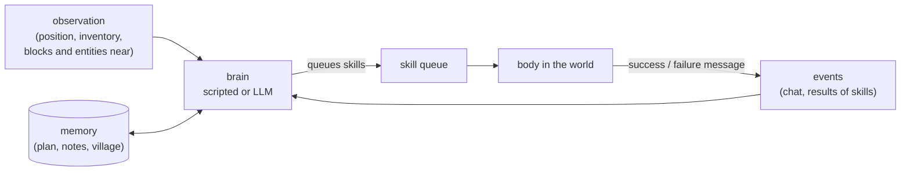

# MCAI Sandbox

A Minecraft-style voxel sandbox that runs in the browser, backed by an authoritative Node.js server. It is built to host
**human players and AI-controlled agents in the same world**, as a base for multi-agent experiments in the spirit of
[Project Sid: Many-agent simulations toward AI civilization](https://arxiv.org/html/2411.00114v1).

All textures, skins, sounds, music and the UI font are generated procedurally in code; no Mojang assets are used.


## Quick start

```bash
npm install
npm run dev          # game server on :8765 + Vite client on :5173
```

Open http://localhost:5173, pick a name and press **Play**. Open more tabs to add more players.

For production, build the client once and let the game server serve it:

```bash
npm run build        # outputs dist/
npm start            # http://localhost:8765 serves the game, the WebSocket and the API
```

Server options (flags or `MC_*` environment variables):

| Flag | Default | Meaning |
|---|---|---|
| `--port` | `8765` | HTTP + WebSocket port |
| `--world` | `world` | World save folder (`server/worlds/<name>`) |
| `--seed` | random | Number or text seed (only used when a new world is created) |
| `--view-distance` | `10` | Chunks sent to human players |
| `--pvp` | `true` | Player-vs-player damage |
| `--agents` | `0` | Number of AI agents to spawn at start-up |
| `--agent-brain` | `worker` | Brain for those agents (`worker`, `companion`, `idle`, `llm`) |

For example: `npx tsx server/src/index.ts --world test --seed hello`.

## What's in the game

- **World:** infinite procedurally generated terrain with 15 biomes: oceans, beaches, plains, forests, birch forests, taiga, snowy taiga and plains, deserts, savanna, windswept hills, snowy peaks, swamps and meadows. It has rivers, caves (spaghetti tunnels and large caverns), underground lava lakes, ore veins, and oak, birch and spruce trees. Flowers, grass, sugar cane, cacti and pumpkins are scattered around.
- **Survival:**
  - Health, hunger and saturation, with natural regeneration.
  - Damage from falling, drowning, lava, fire and starvation.
  - Death drops your items and shows a respawn screen.
  - Beds set your spawn point and skip the night.
- **Mining and building:** break times follow Minecraft's formula (hardness × tool tier × tool speed). Tools wear out, blocks drop the right items, and pickup behaves like Minecraft. You can place blocks with orientation (logs, furnaces, torches, ladders, slabs, stairs), and two slabs merge into a full block. Doors are two blocks tall and open and close; fences and cobblestone walls connect to their neighbours.
- **Crafting:** 95 shaped and shapeless crafting recipes plus 21 smelting recipes, including tools and armour in 5 materials, torches, chests, furnaces, beds, doors, stairs, fences, walls, food and building blocks.
  - 2×2 grid in the inventory, 3×3 grid on the crafting table.
  - Shift-click crafts in bulk; drag with the mouse to split stacks.
- **Smelting:** a furnace with fuel burn time and cooking progress: ores, food, sand to glass, and more.
- **Containers:** chests.
- **Experience:** XP orbs from mining ores, killing mobs and smelting fly to the nearest player and fill a green XP bar with a level number (Minecraft level formula); you drop some XP when you die.
- **Creative mode:** a tabbed, searchable item palette and flying.
- **Mobs:** pig, cow, sheep (dyed and shearable), chicken, zombie, skeleton (shoots arrows), creeper (explodes) and spider.
  - Animals wander, panic when hit and follow you when you hold wheat or seeds.
  - Monsters spawn in the dark, and undead mobs burn in daylight.
- **Simulation:**
  - Water and lava flow; lava meeting water makes obsidian or cobblestone.
  - Sand and gravel fall, and leaves decay.
  - Grass spreads, crops, saplings, sugar cane and cacti grow, and farmland hydrates.
  - TNT explodes and sets off nearby TNT.
- **Multiplayer:** see other players with skins, name tags, held items and animations. There is chat, a player list (Tab) and server commands (`/help`).
- **Saving:** the world is saved to disk: chunks you changed, player data, and container contents.

### Graphics
WebGL2 through Three.js, with a custom deferred-style pipeline:

- **Terrain:** smooth lighting and ambient occlusion using Minecraft-style sky and block light that spreads across chunks. Chunks are meshed in Web Workers.
- **Shadows:** real-time sun and moon shadows with two cascades and PCF filtering.
- **Water:** animated waves, refraction of the scene below, colour absorption with depth, Fresnel reflections of the sky, **screen-space reflections** and sun highlights. Being underwater adds fog.
- **Sky and time of day:** a sky model with sunrise and sunset glow, a square sun and moon, twinkling stars, and a 20-minute day/night cycle.
- **Clouds:** Minecraft-style block clouds.
- **Weather:** rain and snow (snow in cold biomes), thunderstorms with lightning, an overcast sky, ground that looks wet, and rain sounds. Use `/weather clear|rain|thunder`.
- **Foliage and lava:** leaves and plants sway in the wind; lava glows and flows.
- **Post-processing:** HDR tone mapping (ACES), bloom, god rays, vignette and dithering.
- **Particles:** block-break debris, torch flames and smoke, explosions, bubbles and critical-hit sparks.
- **Title screen:** a rotating 3D panorama of a world generated locally.
- **Settings:** each effect can be turned off in *Options*.

Controls: WASD, Space, Shift (sneak), Ctrl or double-tap W (sprint), mouse, 1–9 or the scroll wheel, E (inventory),
Q (drop), T or / (chat), F1 (hide the HUD), F3 (debug screen), F5 (camera view), Tab (player list), middle-click (pick block).

Useful commands: `/gamemode creative|survival|spectator`, `/time set day|night`, `/give <item> [count]`, `/tp x y z`,
`/summon <mob>`, `/weather rain`, `/gamerule doMobSpawning false`, `/agent ...` (see below).

## AI agents

(For how the agent system is built in code, with diagrams, see [docs/ARCHITECTURE.md](docs/ARCHITECTURE.md).)

Agents are **real players**. Each has a body in the world, an inventory, health and hunger, and follows the same rules
as a human player: it walks, digs, crafts and talks through the same game mechanics, and everyone sees it do so. There
is no browser behind it. A server-side **brain** decides what it does, and the body carries that out as **skills**.
The same agents, brains and REST API work in two worlds: this browser sandbox, and real Minecraft Java Edition (see
[Real Minecraft](#real-minecraft-experimental)).

### How an agent works

An agent is made of four parts:

- **The body** (`WorldAgent` in `server/src/world.ts`) is the player in the world. It can observe its surroundings and
  run one skill at a time.
- **The skill queue.** A skill is a small program with a clear goal and a clear result: `collect block=logs count=8`,
  `craft item=wooden_pickaxe`, `build_design design=cottage x=120 z=-40`. Skills are queued and run in order; each one
  ends with success ("collected 8 logs") or a failure message that says what is wrong and what to do about it
  ("needs 3 planks (have 2)"; "the ground is not level here (heights 70..74); run prepare_site x=120 z=-40 first").
- **Events.** Everything that happens to the agent is written to its event stream: chat it heard, damage, items picked
  up or crafted, and every skill's result (`action_done` / `action_failed`, with the skill's arguments).
- **Memory.** A free-form key-value store: the current plan, long-term notes, the village it belongs to, the models it
  uses, statistics. Controllers and brains read and write it; it is exposed at `/api/agents/:name/memory`.

The **brain** sits on top. On every server tick (20 per second) it can look at the events and the observation and queue
skills. A scripted brain decides in code; an LLM brain asks a language model, which answers with tool calls, one per
skill, that the brain queues. Anything outside the server can play the brain role too, through the REST API: observe,
decide, queue skills, read the events, repeat.



**What an observation holds:** position and biome, time of day, health and food, the inventory, what the agent is
holding and wearing, the blocks around it (counted by type, with the nearest of each), the entities near it (players,
agents, mobs, dropped items, with distance), and its current and queued actions. Language models get a trimmed version
(about 2,000 tokens: plants and common stone left out, the nearest 20 block types) because prompt size dominates the
speed of local models.

### Skills

| Skill | Arguments | What it does |
|---|---|---|
| `move_to` | x, y, z, range? | Pathfinding: walks, jumps, swims and drops down ledges; far goals are walked in legs of ~40 blocks |
| `mine` | x, y, z | Walks there, equips the best tool, breaks the block and collects the drops |
| `collect` | block, count | Finds and mines blocks until it has `count` items (`logs`, `stone`, `sand`, `iron_ore`, ...). Picks the cheapest blocks to reach (near, not deep below, in the open) and, if stone needs a pickaxe it does not have, crafts a wooden one first. A village member gathers within 96 blocks of its village (walking back first when it is farther out), no more than 16 blocks below the village, and never inside any village's buildings or plots (with a 2-block margin). A log means its whole tree (Minecraft): the logs it can reach from the ground, then a dirt pillar under its feet for the rest, dug back down afterwards, so no trunk is left floating; logs without leaves are someone's build and are left alone |
| `place` | item, x, y, z | Places a block |
| `craft` | item, count? | Uses recipes; places or uses a crafting table when the recipe needs 3×3, and first makes missing planks and sticks from what it carries |
| `smelt` | item, count? | Uses a furnace, or places one if carried; adds fuel automatically |
| `attack` | id \| kind | Fights an entity |
| `follow` | player, distance?, seconds? | Follows a player |
| `give` | player, item, count? | Walks to a player and tosses them items (for trading and economy experiments) |
| `chat` | message | Talks. Agents only **hear** chat within 48 blocks, as in Project Sid |
| `eat`, `equip`, `drop`, `look_at`, `wait`, `explore`, `sleep` | | |
| `find_site` | size?, radius?, x?, z?, max_slope? | Finds the flattest dry, open area of `size`×`size` nearby (no water or lava, few trees, off every village's buildings and plots) and reports its centre. It checks every centre within 112 blocks on a height grid, allows 4 blocks of height difference (prepare_site levels them) before offering a smaller site, and if nothing fits walks up to two 40-block legs toward dry land. In survival a site needs 30 log blocks within 48 (wood buried more than 16 below the ground does not count), and a smaller wooded site beats a bigger bare one |
| `prepare_site` | x?, z?, width?, depth?, margin?, y? | Prepares a building plot the way a player would: fells every tree touching it (whole trees, canopy included), cuts high ground down and fills low ground to one level with grass on top, plus a margin. Never demolishes builds. Records the plot; preparing next to it at the same `y` extends it |
| `build` | structure, x?, z?, material?, roof?, floor?, width?, depth?, height?, door?, length?, direction? | Builds a `hut` (5×5), `house` (7×7), `platform` or `wall` centred on x,z: walls, windows, roof, an oriented door and a clear path out. Needs prepared ground: refuses sites that are sloped, over water, cluttered by trees, or overlapping a building |
| `build_design` | design, x, z, rotate? | Builds a design from the village design library (drawn by a model or imported from a schematic) centred on x,z, turned by `rotate` degrees clockwise, with doors facing out and a clear path in front of them. Needs prepared ground; building a design that already stands there counts as done |
| `build_box` | x1, y1, z1, x2, y2, z2, block, hollow?, label? | Fills a box with a block (or only its shell), or clears it with `air`; `label` names it in the village record |
| `deposit`, `withdraw` | item?, count? | Real Minecraft: put items in, or take them from, the village storage chests (see [the village economy](#the-village-economy-real-minecraft)) |
| `get_item` | item, count? | Creative mode only: takes items from the creative inventory |

Skills do the arithmetic and the geometry so the brain does not have to: `craft` works out the planks and sticks a
recipe needs, `find_site` scores every candidate area, `prepare_site` fells whole trees and levels to the most common
height, and the building skills check the ground, orient doors and keep the way out clear.

`MC_BUILD_SPEED` multiplies how fast `build`, `build_box` and `prepare_site` work (default `1`, about 10 blocks per
second; walking speed is unchanged); `buildSpeed` in an agent's memory overrides it for that agent. In the sandbox,
building works best in creative mode, where blocks are unlimited and clearing is instant; in survival, `build` and
`build_box` use blocks from the inventory and skip anything they would have to dig out. In real Minecraft, survival
building is the village economy described below.

### Brains

Pick a brain when spawning an agent (`brain` in `POST /api/agents`, or the third word of `/agent spawn`):

| Brain | World | Decides with | Use it for |
|---|---|---|---|
| `idle` | both | nothing: it only runs the skills you queue | driving an agent from outside, testing a skill |
| `worker` | sandbox | a script | a baseline that works up the tech tree: wood → crafting table → wooden pickaxe → stone tools → furnace → coal and torches → iron → iron pickaxe; it also answers nearby players ("hi", "follow me", "come here", "give me oak planks", "what are you doing?", "stop") |
| `companion` | sandbox | a script | follows the nearest human player around and chats now and then |
| `llm` | both | Claude | one model that sees everything and calls skills directly |
| `tiered` | both | a planner model and an executor model | local or mixed models; villages; the brain used for the experiments below |
| `tasks` | Minecraft | a script | scripted village workers for tests: they run the skill calls each village task spells out |

**LLM brain (Claude).** `server/src/llmBrain.ts` sends each agent's observation and recent events to Claude and runs
the returned tool calls as skills. It needs Anthropic credentials (`ANTHROPIC_API_KEY` or an `ant auth login`
profile). `MC_LLM_MODEL` sets the model (default `claude-opus-5`) and `MC_LLM_INTERVAL_MS` how often an idle agent asks
for a decision (default `6000`). Requests use low effort, cache the system prompt, and opt into Anthropic's server-side
refusal fallback (`fallbacks: "default"`).

To write a brain in TypeScript, implement `AgentBrain` from `server/src/world.ts` (`tick`, `onEvent`) and register it
(`BRAINS` in `server/src/brains.ts` for the sandbox, `MC_BRAINS` in `server/src/mineflayer/mcWorld.ts` for Minecraft).
A brain written against `WorldAgent` uses only the world interface, so it runs in either world.
`examples/agent_loop.py` is a small, dependency-free Python controller that runs an observe → decide → act loop over
the REST API; its `decide()` function is where an LLM or a PIANO-style architecture goes.

### The two-tier brain

`server/src/tieredBrain.ts` splits the thinking between two models, the way a person might plan the afternoon and then
just get on with it:

- **The planner** is the slow, careful model. It sets a **goal** and **3-8 concrete steps** ("Collect 8 logs", "Craft
  a wooden_pickaxe", "prepare_site x=120 z=-40 width=13 depth=13"), and may write long-term **notes** (where the base
  is, where ore was seen, promises made to others).
- **The executor** is the fast model. Each turn it gets the plan with the current step marked and answers with 1-3
  skill calls for that step. It marks a step done with `step_done`, or asks for a new plan with `request_replan` when a
  step is impossible.

**What each model sees.** The planner's prompt has the agent's role, game mode and objective, its notes, the village
summary (plots, buildings, the design library, the storage contents, the task board, recent village events, ground
others are working on), the previous plan, the events since it last planned and a trimmed observation. The executor's
prompt has the objective, the village summary, its task, the plan, its recent decisions, any calls that are blocked for
repeating, the events since its last turn and a trimmed observation. The exact prompt and answer of each agent's last
planner and executor call are on the [control panel](#control-panel).

**When the planner runs:** when there is no plan; when a plan is complete; when the executor asks for a new plan; after
3 failed actions; when no step has been completed for 3 minutes (`MC_PLAN_INTERVAL_MS`); and for village roles, when the
task board changes (below). The executor runs whenever the agent is idle, at most every 6 seconds while working
(`MC_LLM_INTERVAL_MS`), and at once when someone speaks to the agent by name.

**Keeping the plan honest.** Executors forget to call `step_done` and redo finished work, so a step is also marked done
when a skill it names succeeds with the item it names ("Collect 26 cobblestone" is not done by collecting logs for a
pickaxe). Models write steps and tasks in their own formats (as objects, as skill calls, as JSON text instead of a
tool call); the brain normalises them.

**Settings** take `<provider>:<model>`, where the provider is `ollama` (local or `:cloud` models) or `anthropic`:
- `MC_EXEC_MODEL` sets the executor (default `ollama:gemma4:31b`) and `MC_PLAN_MODEL` the planner (default: the
  executor's model). `anthropic:claude-sonnet-5`, for example, pairs a local executor with a Claude planner. `none`
  turns off automatic planning, so plans come only from `POST /api/agents/:name/memory {"plan": {"goal": "...", "steps": ["..."]}}`.
- Per agent, `execModel`, `planModel` and `designModel` in its memory override them, so agents on different models share
  a world: `POST /api/agents {"name":"Qwen","brain":"tiered","memory":{"execModel":"ollama:qwen3:30b-instruct"}}`.
  `memory.stats` records call counts, average latency and how many actions succeeded or failed.
- `MC_OLLAMA_URL` (default `http://localhost:11434`), `MC_OLLAMA_ROUTES` (models served by other Ollama instances, e.g.
  `qwen3:30b-instruct=http://127.0.0.1:11435`), `MC_OLLAMA_CTX` (context length, default `8192`: on a 24 GB GPU this
  keeps a ~20 GB model entirely on the GPU; at 16384 part of it spills to the CPU and it runs several times slower) and
  `MC_OLLAMA_TIMEOUT` (seconds per call, default `300`).

Set `objective` in the agent's memory (for example `"build a small village"`) to steer every plan toward it. The
current plan and notes are in its memory (`GET /api/agents/:name/memory`).

**Choosing local models.** Measured on RTX 3090s (24 GB each) with Ollama:

| Model | Decision time | Notes |
|---|---|---|
| `gpt-oss:120b-cloud` | ~3.5 s a plan, ~9 s a design | Fastest planner and architect; runs on Ollama's cloud (prompts leave the machine) |
| `qwen3.8:27b` (dense) | ~20 s a plan | The tightest worker plans (6/6 in a benchmark) |
| `qwen3:30b-instruct` (MoE, ~3B active) | 1-2 s a turn | Fast and fine as executor; loose plans, poor designs |
| `gemma4:31b` (dense) | 14-18 s | Reliable designs, but slow |

Language models count badly and place things badly, so the skills and the brain do the arithmetic (see
[Design principles](#design-principles)). `scripts/bench/` times models on the brain's real prompts.

### Guards against loops and floods

Agents left to themselves loop, repeat and talk over each other. These rules are in code:

- **Repeats are refused.** The same failed call twice, or the same successful call twice within two minutes, is refused
  for five minutes, and the executor is told which calls are blocked so it tries something else.
- **The planner reviews** after 3 failures or 3 minutes without progress.
- **Chat.** Chat from other agents only interrupts an agent that is addressed by name; each agent speaks at most once
  every 30 seconds (before this rule, a village produced 553 messages in 10 minutes).
- **No freelancing.** An agent without a plan can only talk: urgent chat used to send idle agents off building on their
  own.
- **Ground.** Agents reserve the ground they are working on (for 3 minutes, renewed while working), and never build
  over another building.
- **Range.** Every village member stays within 96 blocks of its village's home (the first plot, else the storage, else
  where the mayor started): `move_to` and `explore` beyond it are refused or shortened. Before this, a worker's
  executor explored hop by hop to 180 blocks out and then gave up every gathering task as "none within 96 blocks".
- **Stuck rescue** (real Minecraft, survival). Two moves that fail within 3 blocks of the same spot in 6 minutes (a pit,
  a lake, a hole it dug itself; a walk that timed out without getting anywhere counts) mean the agent is stuck: it swims
  up, walks out, climbs out through natural blocks, and as a last resort is teleported beside the village storage (in
  the storage hut's doorway, when the village has one). The brain is told what happened.

### In-game commands
```
/agent spawn Alex farmer worker     # name, role, brain
/agent do Alex collect block=logs count=8
/agent do Alex give player=@me item=oak_log count=4
/agent list
/agent stop Alex
/agent remove Alex
```

### REST API (control agents from any language)
| Method | Endpoint | Purpose |
|---|---|---|
| POST | `/api/agents` `{name, role?, brain?, position?, memory?, gamemode?, reset?}` | Spawn an agent (`memory` sets its initial memory; `gamemode` is `survival` or `creative`; in Minecraft, `reset` clears its saved inventory and position) |
| GET | `/api/agents` | List agents |
| GET | `/api/agents/:name/observe?radius=16` | Observation: position, health, food, inventory, visible blocks (counts and nearest), nearby entities, current action, recent events |
| POST | `/api/agents/:name/act` `{action, ...args, replace?}` (or an array) | Queue skills |
| POST | `/api/agents/:name/stop` | Cancel the current and queued actions |
| GET | `/api/agents/:name/events?since=<id>` | Event stream: chat heard, damage, pickups, crafts, action done or failed, deaths |
| GET, POST | `/api/agents/:name/memory` | Free-form key-value memory for your controller |
| DELETE | `/api/agents/:name` | Remove the agent |
| GET | `/api/skills`, `/api/recipes?item=`, `/api/status` | Reference data and server status (in Minecraft, also whether the peaceful world settings are applied) |
| GET | `/api/block?x=&y=&z=` | The block at a position (name and state; `loaded: false` when its chunk is not loaded) |
| GET | `/api/blocks?x1=&y1=&z1=&x2=&y2=&z2=` | Minecraft: a box of up to 65,536 blocks, as a list of names and an index into it per block (x fastest, then z, then y; -1 where no bot has the chunk loaded), for checks that compare before and after |
| GET, POST | `/api/village` `{name, objective}` | List villages, or create one or change its objective |
| GET | `/api/village/:name` | A village's plots, buildings, designs, task board, storage (chest by chest, with each one's material group in a storage hut), reservations and recent events |
| POST | `/api/village/:name/designs` | Add a building design to the village library (checked like model-drawn designs) |
| POST | `/api/village/:name/designs/import?name=&skip_bottom=` | Import a Minecraft schematic file (the request body) as a design |
| GET | `/api/village/:name/designs/:design/bill` | Minecraft: the blocks a design needs, and what to gather, craft and smelt for them |
| GET | `/api/materials?items=glass:8,chest:1&have=sand:2` | Minecraft: the same for any list of items, less what is in hand |
| POST | `/api/village/:name/layout` `{buildings, x, z, y?, size?}` | Minecraft: lay buildings out on a plot and post their tasks, as the mayor's `plan_layout` does |
| POST | `/api/village/:name/storage` `{x, y, z, group?}`, `/api/village/:name/tasks/:id` `{status, by?}` | Minecraft, for tests: register an existing chest as storage (with its material group in a sorted storage); set a task's status (`claimed` holds a task back from the workers) |
| GET | `/api/overview`, `/api/maps`, `/api/models` | The control panel's data: every agent's brain state, maps, loaded models |
| GET | `/api/atlas?village=` (or `?x=&z=`), `radius=`; `?all=1` | Minecraft: the shared atlas, a summary of every chunk the bots have seen near a village or a point (ground height and flatness, water, logs by kind, surface materials, exposed ores underground and whose mine dug there), and what a summary costs; `all=1` returns every chunk and every village's ground, compact, for the panel's world map |
| GET | `/api/metrics` | Sandbox experiment metrics per agent: unique items and when each was first obtained (progression, as in Project Sid), items crafted, blocks mined, kills, deaths, distance, messages sent; plus a social graph of who heard whom |

**Scale:** in the sandbox, the per-tick pathfinding budget and fast block search keep the server at about 8 ms per
tick with 30 autonomous agents (20 TPS needs under 50 ms). `/api/status` shows per-phase tick timings.

### Villages: agents building together

Agents with the same `village` in their memory share one village record (saved in `villages.json` next to the world):
its plots, buildings, design library, task board, storage and a log of what happened.

**Roles.** An agent with `villageRole: "mayor"` coordinates and does no physical work itself; every other member is a
worker.

- **The mayor** finds the site (`find_site`), has each kind of building designed (`design_building`: the architect
  model draws it), lays the buildings out (`plan_layout`), then waits. It reviews the board when every task is done or a
  task fails, re-posts a failed task with a fix, and calls `declare_complete` when the objective is met. Its executor may
  only look around, talk, find a site and design; plan steps that are workers' jobs (collecting, crafting, building)
  are dropped with a note, and so are steps naming a planner tool such as `plan_layout` (the executor cannot call it
  and improvised a new, smaller site instead). A mayor with nothing laid out that answers with an empty plan gets
  `find_site` added by code, or is asked again 10 seconds later if it already has a site. Whether the village is
  complete is checked by code on every tick of the mayor's brain: when every building of the layout stands and no task
  is open, code declares it, whatever the mayor last did.
- **Workers** take the next open task whose prerequisites are done, *before* planning (otherwise several would plan
  the same one), do it, and take the next. A task that code posted spells out its own skill calls ("collect
  block=logs count=12, then deposit item=all"), and those calls are the worker's plan: no planner call. Other tasks go
  to the planner. A worker with nothing to claim waits without calling any model.

**The task board.** A task is `open`, `claimed` by one worker, `done` or `failed`, and may wait for others (`after`).
A worker that has to replan the same task three times hands it back; handed back twice, it fails, so the mayor can
rethink it. Building tasks also wait until the design they name is in the library.

**Designs.** `design_building` asks the architect model to draw a building as horizontal layers of symbols, one per
block, spaced so the model can count them (`"L P P P L"`), with a palette (`{"L": "oak_log", "P": "oak_planks"}`). Code
checks the design (sizes, real blocks, a door on the outside with room above it, moving or adding the door when the
model puts it inside the wall) and sends the problems back once for a fix. A design is reused for every copy, so
matching buildings match. The architect's brief says how much room the site has (never below 5x5: what does not fit
goes on a second site). In survival, code also limits what may be drawn, because every block has to be gathered:
at most 9x9, raw materials from a short list (logs, stone, sand, sandstone, dirt, gravel, terracotta, and what is
crafted or smelted from them) and no furnaces, crafting tables or chests as decoration; the brief says when the site
has no sand or sandstone. Before these limits, the architect drew 13x13 halls in mossy cobblestone, and workers
went 70 blocks down to lush caves for the moss.

**Layout.** `plan_layout` (`server/src/layout.ts`) takes the buildings by name (`["cottage", "cottage",
"meeting_hall"]`) and does the geometry: it packs their real footprints in rows on one plot, 3-block streets apart
(2-block streets and a 1-block margin when that is what fits), choosing the column count that gives the squarest plot,
and centres the plot on the site the mayor found. It refuses designs that are not drawn yet and ground that is taken,
each with the reason. When the site is too small for everything, it lays out the largest set that fits if that is at
least half the buildings, so the workers can start, and keeps the rest as unplaced; the mayor's next successful
`find_site` gets them laid out there by code (the model managed that step 1-2 times in 10). Fewer than half is
refused with the size the whole village needs. In survival it also asks the world whether the materials are near the
site in the amounts needed, counted the way `collect` would reach them (anything within 40 blocks, only exposed blocks
farther out, nothing more than 16 below the ground; wood may be a quarter short, since felled trees and ground not yet
loaded add some), and refuses with the choice of smaller buildings or another site. Then it posts the tasks in order:
prepare the plot; set up the storage; the materials for each building; each building at its computed position. In
survival, a new village's first layout also gets a storage hut, added by code (the mayor does not name it, and
`design_building` refuses the name): see [the village economy](#the-village-economy-real-minecraft). Models are poor at this arithmetic: before `plan_layout`, a mayor placed a hall half outside its plot and spent the
rest of the run relocating it.

```sh
curl -X POST localhost:8765/api/village -d '{"name":"Birchwood","objective":"two matching cottages and a meeting hall"}'
curl -X POST localhost:8765/api/agents -d '{"name":"Mayor","brain":"tiered","gamemode":"creative","memory":{"village":"Birchwood","villageRole":"mayor"}}'
curl -X POST localhost:8765/api/agents -d '{"name":"Ada","brain":"tiered","gamemode":"creative","memory":{"village":"Birchwood"}}'
```

In creative mode, blocks are free and a village of two cottages and a hall takes about four minutes with three workers
at `buildSpeed: 4`. In survival in real Minecraft, the agents first have to gather everything: see
[the village economy](#the-village-economy-real-minecraft).

**Importing schematics.** Builds shared on sites such as Planet Minecraft or Minecraft-Schematics.com can be added to a
village's design library: `.schem` (WorldEdit/Sponge v1-v3), `.schematic` (MCEdit, pre-1.13 ids), `.litematic`
(Litematica) and `.nbt` (structure blocks), up to 64x64x64 after trimming empty space.

```sh
curl -X POST "localhost:8765/api/village/Birchwood/designs/import?name=tavern" --data-binary @tavern.schem
```

In the sandbox, blocks this game lacks become the nearest match (dark oak planks become spruce planks, brick stairs
become bricks, glass panes become glass); decorations with no counterpart (carpets, signs, trapdoors) are left out, and
plants and water keep whatever is on site. The response lists the substitutions and any blocks with no match. Use
`skip_bottom=N` to drop ground layers saved with the build. Stairs and logs lose their orientation; doors face outward.
Check each build's licence before sharing it further.

### Design principles

What building these agents taught, and what the code is built around:

- **Models decide; code does arithmetic and geometry.** Models miscount crafting quantities and row lengths, place
  doors inside walls, overlap buildings and invent item ids. So skills make the missing planks, designs use spaced
  symbols, doors are moved in code, `find_site` scores sites, `plan_layout` places buildings and the bill of materials
  counts every block. The weaker the model, the higher-level the skills should be.
- **Failure messages are the model's eyes.** A failure says what is short or where the problem is, and what to do next
  ("short of materials for the cottage: 35 acacia_planks (carrying 1, storage has 0). To get them: gather 9 acacia_log;
  craft 36 acacia_planks"). Project Sid calls this action awareness.
- **Agents loop unless stopped**, and several agents race for the same work: hence the guards above, claiming tasks
  before planning, and reserving ground.
- **Prepare land like a player:** find a site, fell whole trees and level the ground, then build. Building on unprepared
  ground left pillars, floating canopies and trapped agents.
- **Check a model's raw output before judging it.** Most "failures" of new models were format quirks (layers sent as a
  string, tasks written as skill calls), now normalised in code.
- **Test the code without the models.** Scripted workers (`tasks` brain) and staged villages check the economy in
  minutes; model-driven runs then test behaviour.

### Testing agents

`scripts/` has the harnesses used to develop the agents (Python, standard library only; the game server must be running):

- `watch_survival.py NAME [MAX_MINUTES] [TARGET]` spawns a tiered survival agent and tracks unique items until it
  holds TARGET (default stone_pickaxe) or stalls.
- All watch scripts use the sandbox API by default; set `MCAI_API=http://localhost:8766/api` for real Minecraft.
- `scripts/bench/` compares models on the brain's real prompts and tools: `modelbench.mts` (mayor planning and
  designs), `execbench.mts` (executor turns) and `planbench.mts` (worker plans), e.g.
  `node_modules/.bin/tsx scripts/bench/execbench.mts qwen3:30b-instruct` (`OLLAMA_URL=` for another Ollama server).
- `watch_village.py VILLAGE X Z WORKERS MAX_MINUTES "objective" [WORKER_PLANNER] [SITE_SIZE]` searches outward from X,Z for
  dry land, spawns a mayor and workers, streams their actions and the task board, and stops when the mayor declares the
  objective complete, the run stalls or an agent fails the same way 3 times. It prints tasks, designs, plots, buildings,
  storage and per-agent stats. `MCAI_GAMEMODE=survival` runs the village economy (real Minecraft); the land probe then
  also skips ground with too few trees, and the village spawns at the site it found, not at X,Z.
- `attach_village.py VILLAGE MINUTES_SO_FAR` follows a village whose agents are already running (when a watcher was
  stopped mid-run): it prints their new events until the village is complete or nothing succeeds for 5 minutes.
- `scripts/checks/` holds targeted checks of the survival village's code, without models (the agent server must be
  running): `find_site.py X Z SIZE[:SLOPE],...` (site search, wood, walking legs), `layout_small_sites.py VILLAGE`
  (partial layouts and second sites), `materials_near_site.py` (plan_layout's material counts), `treeless_site.py` and
  `smelt_fuel.py`, `atlas.py` and `fell_trees.py`; `mine.py VILLAGE [ROUNDS [COUNT]]` (Gus collects cobblestone in the
  village mine; each round must come from the planned tunnel cells, with nothing else changed at the mine's level) and
  `atlas_ores.py VILLAGE` or `--near X Z [RADIUS]` (the atlas's exposed ores against the blocks, read with
  `/api/blocks`). Run the relevant one after changing find_site, layout.ts, smelting, the atlas, felling or the mine.
  Two helpers sit beside them: `fresh_land.py [MIN_DISTANCE]` lists fresh land for a test from
  the atlas, away from every village (no server needed), and `follow_workers.py VILLAGE MINUTES` follows a staged
  village's workers on after the stage runner's stall rule stopped it.
- `test_rescue.py [pit|box|pool]` traps Gus with RCON and checks the stuck rescue.
- `stage_village.py VILLAGE X Z [--stage full|build] [--buildings testhut,testhall] [--brain tasks|tiered]` (real
  Minecraft) starts a village at a stage and watches it: the layout is posted through the API, `--stage build` also
  places and stocks the storage chest (with a storage hut: one chest per material group in the hut's spots once the
  plot is prepared, then a check that a mixed deposit is sorted; `--no-deposit-check` skips it), and the default
  workers are scripted (brain `tasks`: they run the skill calls each task spells out, no model), so the economy's code
  is tested in one to ten minutes.
- `scripts/bench/mayorbench.mts [model] [times]` replays the mayor's real prompts in situations that went wrong.
- `watch_agent.py SPEC_JSON [MAX_MINUTES] [EXPECTED_BUILDS]` runs one agent and stops early when it has built enough or is
  stuck. `bench_agent.py` compares models on survival progression.
- `design_test.ts` asks a model for a design and validates it; `gen_test_schematics.ts` writes a test house in every
  schematic format.

Most of this world is ocean or hills, so start village tests where there is land (the village watcher searches for it).

## Real Minecraft (experimental)

The same agents can play real Minecraft Java Edition (26.1) through [Mineflayer](https://github.com/PrismarineJS/mineflayer),
on a private local server. [docs/ARCHITECTURE.md](docs/ARCHITECTURE.md) explains how it fits together, with diagrams.

```bash
npm run mc:setup     # once: portable Java 25 and a Paper 26.1.2 server in mc/ (listens on 127.0.0.1 only)
# accept the Minecraft EULA: eula=true in mc/server/eula.txt
npm run mc:server    # start the server (stop it with: python mc/rcon.py stop, which saves the world)
npm run mc:agents    # agent API on http://localhost:8766/api, same routes as the sandbox
```

Agents are spawned and driven through the same REST API as in the sandbox (on port 8766), and brains written against
the world interface (`tiered`, `llm`, `idle`) run unchanged. Skills: move_to, chat, wait, look_at, mine, collect,
place, craft, smelt, eat, attack, explore, follow, give, equip, drop, get_item, deposit, withdraw, find_site,
prepare_site, build_design, build_box and build (`GET /api/skills`), with the sandbox's names, arguments and failure
messages. Spawn with `"reset": true` for a fresh start (a name keeps its inventory and position otherwise). Survival
bots have a self-defence reflex: they fight back with a weapon, or run. Join with a 26.1.2 client at `localhost` to
watch (`POST /api/watch {"player": ..., "agent": ...}` puts you in spectator mode next to an agent).

Some things work differently from the sandbox, because Mineflayer (the bot library) and the real server behave
differently:

- **Building** places blocks with `/setblock` and `/fill` over RCON (the server console), paced by `buildSpeed`, while
  the bot stands by the site and watches. It is free in creative; in survival every block is paid for (below).
- **Crafting** is carried out by server command, charged exactly: the ingredients are counted and taken (`/clear`) and
  the result given (`/give`); a recipe that needs a table still needs one placed nearby. Mineflayer's own crafting
  clicks worked from a stale view of the inventory on 26.1 and made oak buttons out of planks.
- **Walking** uses mineflayer-pathfinder with a watchdog for stuck bots, digging only natural blocks, opening doors,
  going around water (and swimming out of it), and splitting long walks into legs. A bot that stays stuck is rescued
  (see the guards above).
- **One event loop for every bot.** All bots share the agent server's Node process, so path searches are capped per
  tick and block scans filter as they search. The server logs any stall of the event loop over 2 seconds as a `[lag]`
  line with what each agent was doing: 2-3.5 s while bots join or during a site search's log scan is normal; a stall
  over ~30 s makes Paper disconnect every bot at once.

### The village economy (real Minecraft)

In real Minecraft, villages are built the way a group of players would: in survival, from materials they gather
themselves. When the agent server starts it makes the world **peaceful and safe** (`mcRules.ts`): no hostile mobs, no
fall, drowning, fire or freeze damage, keep-inventory, no fire spread. So the agents only gather, craft and build.

**What a building costs.** Code works out the bill of materials of a design (`mcMaterials.ts`): every block, with a door
counted once for its two cells, then the recipe chain down to raw materials using minecraft-data's recipes and a table
of smelting recipes. Planks come from logs, doors and slabs from planks, glass from sand smelted with planks as fuel,
stone bricks from stone smelted from cobblestone. Recipes that differ only by wood kind accept any wood; crafts round up
to whole batches and leftovers are reused. Blocks that need Nether materials or hard-to-find ones (glowstone, iron for
lanterns, wool, bricks) are refused at design time, and the architect is asked for cheap materials: planks, logs,
cobblestone, sandstone, a few windows. `GET /api/village/:v/designs/:d/bill` shows the bill, for example:

```
needs 25 cobblestone, 54 oak_planks, 1 oak_door, 1 glass; gather 25 cobblestone, 1 sand, 15 oak_log, 1 logs (any kind);
craft 4 planks (any kind), 60 oak_planks, 3 oak_door; smelt 1 glass (fuel: 1 planks, or 1 coal instead)
```

**Village storage.** A village keeps its materials in chests (`mcStorage.ts`), in a **storage hut** that code draws
and lays out with the village's first layout (`huts.ts`): 7 wide, 9 deep and 4 high, a cobblestone floor, plank walls
with log corners, a plank roof, an open doorway in the middle of the south wall (no door: bots caught on an open door's
panel) and no windows. Inside are nine chest spots,
four along each side wall and one at the back, none side by side (two chests side by side would join into a double
chest). The design marks them `_`, cells the build leaves as they are, so the hut is built around chests already
standing: `build_design` lets the village's chests stand there, and refuses to build when one is not at the level of
the hut's floor (it would be buried under the floor layer). The village's crafting table and furnace stand in the
middle of the hut: within 32 blocks of it every craft and smelt happens there (one smelter at a time), so no tables
and furnaces are left about the village; farther out a table is put down as before, never on village ground.

The storage is **sorted**: each chest holds one material group (logs, planks, cobblestone, sand, glass, terracotta,
misc), given at its first use. `deposit` puts each item into its group's chest; when that is full or missing it takes a
free chest, else puts a new chest in the next free spot (carried, or crafted from logs carried or taken from storage),
else any chest with room. `withdraw` goes to the chests that hold the item. `deposit item=all` keeps tools and leaves
the junk that gathering picks up (saplings, seeds, dirt, cocoa beans). Villages laid out before the hut keep their loose
chests: the first `deposit` puts a carried chest down beside the plot, and when the chests are full, another goes down
in a row beside them. What each chest holds is recorded whenever it is opened, and shown chest by chest in every
planner's village summary, in `/api/village/:v` and in the panel's detailed view ("chest 1 (logs): 64 oak_log, ...").
**The mine.** With the storage hut, a new village's first layout gets a **mining hut** (`huts.ts`, 5x5, wood only),
turned so that stairs inside it face the nearest edge of the plot. The code-posted task "Dig the village mine"
(`dig_mine`, `mcMine.ts`) digs the stairs down to stone, at least 7 steps; from then on `collect cobblestone` in that
village extends a main tunnel with 12-block branches every 3 cells (18-32 cobblestone a trip, about a minute) instead
of digging pits around the village. The mine digs only natural ground, never village ground or anything built, and ends
a tunnel or branch at water, lava, a cave, a missing ceiling, open air beside it (a hillside) or a cell with no stone
(a tunnel through a hillside's dirt once gave 412 dirt for 67 cobblestone). A main tunnel that ends does not end the
mine: a new one turns left, then right, at one of its junctions (up to 12 tunnels a level), and when no tunnel at a
level can go on, the stairs go on down 6-10 steps into stone to a new level (at most three). Only then is cobblestone
gathered at the surface again. One miner digs a tunnel at a time: a second turns its own tunnel off the busy one (or
starts a second face at the bottom of the stairs), else waits up to two minutes. Walks inside the mine dig nothing (a
walk free to dig cut its own shortcut from the hut to the face), each cell is dug standing on the one before it, and no
bot's pathfinder may dig into the mine's tunnels. Ores its cells lay open are counted in the village record and recorded
in the atlas (see the control panel). In the staged and model-driven runs of 2026-10-01 every cobblestone came from the
mine, and the first tunnel of one village met a hillside after 28 cells and turned.

**Materials still to gather.** Code keeps a list of what the village still needs gathered (`refreshNeeds` in
`mcWorld.ts`): the raw materials of every laid-out building not built or being built yet, plus anything the mayor asked
to keep in stock (`add_need`), less the storage and what each worker carries for its gather task. Every village summary,
`/api/village/:v` and the panel show it, and code posts gather tasks for whatever no task covers.
Crafting tables and furnaces are never put down on a village's plots or next to its buildings (a table a gatherer put
down stood inside the future hut and raised its floor).

**From objective to buildings.** For "two matching cottages and a meeting hall":

1. The **mayor** runs `find_site` (a site with enough trees near it), has a `cottage` and a `meeting_hall` designed
   within the survival limits, and calls `plan_layout`, which checks the materials are near the site.
2. `plan_layout` places the buildings, with the storage hut, and posts the tasks, each as exact skill calls: prepare
   the plot; set up the storage (collect 10 logs, craft 4 chests, deposit: the chests go into the hut's chest spots on
   the prepared plot); gather the hut's materials and build it around the chests; for each other building, gather its
   raw materials in parts two workers can share ("collect block=logs count=12, then deposit item=all", "collect
   block=cobblestone count=29, then deposit item=all"); then build it at its coordinates. The other buildings'
   gathering waits only for the storage, their builds for the hut.
3. **Workers** claim the tasks in order and run each task's skill calls exactly as written; the executor model is
   asked only when one fails (it had faked gathering by withdrawing logs from storage and depositing them again).
   Gathering stays within 96 blocks of the village and never mines inside its plots; stone is mined for cobblestone,
   with a wooden pickaxe `collect` crafts itself when it has none. A gather task for a material that is not within
   reach is given up at once (it is "soft": the build checks its own materials), and only that task: the queue goes
   with it.
4. A **builder** at a site counts what it carries (on the server), takes what is missing from storage, crafts and
   smelts what can be made from what is there (planks, doors, glass, and the table and furnace for them), and places
   the building block by block against its inventory. Each wood kind is chosen per part from what was gathered (an oak
   design comes out in acacia where acacia grows).
5. If materials are still short, the build posts gather tasks for exactly the shortfall, puts itself back on the board
   behind them, and returns what it took to storage. If only glass is missing and there is no sand near the village,
   the windows are left open instead. Smelting keeps topping its fuel up from every stack of planks in hand.
6. When every building stands, the mayor declares the objective complete (code checks it first), or code declares it:
   the check runs on every tick of the mayor's brain, so a mayor busy with something else does not leave a finished
   village running.

Acceptance runs (2026-09-28/29, "two matching cottages and a meeting hall" from nothing, a mayor and two workers, no
manual help): with gpt-oss as the workers' planner, five runs built everything in 10.2-29.2 minutes, three of them in
a row (14.6, 25.2 and 29.2); with qwen3.8, two passed in 26.2 and 39.2 minutes. The runs that failed on the way each
found a code bug, since fixed. What decides the time is gathering: oak woods took 10-15 minutes;
logs high on hills (up to 23 failed collects a run) and designs with log roofs (a 9x9 log roof is 81 logs) took 25-40.
`scripts/stage_village.py` runs the same chain with scripted workers, in about a minute when the storage starts
stocked.

### Models

Each brain role can use its own model (`"<provider>:<model>"`, per agent in memory: `planModel`, `execModel`,
`designModel`). The combination that built a whole village fastest so far:

| Role | Model | Runs on |
|---|---|---|
| Mayor's planner and architect | `ollama:gpt-oss:120b-cloud` | Ollama cloud (a subscription; prompts leave the machine) |
| Workers' planner | `ollama:qwen3.8:27b` | local, GPU 0 |
| Executors | `ollama:qwen3:30b-instruct` | local, GPU 1, three requests at once |

In village runs the workers' planner is not called at all (tasks posted by code carry their own steps) and the
executors only step in after a failure, so the choice of those models shows little there; it will matter for tasks
players ask for in chat.

`scripts/ollama_exec.py start` runs the two local models on their own Ollama servers (ports 11435 and 11436), each
pinned to one GPU, and checks they fit; the Ollama app keeps relaying cloud models. Run `python scripts/ollama_exec.py
status` before a series of runs: Ollama can report a model as fully in VRAM when Windows has moved most of it into
shared system memory (an executor ran at 2.7 tokens a second, one turn took 187 s), so the script compares each card's
memory with its model and prints a WARNING; then stop and start them. Then point the agents at them:

```bash
python scripts/ollama_exec.py start
MC_OLLAMA_ROUTES="qwen3:30b-instruct=http://127.0.0.1:11435,qwen3.8:27b=http://127.0.0.1:11436" npm run mc:agents
MCAI_API=http://localhost:8766/api MCAI_MAYOR_MODEL=ollama:gpt-oss:120b-cloud MCAI_DESIGN_MODEL=ollama:gpt-oss:120b-cloud \
  python scripts/watch_village.py Elmfield 120 0 2 12 "two matching cottages and a meeting hall" ollama:qwen3.8:27b
```

### Control panel

http://localhost:8766/panel (or http://localhost:8765/panel for the sandbox) shows, for every agent: what its brain is
doing (planning, thinking, acting, waiting: since when and why), its plan as a checklist, its task, the current action,
a live top-down map (terrain, facing, mobs, players, the target, village plots and buildings), the exact prompt its
executor and planner last saw and what they answered, recent decisions and events, inventory and model statistics;
plus the village task board and the models loaded in every Ollama server. Buttons stop, remove or watch an agent.
In Minecraft the panel shows one world map of everything the bots have seen (the shared atlas,
`mcAtlas.ts`): every chunk a bot receives is summarised in about 0.4 ms, again a minute after its blocks change, and
kept in `mc/server/atlas.json`), with every village's plots, buildings and storage chests and the agents drawn on it;
drag to pan, wheel to zoom, and the pointer shows the ground and the logs and sand of the chunk under it. Underground,
a summary records the ores exposed to air (in cave walls, ravines, cliffs and mine tunnels) by kind, with how many and
their lowest and highest y, and which village's mine has dug in the chunk; the pointer shows these too ("exposed ores:
3 coal (y 41 to 52)"). Agents do not use the atlas yet; finding materials and sites from it is a later step.

## Project layout

```
shared/src   game logic used by both sides: blocks, items, recipes, world gen, lighting, physics, pathfinding, protocol
server/src   authoritative server: world storage, entities and mobs, players, containers, commands, agents and API
client/src   browser client: renderer and shaders, meshing workers, UI, audio, input, networking
examples/    external agent controller example
scripts/     agent test harnesses and the local model servers (ollama_exec.py)
mc/          the local Minecraft server: setup, start and RCON scripts (jar, Java and world are gitignored)
docs/        ARCHITECTURE.md: how the agent system fits together, with diagrams
```

The agent framework lives in `server/src`: `world.ts` (the world interface brains depend on: `WorldAgent`,
`WorldAdapter`, `AgentBrain`), `skills.ts` (skill tool definitions shared by the LLM brains), `agents.ts` (the sandbox
world: agents, skills including the building engine, REST API), `brains.ts` (brain registry and scripted brains),
`llmBrain.ts` (Claude brain),
`tieredBrain.ts` (planner/executor brain, village roles, model providers), `village.ts` (shared village state),
`layout.ts` (plan_layout), `huts.ts` (the storage hut, drawn by code), `taskBrain.ts` (scripted village worker for tests), `designs.ts` (design format and checks)
and `schematic.ts` with `nbt.ts` (schematic import). The Mineflayer adapter for real Minecraft is in
`server/src/mineflayer/` (including `mcRules.ts`, `mcMaterials.ts`, `mcStorage.ts` and `mcBuild.ts` for the village
economy), the local server's scripts in `mc/`; the control panel is
`server/panel/index.html` with `server/src/panel.ts`. See [docs/ARCHITECTURE.md](docs/ARCHITECTURE.md).

The protocol is JSON over WebSocket (`/ws`), plus a compact binary format for chunks (`shared/src/protocol.ts`).
Because the protocol is documented and shared, you can also write a headless bot as an ordinary network client.
