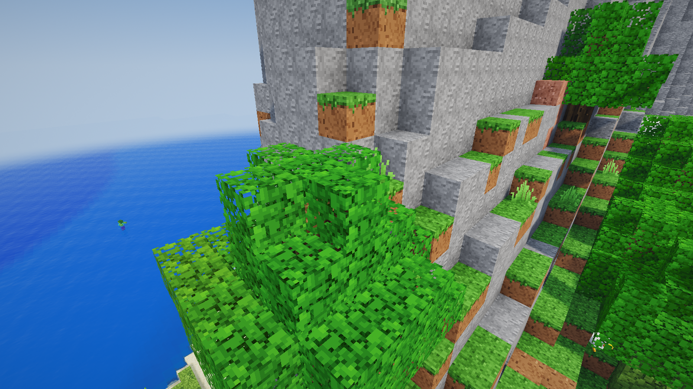
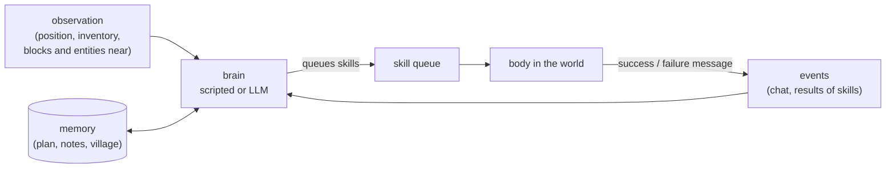

# MCAI Sandbox

A Minecraft-style voxel sandbox that runs in the browser, backed by an authoritative Node.js server. It is built to host
**human players and AI-controlled agents in the same world**, as a base for multi-agent experiments in the spirit of
[Project Sid: Many-agent simulations toward AI civilization](https://arxiv.org/html/2411.00114v1).

All textures, skins, sounds, music and the UI font are generated procedurally in code; no Mojang assets are used.




## Quick start

```bash
npm install
npm run dev          # game server on :8765 + Vite client on :5173
```

Open http://localhost:5173, pick a name and press **Play**. Open more tabs to add more players.

For production, build the client once and let the game server serve it:

```bash
npm run build        # outputs dist/
npm start            # http://localhost:8765 serves the game, the WebSocket and the API
```

Server options (flags or `MC_*` environment variables):

| Flag | Default | Meaning |
|---|---|---|
| `--port` | `8765` | HTTP + WebSocket port |
| `--world` | `world` | World save folder (`server/worlds/<name>`) |
| `--seed` | random | Number or text seed (only used when a new world is created) |
| `--view-distance` | `10` | Chunks sent to human players |
| `--pvp` | `true` | Player-vs-player damage |
| `--agents` | `0` | Number of AI agents to spawn at start-up |
| `--agent-brain` | `worker` | Brain for those agents (`worker`, `companion`, `idle`, `llm`) |

For example: `npx tsx server/src/index.ts --world test --seed hello`.

## What's in the game

- **World:** infinite procedurally generated terrain with 15 biomes: oceans, beaches, plains, forests, birch forests, taiga, snowy taiga and plains, deserts, savanna, windswept hills, snowy peaks, swamps and meadows. It has rivers, caves (spaghetti tunnels and large caverns), underground lava lakes, ore veins, and oak, birch and spruce trees. Flowers, grass, sugar cane, cacti and pumpkins are scattered around.
- **Survival:**
  - Health, hunger and saturation, with natural regeneration.
  - Damage from falling, drowning, lava, fire and starvation.
  - Death drops your items and shows a respawn screen.
  - Beds set your spawn point and skip the night.
- **Mining and building:** break times follow Minecraft's formula (hardness × tool tier × tool speed). Tools wear out, blocks drop the right items, and pickup behaves like Minecraft. You can place blocks with orientation (logs, furnaces, torches, ladders, slabs, stairs), and two slabs merge into a full block. Doors are two blocks tall and open and close; fences and cobblestone walls connect to their neighbours.
- **Crafting:** 95 shaped and shapeless crafting recipes plus 21 smelting recipes, including tools and armour in 5 materials, torches, chests, furnaces, beds, doors, stairs, fences, walls, food and building blocks.
  - 2×2 grid in the inventory, 3×3 grid on the crafting table.
  - Shift-click crafts in bulk; drag with the mouse to split stacks.
- **Smelting:** a furnace with fuel burn time and cooking progress: ores, food, sand to glass, and more.
- **Containers:** chests.
- **Experience:** XP orbs from mining ores, killing mobs and smelting fly to the nearest player and fill a green XP bar with a level number (Minecraft level formula); you drop some XP when you die.
- **Creative mode:** a tabbed, searchable item palette and flying.
- **Mobs:** pig, cow, sheep (dyed and shearable), chicken, zombie, skeleton (shoots arrows), creeper (explodes) and spider.
  - Animals wander, panic when hit and follow you when you hold wheat or seeds.
  - Monsters spawn in the dark, and undead mobs burn in daylight.
- **Simulation:**
  - Water and lava flow; lava meeting water makes obsidian or cobblestone.
  - Sand and gravel fall, and leaves decay.
  - Grass spreads, crops, saplings, sugar cane and cacti grow, and farmland hydrates.
  - TNT explodes and sets off nearby TNT.
- **Multiplayer:** see other players with skins, name tags, held items and animations. There is chat, a player list (Tab) and server commands (`/help`).
- **Saving:** the world is saved to disk: chunks you changed, player data, and container contents.

### Graphics
WebGL2 through Three.js, with a custom deferred-style pipeline:

- **Terrain:** smooth lighting and ambient occlusion using Minecraft-style sky and block light that spreads across chunks. Chunks are meshed in Web Workers.
- **Shadows:** real-time sun and moon shadows with two cascades and PCF filtering.
- **Water:** animated waves, refraction of the scene below, colour absorption with depth, Fresnel reflections of the sky, **screen-space reflections** and sun highlights. Being underwater adds fog.
- **Sky and time of day:** a sky model with sunrise and sunset glow, a square sun and moon, twinkling stars, and a 20-minute day/night cycle.
- **Clouds:** Minecraft-style block clouds.
- **Weather:** rain and snow (snow in cold biomes), thunderstorms with lightning, an overcast sky, ground that looks wet, and rain sounds. Use `/weather clear|rain|thunder`.
- **Foliage and lava:** leaves and plants sway in the wind; lava glows and flows.
- **Post-processing:** HDR tone mapping (ACES), bloom, god rays, vignette and dithering.
- **Particles:** block-break debris, torch flames and smoke, explosions, bubbles and critical-hit sparks.
- **Title screen:** a rotating 3D panorama of a world generated locally.
- **Settings:** each effect can be turned off in *Options*.

Controls: WASD, Space, Shift (sneak), Ctrl or double-tap W (sprint), mouse, 1–9 or the scroll wheel, E (inventory),
Q (drop), T or / (chat), F1 (hide the HUD), F3 (debug screen), F5 (camera view), Tab (player list), middle-click (pick block).

Useful commands: `/gamemode creative|survival|spectator`, `/time set day|night`, `/give <item> [count]`, `/tp x y z`,
`/summon <mob>`, `/weather rain`, `/gamerule doMobSpawning false`, `/agent ...` (see below).

## AI agents

(For how the agent system is built in code, with diagrams, see [docs/ARCHITECTURE.md](docs/ARCHITECTURE.md).)

Agents are **real players**. Each has a body in the world, an inventory, health and hunger, and follows the same rules
as a human player: it walks, digs, crafts and talks through the same game mechanics, and everyone sees it do so. There
is no browser behind it. A server-side **brain** decides what it does, and the body carries that out as **skills**.
The same agents, brains and REST API work in two worlds: this browser sandbox, and real Minecraft Java Edition (see
[Real Minecraft](#real-minecraft-experimental)).

### How an agent works

An agent is made of four parts:

- **The body** (`WorldAgent` in `server/src/world.ts`) is the player in the world. It can observe its surroundings and
  run one skill at a time.
- **The skill queue.** A skill is a small program with a clear goal and a clear result: `collect block=logs count=8`,
  `craft item=wooden_pickaxe`, `build_design design=cottage x=120 z=-40`. Skills are queued and run in order; each one
  ends with success ("collected 8 logs") or a failure message that says what is wrong and what to do about it
  ("needs 3 planks (have 2)"; "the ground is not level here (heights 70..74); run prepare_site x=120 z=-40 first").
- **Events.** Everything that happens to the agent is written to its event stream: chat it heard, damage, items picked
  up or crafted, and every skill's result (`action_done` / `action_failed`, with the skill's arguments).
- **Memory.** A free-form key-value store: the current plan, long-term notes, the village it belongs to, the models it
  uses, statistics. Controllers and brains read and write it; it is exposed at `/api/agents/:name/memory`.

The **brain** sits on top. On every server tick (20 per second) it can look at the events and the observation and queue
skills. A scripted brain decides in code; an LLM brain asks a language model, which answers with tool calls, one per
skill, that the brain queues. Anything outside the server can play the brain role too, through the REST API: observe,
decide, queue skills, read the events, repeat.



**What an observation holds:** position and biome, time of day, health and food, the inventory, what the agent is
holding and wearing, the blocks around it (counted by type, with the nearest of each), the entities near it (players,
agents, mobs, dropped items, with distance), and its current and queued actions. Language models get a trimmed version
(about 2,000 tokens: plants and common stone left out, the nearest 20 block types) because prompt size dominates the
speed of local models.

### Skills

| Skill | Arguments | What it does |
|---|---|---|
| `move_to` | x, y, z, range? | Pathfinding: walks, jumps, swims and drops down ledges; far goals are walked in legs of ~40 blocks |
| `mine` | x, y, z | Walks there, equips the best tool, breaks the block and collects the drops |
| `collect` | block, count | Finds and mines blocks until it has `count` items (`logs`, `stone`, `sand`, `iron_ore`, ...). Picks the cheapest blocks to reach (near, not deep below, in the open) and, if stone needs a pickaxe it does not have, crafts a wooden one first. A village member gathers within 96 blocks of its village (walking back first when it is farther out), no more than 16 blocks below the village, and never inside any village's buildings or plots (with a 2-block margin). A log means its whole tree (Minecraft): the logs it can reach from the ground, then a dirt pillar under its feet for the rest, dug back down afterwards, so no trunk is left floating. A fallen tree (Minecraft 26.1's lying logs: one straight row of one kind, touching nothing built, outside every village) is cut from the ground; stumps and other logs without leaves are someone's build, passed over without counting as a failure. A giant tree (a jungle giant of far more logs than the task still wants) is passed over while an ordinary tree is near, and felled whole only when nothing else is. `wheat_seeds` means short grass, tall grass and ferns (Minecraft: one seed in eight), never a wheat crop, so a village's own field is safe. In Minecraft it keeps out of water: a block with water above it (also above the sand or gravel stacked on it, which would fall) is passed over, and so is a buried one with water beside it (kelp, seagrass and bubble columns count as water). After each block or tree, a village gatherer also takes open blocks of other materials the village still needs within 4 blocks (side pickups), only at or above its feet, never under itself and none with water beside or above, so it digs no pits to fall into. The first village collect that finds no sand fails its task, closes the village's other open sand tasks and marks sand unavailable there until the next layout |
| `place` | item, x, y, z | Places a block |
| `craft` | item, count? | Uses recipes; places or uses a crafting table when the recipe needs 3×3, and first makes missing planks and sticks from what it carries |
| `smelt` | item, count? | Uses a furnace, or places one if carried; adds fuel automatically |
| `attack` | id \| kind | Fights an entity |
| `follow` | player, distance?, seconds? | Follows a player |
| `give` | player, item, count? | Walks to a player and tosses them items (for trading and economy experiments) |
| `chat` | message | Talks. Agents only **hear** chat within 48 blocks, as in Project Sid |
| `eat`, `equip`, `drop`, `look_at`, `wait`, `explore`, `sleep` | | |
| `scout` | x, z | Real Minecraft: walks toward x,z so the land around it comes into the shared atlas, waits for the atlas to take it in and reports how far it got. It never fails (a scout stopped halfway still brought land in); used by code-posted scout tasks |
| `find_site` | size?, radius?, x?, z?, max_slope? | Finds the flattest dry, open area of `size`×`size` nearby (no water or lava, few trees, off every village's buildings and plots) and reports its centre. It checks every centre within 112 blocks on a height grid, allows 4 blocks of height difference (prepare_site levels them) before offering a smaller site, and if nothing fits walks up to two 40-block legs toward dry land. In survival a site needs 30 log blocks within 48 (a log counts when it is no more than 16 below its own column's ground and below the site, as `collect` would reach it), and a smaller wooded site beats a bigger bare one. In Minecraft each column's ground is read from its real top, however far above the bot (a hill 50 blocks up once read as flat, treeless ground), and kelp or seagrass mark water. When nothing good is found around it, an agent in no village or a mayor looking for its first site turns to the shared atlas: it walks to the best areas the atlas knows (level, dry, wooded, sand near; at most 300 blocks of walking in all) and surveys the ground there; the reply says how far it walked. A new village's first site may lie up to 256 blocks from where its mayor started (later sites stay within 96 of the village). Its verdict (good, small, treeless or none) is kept for code in `memory.siteSearch` |
| `prepare_site` | x?, z?, width?, depth?, margin?, y? | Prepares a building plot the way a player would: fells every tree touching it (whole trees, canopy included), cuts high ground down and fills low ground to one level with grass on top (also where a felled tree stood below the level), plus a margin. Never demolishes builds. Records the plot; preparing next to it at the same `y` extends it. A margin column over a drop or deep water (more than 8 below the level) is left as it is; such a column on the plot itself refuses the plot. In Minecraft it checks the plot afterwards: cells unlike the plan are redone once, then every plot column must pass the build's own ground rule (odd ones confirmed over RCON), or it fails saying where. Plots go up to 40x40 there (about 2.5 minutes at 1x); a preparer whose plot is partly not loaded walks to its middle first |
| `build` | structure, x?, z?, material?, roof?, floor?, width?, depth?, height?, door?, length?, direction? | Builds a `hut` (5×5), `house` (7×7), `platform` or `wall` centred on x,z: walls, windows, roof, an oriented door and a clear path out. Needs prepared ground: refuses sites that are sloped, over water, cluttered by trees, or overlapping a building |
| `build_design` | design, x, z, rotate? | Builds a design from the village design library (drawn by a model, drawn by code from a model's style, or imported from a schematic) centred on x,z, turned by `rotate` degrees clockwise (in Minecraft stairs, logs on their side and trapdoors turn with it), with doors facing out and a clear path in front of them. Needs prepared ground; building a design that already stands there counts as done |
| `build_box` | x1, y1, z1, x2, y2, z2, block, hollow?, label? | Fills a box with a block (or only its shell), or clears it with `air`; `label` names it in the village record |
| `deposit`, `withdraw` | item?, count? | Real Minecraft: put items in, or take them from, the village storage chests (see [the village economy](#the-village-economy-real-minecraft)) |
| `get_item` | item, count? | Creative mode only: takes items from the creative inventory |

Skills do the arithmetic and the geometry so the brain does not have to: `craft` works out the planks and sticks a
recipe needs, `find_site` scores every candidate area, `prepare_site` fells whole trees and levels to the most common
height, and the building skills check the ground, orient doors and keep the way out clear.

`MC_BUILD_SPEED` multiplies how fast `build`, `build_box` and `prepare_site` work (default `1`, about 10 blocks per
second; walking speed is unchanged); `buildSpeed` in an agent's memory overrides it for that agent. In the sandbox,
building works best in creative mode, where blocks are unlimited and clearing is instant; in survival, `build` and
`build_box` use blocks from the inventory and skip anything they would have to dig out. In real Minecraft, survival
building is the village economy described below.

### Brains

Pick a brain when spawning an agent (`brain` in `POST /api/agents`, or the third word of `/agent spawn`):

| Brain | World | Decides with | Use it for |
|---|---|---|---|
| `idle` | both | nothing: it only runs the skills you queue | driving an agent from outside, testing a skill |
| `worker` | sandbox | a script | a baseline that works up the tech tree: wood → crafting table → wooden pickaxe → stone tools → furnace → coal and torches → iron → iron pickaxe; it also answers nearby players ("hi", "follow me", "come here", "give me oak planks", "what are you doing?", "stop") |
| `companion` | sandbox | a script | follows the nearest human player around and chats now and then |
| `llm` | both | Claude | one model that sees everything and calls skills directly |
| `tiered` | both | a planner model and an executor model | local or mixed models; villages; the brain used for the experiments below |
| `tasks` | Minecraft | a script | scripted village workers for tests: they run the skill calls each village task spells out (the tiered mayor runs its gather tasks the same way while it waits) |

**LLM brain (Claude).** `server/src/llmBrain.ts` sends each agent's observation and recent events to Claude and runs
the returned tool calls as skills. It needs Anthropic credentials (`ANTHROPIC_API_KEY` or an `ant auth login`
profile). `MC_LLM_MODEL` sets the model (default `claude-opus-5`) and `MC_LLM_INTERVAL_MS` how often an idle agent asks
for a decision (default `6000`). Requests use low effort, cache the system prompt, and opt into Anthropic's server-side
refusal fallback (`fallbacks: "default"`).

To write a brain in TypeScript, implement `AgentBrain` from `server/src/world.ts` (`tick`, `onEvent`) and register it
(`BRAINS` in `server/src/brains.ts` for the sandbox, `MC_BRAINS` in `server/src/mineflayer/mcWorld.ts` for Minecraft).
A brain written against `WorldAgent` uses only the world interface, so it runs in either world.
`examples/agent_loop.py` is a small, dependency-free Python controller that runs an observe → decide → act loop over
the REST API; its `decide()` function is where an LLM or a PIANO-style architecture goes.

### The two-tier brain

`server/src/tieredBrain.ts` splits the thinking between two models, the way a person might plan the afternoon and then
just get on with it:

- **The planner** is the slow, careful model. It sets a **goal** and **3-8 concrete steps** ("Collect 8 logs", "Craft
  a wooden_pickaxe", "prepare_site x=120 z=-40 width=13 depth=13"), and may write long-term **notes** (where the base
  is, where ore was seen, promises made to others).
- **The executor** is the fast model. Each turn it gets the plan with the current step marked and answers with 1-3
  skill calls for that step. It marks a step done with `step_done`, or asks for a new plan with `request_replan` when a
  step is impossible.

**What each model sees.** The planner's prompt has the agent's role, game mode and objective, its notes, the village
summary (plots, buildings, the design library, the storage contents, the task board, recent village events, ground
others are working on), the previous plan, the events since it last planned and a trimmed observation. The executor's
prompt has the objective, the village summary, its task, the plan, its recent decisions, any calls that are blocked for
repeating, the events since its last turn and a trimmed observation. The exact prompt and answer of each agent's last
planner and executor call are on the [control panel](#control-panel).

**When the planner runs:** when there is no plan; when a plan is complete; when the executor asks for a new plan; after
3 failed actions; when no step has been completed for 3 minutes (`MC_PLAN_INTERVAL_MS`); and for village roles, when the
task board changes (below). The executor runs whenever the agent is idle, at most every 6 seconds while working
(`MC_LLM_INTERVAL_MS`), and at once when someone speaks to the agent by name.

**Keeping the plan honest.** Executors forget to call `step_done` and redo finished work, so a step is also marked done
when a skill it names succeeds with the item it names ("Collect 26 cobblestone" is not done by collecting logs for a
pickaxe). Models write steps and tasks in their own formats (as objects, as skill calls, as JSON text instead of a
tool call); the brain normalises them.

**Settings** take `<provider>:<model>`, where the provider is `ollama` (local or `:cloud` models) or `anthropic`:
- `MC_EXEC_MODEL` sets the executor (default `ollama:gemma4:31b`) and `MC_PLAN_MODEL` the planner (default: the
  executor's model). `anthropic:claude-sonnet-5`, for example, pairs a local executor with a Claude planner. `none`
  turns off automatic planning, so plans come only from `POST /api/agents/:name/memory {"plan": {"goal": "...", "steps": ["..."]}}`.
- Per agent, `execModel`, `planModel` and `designModel` in its memory override them, so agents on different models share
  a world: `POST /api/agents {"name":"Qwen","brain":"tiered","memory":{"execModel":"ollama:qwen3:30b-instruct"}}`.
  `memory.stats` records call counts, average latency and how many actions succeeded or failed.
- `MC_OLLAMA_URL` (default `http://localhost:11434`), `MC_OLLAMA_ROUTES` (models served by other Ollama instances, e.g.
  `qwen3:30b-instruct=http://127.0.0.1:11435`), `MC_OLLAMA_CTX` (context length, default `8192`: on a 24 GB GPU this
  keeps a ~20 GB model entirely on the GPU; at 16384 part of it spills to the CPU and it runs several times slower) and
  `MC_OLLAMA_TIMEOUT` (seconds per call, default `300`).

Set `objective` in the agent's memory (for example `"build a small village"`) to steer every plan toward it. The
current plan and notes are in its memory (`GET /api/agents/:name/memory`).

**Choosing local models.** Measured on RTX 3090s (24 GB each) with Ollama:

| Model | Decision time | Notes |
|---|---|---|
| `gpt-oss:120b-cloud` | ~3.5 s a plan, ~9 s a design | Fastest planner and architect; runs on Ollama's cloud (prompts leave the machine) |
| `qwen3.8:27b` (dense) | ~20 s a plan | The tightest worker plans (6/6 in a benchmark) |
| `qwen3:30b-instruct` (MoE, ~3B active) | 1-2 s a turn | Fast and fine as executor; loose plans, poor designs |
| `gemma4:31b` (dense) | 14-18 s | Reliable designs, but slow |

Language models count badly and place things badly, so the skills and the brain do the arithmetic (see
[Design principles](#design-principles)). `scripts/bench/` times models on the brain's real prompts.

### Guards against loops and floods

Agents left to themselves loop, repeat and talk over each other. These rules are in code:

- **Repeats are refused.** The same failed call twice, or the same successful call twice within two minutes, is refused
  for five minutes, and the executor is told which calls are blocked so it tries something else.
- **The planner reviews** after 3 failures or 3 minutes without progress (a worker running a step of a code-posted
  task is spared the timed review for up to three intervals: a long gather step is progress).
- **Chat.** Chat from other agents only interrupts an agent that is addressed by name; each agent speaks at most once
  every 30 seconds (before this rule, a village produced 553 messages in 10 minutes).
- **No freelancing.** An agent without a plan can only talk: urgent chat used to send idle agents off building on their
  own.
- **Ground.** Agents reserve the ground they are working on (for 3 minutes, renewed while working), and never build
  over another building.
- **Range.** Every village member stays within 96 blocks of its village's home (the first plot, else the storage, else
  where the mayor started): `move_to` and `explore` beyond it are refused or shortened. Before this, a worker's
  executor explored hop by hop to 180 blocks out and then gave up every gathering task as "none within 96 blocks".
  The one exception is a new village before its first layout: its mayor's first site search and walk, and its scouts,
  may go up to 256 blocks from where the mayor started.
- **Stuck rescue** (real Minecraft, survival). Two moves that fail within 3 blocks of the same spot in 6 minutes (a pit,
  a lake, a hole it dug itself; a walk that timed out without getting anywhere counts) mean the agent is stuck: it swims
  up, walks out, climbs out through natural blocks, and as a last resort is teleported beside the village storage (in
  the storage hut's doorway, when the village has one). The walk out tries the direction away from where the stalled
  walk was going first (in a pit the server refused every move toward the goal, and only the other way got out). A walk
  counts only when the agent is out: a village member when a path home exists (a path search, no walking; with none it
  is sealed in and skips the walk), an agent in no village when it stands under the open sky. A village member on its
  village's ground (the mine, a plot, a building) is not climbed out, and the climb never digs or pillars into any
  village's ground: the teleport takes it home. The brain is told what happened.

### In-game commands
```
/agent spawn Alex farmer worker     # name, role, brain
/agent do Alex collect block=logs count=8
/agent do Alex give player=@me item=oak_log count=4
/agent list
/agent stop Alex
/agent remove Alex
```

### REST API (control agents from any language)
| Method | Endpoint | Purpose |
|---|---|---|
| POST | `/api/agents` `{name, role?, brain?, position?, memory?, gamemode?, reset?}` | Spawn an agent (`memory` sets its initial memory; `gamemode` is `survival` or `creative`; in Minecraft, `reset` clears its saved inventory and position) |
| GET | `/api/agents` | List agents |
| GET | `/api/agents/:name/observe?radius=16` | Observation: position, health, food, inventory, visible blocks (counts and nearest), nearby entities, current action, recent events |
| POST | `/api/agents/:name/act` `{action, ...args, replace?}` (or an array) | Queue skills |
| POST | `/api/agents/:name/stop` | Cancel the current and queued actions |
| GET | `/api/agents/:name/events?since=<id>` | Event stream: chat heard, damage, pickups, crafts, action done or failed, deaths |
| GET, POST | `/api/agents/:name/memory` | Free-form key-value memory for your controller |
| DELETE | `/api/agents/:name` | Remove the agent |
| GET | `/api/skills`, `/api/recipes?item=`, `/api/status` | Reference data and server status (in Minecraft, also whether the peaceful world settings are applied) |
| GET | `/api/block?x=&y=&z=` | The block at a position (name and state, a sign's `text` in Minecraft; `loaded: false` when its chunk is not loaded) |
| GET | `/api/blocks?x1=&y1=&z1=&x2=&y2=&z2=&states=` | Minecraft: a box of up to 65,536 blocks, as a list of names and an index into it per block (x fastest, then z, then y; -1 where no bot has the chunk loaded), for checks that compare before and after; `states=1` names blocks with their states (`oak_stairs[facing=north,half=bottom,shape=straight]`) |
| GET | `/api/agents/:name/near?items=sand:64,stone:300&range=96` | Minecraft: plan_layout's material counts around where the agent stands, each item timed (`found`, `ms`) |
| GET, POST | `/api/village` `{name, objective}` | List villages, or create one or change its objective |
| GET | `/api/village/:name` | A village's plots, buildings, designs, task board, storage (chest by chest, with each one's material group in a storage hut), reservations and recent events |
| POST | `/api/village/:name/designs` | Add a building design to the village library (checked like model-drawn designs) |
| POST | `/api/village/:name/designs/import?name=&skip_bottom=` | Import a Minecraft schematic file (the request body) as a design |
| GET | `/api/village/:name/designs/:design/bill` | Minecraft: the blocks a design needs, and what to gather, craft and smelt for them |
| GET | `/api/materials?items=glass:8,chest:1&have=sand:2` | Minecraft: the same for any list of items, less what is in hand |
| POST | `/api/village/:name/layout` `{buildings, x, z, y?, size?, plan?, biome?}` | Minecraft: lay buildings out on a plot and post their tasks, as the mayor's `plan_layout` does (`plan: "street"` for the street plan, its town centre from `biome`, round a green when `size` is 40 or more; `"rows"` clears it) |
| POST | `/api/village/:name/storage` `{x, y, z, group?}`, `/api/village/:name/tasks/:id` `{status, by?}` | Minecraft, for tests: register an existing chest as storage (with its material group in a sorted storage); set a task's status (`claimed` holds a task back from the workers) |
| GET | `/api/overview`, `/api/maps`, `/api/models` | The control panel's data: every agent's brain state, maps, loaded models |
| GET | `/api/atlas?village=` (or `?x=&z=`), `radius=`; `?all=1` | Minecraft: the shared atlas, a summary of every chunk the bots have seen near a village or a point (ground height and flatness, water, logs by kind, surface materials, exposed ores underground and whose mine dug there, farmable plants), and what a summary costs; `all=1` returns every chunk and every village's ground, compact, for the panel's world map, and the animals the bots have seen |
| GET | `/api/metrics` | Sandbox experiment metrics per agent: unique items and when each was first obtained (progression, as in Project Sid), items crafted, blocks mined, kills, deaths, distance, messages sent; plus a social graph of who heard whom |

**Scale:** in the sandbox, the per-tick pathfinding budget and fast block search keep the server at about 8 ms per
tick with 30 autonomous agents (20 TPS needs under 50 ms). `/api/status` shows per-phase tick timings.

### Villages: agents building together

Agents with the same `village` in their memory share one village record (saved in `villages.json` next to the world):
its plots, buildings, design library, task board, storage and a log of what happened.

**Roles.** An agent with `villageRole: "mayor"` coordinates; its only physical work is gathering while it waits for
the workers (survival, Minecraft). Every other member is a worker.

- **The mayor** finds the site (`find_site`), has each kind of building designed (`design_building`: the architect
  model draws it; in Minecraft the library first fills with vanilla houses of the site's biome, and the architect draws
  only what they do not cover), lays the buildings out (`plan_layout`), then waits. It reviews the board when every task is done or a
  task fails, re-posts a failed task with a fix, and calls `declare_complete` when the objective is met. Its executor may
  only look around, talk, find a site and design; plan steps that are workers' jobs (collecting, crafting, building)
  are dropped with a note, and so are steps naming a planner tool such as `plan_layout` (the executor cannot call it
  and improvised a new, smaller site instead). A mayor with nothing laid out that answers with an empty plan gets
  `find_site` added by code, or is asked again 10 seconds later if it already has a site (at most 3 times a site), with
  a reason that names the vanilla library and says "call plan_layout now" (or repeats a refused `plan_layout`'s advice
  while the site and library are unchanged). A plan of only waiting or watching steps counts as empty while nothing is
  laid out (a run lost 3 minutes to three "wait" plans), and the mayor's executor waits while a new plan is being made.
  Whether the village is
  complete is checked by code on every tick of the mayor's brain: when every building of the layout stands and no task
  is open, code declares it, whatever the mayor last did. Once its layout is posted and its plan is empty, the mayor
  gathers too (survival, Minecraft): a scripted task runner beside the empty plan claims only soft "Gather N item"
  tasks (logs, sand and dirt before cobblestone) and runs their skill calls as written, as workers run code-posted
  tasks, with no model call. It hands the task back without counting a try when the mayor gets a plan with steps, the
  village is complete or a second site is needed (`memory.mayorGathers: false` turns it off); a busy mine sends it
  back the same way and leaves cobblestone alone for 3 minutes. Its gathering is left out of what the planner and the
  executor see, so every wake-up works as before.
- **Workers** take the next open task whose prerequisites are done, *before* planning (otherwise several would plan
  the same one), do it, and take the next. A task that code posted spells out its own skill calls ("collect
  block=logs count=12, then deposit item=all"), and those calls are the worker's plan: no planner call. Other tasks go
  to the planner. A worker with nothing to claim waits without calling any model.

**The task board.** A task is `open`, `claimed` by one worker, `done` or `failed`, and may wait for others (`after`).
A worker that has to replan the same task three times hands it back; handed back twice, it fails, so the mayor can
rethink it. Building tasks also wait until the design they name is in the library.

**Designs.** `design_building` asks the architect model to draw a building as horizontal layers of symbols, one per
block, spaced so the model can count them (`"L P P P L"`), with a palette (`{"L": "oak_log", "P": "oak_planks"}`). Code
checks the design (sizes, real blocks, a door of any wood on the outside with room above it, moving or adding the door
when the model puts it inside the wall) and sends the problems back for a fix (three tries in all; a failed model call,
such as a cloud error, counts as one). A design is reused for every copy, so matching buildings match (copies differ
only by `rotate`). The architect's brief says how much room the site has (never below 5x5: what does not fit goes on a
second site). In Minecraft the architect usually describes a style instead and code draws the layers (below), and a
village's houses mostly come from Minecraft's own village pieces (below).

Each world gives the architect its own block list (`WorldAdapter.designBlocks`). In Minecraft that includes stairs,
slabs, fences, fence gates, trapdoors, walls and glass panes, written with block states (`"oak_stairs[facing=south]"`,
`"oak_log[axis=x]"`), and the prompt's example is a 7x7 house with a stair gable roof; the sandbox keeps its plain list
and a flat-roofed example. States are checked against the game's own (a misspelt one used to leave a hole at build
time), `waterlogged` is dropped, and double slabs are refused. Two shape checks catch roofs that look right in the
palette but not in the layers: the rain test (every open cell of layer 1 has a block somewhere above it: a 5-deep
example copied onto a 7-deep house left rows open to the sky) and the solid-roof check (more than 2.5 blocks a column
above the inside is refused: one "pitched" hall filled its roof with planks and cobblestone, 549 blocks).

**Styles drawn by code** (`server/src/buildingGen.ts`). A pitched roof drawn by hand means layers that shrink inward,
counted row by row, and models got it wrong: gable ends left open, roofs floating a layer above the walls. Where the
world takes block states (Minecraft), the architect also has `submit_style`, and its prompt leads with it: the size of
the walls (odd), wall height (3 or 4), floor (none, planks or cobblestone), a base course (a stone base under wood), a
log frame (corner posts and a beam laid along the top of the walls), the wall material, the roof (gable, hip, or flat
with a slab parapet) with its axis, material and an overhang of 0 or 1, windows (glass, panes, open or none) and the
door's side. Code draws the layers: the roof is a height field over the footprint, each cell a stair facing uphill or
the slab ridge; the wall columns go up to the roof, so gable ends are whole; the inside stays empty; a foundation
course runs under the walls; windows sit symmetrically and the door stands in the middle of its wall. Stair shapes
(a hip's corners) are left to the server, which works them out from the neighbours when `/setblock` places a stair;
`stairShape()` is vanilla's rule, used only by checks. A generated design goes through the same checks as a drawn one
and keeps its style (`Design.style`, also through the design API). Code fixes a style rather than refusing it, with a
note in the reply: sizes made odd, material names read as meant ("oak_stairs" as the roof's material, a wood's name for
planks), walls capped (a house 9 across, a landmark 11: a 13x13 hall took a village run to 23 minutes), stone and
stone bricks swapped for cobblestone and glass for panes until the furnace runs fit (`fitSmelts`), and the largest
smaller size within the gather budget (`shrinkStyle`). Doors are judged by the building's edge, not the grid's (an
overhang's ring is outside), in validation, when a door is moved and when `build_design` faces it.

In survival, code also limits what may be drawn, because every block has to be gathered: raw materials from a short
list (logs, stone, sand, sandstone, dirt, gravel, terracotta, and what is crafted or smelted from them), no furnaces,
crafting tables or chests as decoration (in a hand drawing they become air, with a note), and a cost budget in place of
the old 9x9 cap: a house may need up to 150 blocks gathered by hand (logs, cobblestone, sand... from the bill of
materials), a landmark (a design whose name ends in hall, chapel, tower, market, inn...) up to 300, and at most 32
furnace runs (the budgets were 250 and 400 until the generator, whose fuller buildings with overhangs made a village of
~760). `plan_layout` lays out only one building over 150 a village. The brief says when the site has no sand or
sandstone. Before these limits, the architect drew 13x13 halls in mossy cobblestone, and workers went 70 blocks down
to lush caves for the moss. `build_design` turns facing blocks with the building (`rotate`: stairs, logs on their side,
trapdoors, fence sides), and a resumed build counts a stair or log the wrong way round as not built yet.

**The architect sees its building.** `elevations()` (`designs.ts`) draws a design as text: the views from the south,
from the east and from above, with the palette as a legend. `lintDesign()` notes what looks wrong in a valid design: a
flat roof (less than a third of the inside topped by stairs), wall gaps bigger than a window, gable ends left open, a
layer empty all round under the roof, walls under 3 high on a building over 7 across; and, for hand drawings only,
weaker notes (one plain wall material, no window in a long wall with the door). Where styles are offered, a valid design
with notes is shown back once, with what it submitted, its elevations and the notes; a style may be revised only as a
style, and the revision is kept only with fewer notes. A refused hand drawing is pointed at `submit_style`. In the
benches, styles never drew notes and flat hand drawings shown back came back as styles, while hand drawings shown their
own open gable ends were not fixed (0 of 8): what keeps designs right is keeping the architect on styles. Every refused
try and the verdict is logged as a `[design]` line, and the control panel shows each design's elevations.

**Vanilla village pieces** (Minecraft; `server/src/vanillaPieces.ts`, phase D's "Vanilla villages" in `docs/PLAN.md`).
The Paper server's jar holds the game's own village pieces (houses, town centres, streets) for five biomes: plains,
savanna, snowy, taiga and desert. They are read from the local jar at runtime (`vanillaData.ts`, below; `MC_VANILLA_JAR`
picks another jar) and never copied into the repository: they are Mojang's files. `pieceToDesign` turns a house into a
design with its block states: cut at its entrance door (the door's level is layer 1, the floor under it layer 0, the
ground fill below dropped), jigsaw blocks replaced by what they become, outside air and anything open to the sky left
as `_`, double slabs as full blocks, only the states the server does not work out itself kept (facing, half, axis,
type, open, rotation), and turned so the entrance faces south. Blocks the economy cannot make are substituted:
terracotta by biome (cobblestone, acacia planks in savanna, sandstone in desert), stained glass and iron bars to panes,
diorite, granite, mossy cobblestone and bricks to cobblestone, bookshelves to planks, wool to a slab of the piece's
wood, decoration, lights and workstations to air, plants and water to `_`. Each piece then goes through the checks an
architect's survival design does (validity, easy materials, the budget, furnace runs): 62 of the 152 house pieces pass,
at 55-189 gather units (most of the rest have no door, cost too much, as most of taiga's log houses do, or are built
of snow and ice). `centreToDesign` imports a town centre (a meeting point, without water: there are no buckets) with its
street connectors. `vanillaLibrary(biome)` gives a biome's centre and up to four small houses, two others and one
landmark (a library or temple) that pass; `villageBiome` maps the world's biomes onto the five.

After the mayor's `find_site`, while nothing is laid out, code fills the village library with the vanilla houses of the
site's biome (`find_site` records it), sets the village's plan to "street", and tells the mayor which they are; a line
in its prompt says to use them and to draw a design only for a kind of building they do not cover. "Matching" houses
are siblings of one family (two different small houses), not one design twice: a repeated small house in `plan_layout`
becomes another of the library's. Builders charge stripped logs and bark blocks as logs (and keep "stripped_" when they
swap the wood kind for the village's), and a door with no way out (between rooms) faces across its wall.

**Layout.** `plan_layout` (`server/src/layout.ts`) takes the buildings by name (`["cottage", "cottage",
"meeting_hall"]`) and does the geometry: it packs their real footprints in rows on one plot of up to 32x32 (or, with
vanilla pieces, round a green or along streets on up to 40x40: below), 3-block streets apart
(2-block streets and a 1-block margin when that is what fits), choosing the column count that gives the squarest plot,
and centres the plot on the site the mayor found. Buildings drawn from a style are packed by their walls, so an
overhang's eaves hang over the street; such a building reserves only its own area while it is built, and the clearing
in front of its door keeps off other buildings, built or planned. It refuses designs that are not drawn yet and ground that is taken,
each with the reason. When the site is too small for everything, it lays out the largest set that fits if that is at
least half the buildings, so the workers can start, and keeps the rest as unplaced; the mayor's next successful
`find_site` gets them laid out there by code (the model managed that step 1-2 times in 10). Fewer than half is
refused with the size the whole village needs. In survival it also asks the world whether the materials are near the
site in the amounts needed, counted the way `collect` would reach them (anything within 40 blocks, only exposed blocks
farther out, nothing more than 16 below the ground; wood may be a quarter short, since felled trees and ground not yet
loaded add some), and refuses with the choice of smaller buildings or another site. Then it posts the tasks in order:
prepare the plot; set up the storage; the materials for each building; each building at its computed position. In
survival, a new village's first layout also gets a storage hut, added by code (the mayor does not name it, and
`design_building` refuses the name): see [the village economy](#the-village-economy-real-minecraft). Models are poor at this arithmetic: before `plan_layout`, a mayor placed a hall half outside its plot and spent the
rest of the run relocating it.

**Greens and streets** (`server/src/streetPlan.ts`). A village whose plan is "street" (set with the vanilla library) has
its first plot laid out by code from vanilla's pieces. On a site of 40 or more it gets a **green**: the biome's town
centre in an open green (4 blocks wide round it, else 3 or 2), a 3-wide ring street round the green, streets from the
centre's own connectors across the green to the ring, and every building outside the ring with its door onto it. The
centre and ring may move up to 4 blocks south or north so the storage hut, which is never turned, fits north of the
ring; the first such plan that places every building is taken (`planGreen`), and the green itself stays free. When no
green places everything, or the site is smaller, the plot gets the **street plan**: the town centre in the middle of
the pad, 3-wide streets from
its street connectors out to the pad's edge (a plain street from a side without one, when that places more), and every
building turned with `build_design`'s `rotate` so its door opens onto a street, its entrance step touching it or a path
of up to 4 blocks to it. Buildings keep 2 blocks apart (each build claims a block round its area), the storage hut is
never turned (its chest spots stay where they are), and the mining hut keeps free ground behind it to the pad's edge for
its stairs. A beam search places them in both plans (a greedy first choice left half the pad unused). When the centre leaves
buildings out, plain crossing streets take its place, and when those leave too many out, rows; desert's town centres
all hold water, so desert villages get crossing streets. `prepare_site` lays the streets, the paths and the centre's
plaza as `dirt_path` while it levels the plot, free, from the layout record (`layouts[].streets`); the centre itself is
built like any other building. Later sites get rows.

**Street lamps.** A green or street plan in Minecraft also gets lamps (`placeLamps`): posts beside the main streets
about every 8 blocks, corners and the pad's edge first, 2 blocks from every building and off door walkways and the
mining hut's ground. `plan_layout` records them on the layout and posts a soft "Light the streets: N lamp posts" task
that may start once every build is claimed (no lamp stands on a building's claimed ground or door walkway, so the lamps
go up while the last builds run; their logs are kept back from the storage's cover counts); `light_streets` puts them all up in one job from the storage hut (a fence of the village's wood with
a torch; in the desert two cut sandstone), charged like a build, checks the torches after, and goes back on the board
behind gather tasks when the storage falls short. The village counts as complete once they are lit.

**Name signs.** Every layout in Minecraft, rows too, also gets a wall sign beside each building's entrance door naming
its use (`placeSigns`, `signLabel`): "House", "Library" and so on for vanilla pieces, "Storage" and "Mine" for the huts,
other designs their own name tidied; facing out, right of the door as seen from outside, then left, then over it, and
off other buildings, walkways and lamps. `plan_layout` records them on the layout and posts a soft "Put up the signs: N
signs" task after every build and the lamps; `put_up_signs` makes the signs at the storage hut's table from the
village's wood (6 planks and a stick make 3), places them charged with their text (waxed, so a click does not edit
it), checks each text on the server and writes a wrong one again. The village counts as complete once they are up too.

**The farm.** A village's first layout in Minecraft survival also gets a wheat field (`placeFarm`): 5x7, a water channel
down the middle with farmland either side, on free pad ground nearest the storage hut (off streets, the green, door
walkways including the entrances, the mining hut's back strip, and 2 blocks from every building). There is none in
snowy or desert villages (the channel freezes; no grass for seeds), nor where the grass near the site, the plot itself
left out, is too thin for the seeds. `plan_layout` records it on the layout and posts two soft "Gather 8 wheat_seeds for
the farm" tasks (claimable at once, gathered while the plot is prepared), then "Plant the farm: 16 wheat"
right after the storage hut's build, so the wheat grows while the houses go up. `tend_farm` lays the water and the
farmland free (landscaping), needs a hoe (from storage, or made at the hut's table), sows 16 wheat in alternate rows,
each charged as a wheat seed, checks every cell on the server, and asks once each for missing seeds or the hoe's log.
Seeds come from short grass, tall grass and ferns (never a village's own wheat), and the waiting mayor gathers them
before anything else. No walk steps onto a farm (a bot standing on one may leave it). Wheat grows with time frozen at
day, but only within about 6 chunks of an agent or player. The village counts as complete once the farm is planted.

**The harvest.** Every 30 seconds code reads each planted field's wheat from the bots' view; when 3/4 of it (at least 4)
is ripe and the board has nothing claimable, an idle worker holding no task is given `harvest_farm` as a chore: no task
on the board, so completion, the mayor's wake-ups and the watch scripts' stop rules never see it, and its failures are
not counted as the run's. `harvest_farm` is queued by code only (it is not a model tool, so not in `/api/skills`). The
worker stands by the storage hut, takes each ripe cell's loot from the server (`loot give ... mine`: vanilla's loot
table, wheat and 1-4 seeds, without walking on the field), sows the cell again charged a seed (or clears it, never
leaving it ripe), bakes wheat into bread at the hut's table (only wheat beyond 16 kept in storage for the pens and the
cake) and deposits the bread, the wheat left over and the seeds. A failed harvest waits 10 minutes before the next try.

**Farm slots and exploring.** Where a layout gets the wheat field it also keeps up to two free 5x7 farm slots near it
(placed after the lamps, so no lamp is lost), with no kind given yet. The bots record what they see as they work: the
atlas keeps the farmable plants of each chunk (sugar cane, pumpkins, melons, carrots, potatoes, beetroots and a few
more) and the animals near the bots. Once the village is complete, code gives idle members chores: each agent holds at
most one, and each chore holds a key for what it works on (a slot, the field, a farm start, the annex, the lure, a
pen's work, the cake, the iron age, exploring), so no two agents take the same work but several work at once. Workers
come first; the Mayor takes chores too once the village is complete (its executor then takes no model turn unless
something urgent comes). Chores that would get in each other's way never run together: no harvest or farm start beside
a lure (their seeds tempt the animals), no exploring beside it. A free slot is started with the first kind not farmed yet (sugar cane, pumpkin, melon, then the crops) that
was seen within 160 blocks of home on ground `collect` may take from (`start_farm`: the worker walks to the sighting,
collects the first plants there, makes pumpkin or melon seeds by hand, walks home and lays the slot as the wheat field
is laid, then plants it, charged one item a cell); a ripe slot is harvested (`harvest_slot`: crops looted and resown,
cane cut from the top down, pumpkins and melons taken); and while a slot is still free and nothing else is to do, a
worker explores, scouting 8 points on a 160-block ring round the village once each so the atlas learns more land.
None of these is a model tool or a board task, so none holds completion. A scout whose walk home ends more than 12
blocks short, or a farm start that failed far out, is teleported home (a worker once floated in a lake for 4 minutes).
Sugar cane is counted in the atlas by the blocks above each stalk's base (what a cut takes; a 1-high stalk is not
recorded), a cane start needs at least 2, and a sighting that gave too little is passed over by its column.

**The annex and the pens.** Once the village is complete and the farm slots' starts are done, an idle worker prepares
an annex as a chore (`prepare_annex`): a 13x9 rectangle beside the plot, 3 blocks out from its edge, levelled to the
plot's height. Code chooses it from the four sides, sliding along each edge: every village's buildings, plots and
reservations and the mine are kept clear, the ground must be dry and within a few blocks of the plot's level, and the
lowest score wins (earthwork, trees to fell, and the walk from the storage hut). The annex holds two 5x7 slots for pens,
each with its end facing the village; no plant farm is ever started on them. Then, if a chicken (or, for the second
slot, a cow) was seen within 96 blocks of the storage in the last half hour, an agent starts a pen of that kind on a
free annex slot (`start_pen kind=chicken|cow`): at the storage hut it puts up the ring of fences with the gate open
(charged, made from storage), takes the lure into its off-hand by command (wheat seeds for chickens, from storage or the
grass; wheat for cows, from storage only, so no cow trip before the field's first harvest), walks to the sighting and
leads up to 4 animals home in 4-block hops, waiting after each until they are close. At the gate it is teleported
inside, then to the pen's back row; animals left in or just outside the gate are teleported in (cows jam in a 1-wide
gate; chickens walk through), the gate is closed by command, the agent teleported out, and the animals inside are
counted on the server. A pen holding fewer than 2 is lured into again (one animal never breeds); its gate stays shut
until the agent is at it with the new ones. Failed starts back off by kind. Walks treat an open fence gate as passable
and a closed one as a wall they never open (the pathfinder used to leave gates open).

**Eggs, breeding, milk and a cake.** A pen's own work is done from the cell beyond its gate, by command, and charged to
the agent's inventory: no agent goes into a closed pen (Mineflayer cannot tell a calf from a cow, and feeding by hand fed
the new chick). `collect_eggs` runs when a bot sees an item in a chicken pen (eggs despawn after 5 minutes): the eggs are
teleported to the agent, counted on the server and deposited by name. `breed_pen` puts two ready adults (Age 0) in love
while the pen is under its cap (6 chickens, 4 cows) and storage holds their food, charging one each, at most every 5
minutes. `milk_cows` turns each empty bucket storage holds into a milk bucket, up to 3. `bake_cake` makes a cake at the
storage hut's table once storage holds 3 milk buckets, an egg, 3 wheat and 2 sugar (or cane), and keeps at most 2 cakes
there. Crafts now give back what a real craft leaves in the grid (a cake's three milk buckets leave three buckets; a
honey bottle its glass bottle). Buckets, milk and eggs go into storage by name, since `deposit all` keeps buckets as
tools and eggs as junk. The pens' chores come after the farm slots' starts and before the iron age, which makes three
buckets instead of one once a cow pen holds cows (counting the buckets and milk storage already holds).

```sh
curl -X POST localhost:8765/api/village -d '{"name":"Birchwood","objective":"two matching cottages and a meeting hall"}'
curl -X POST localhost:8765/api/agents -d '{"name":"Mayor","brain":"tiered","gamemode":"creative","memory":{"village":"Birchwood","villageRole":"mayor"}}'
curl -X POST localhost:8765/api/agents -d '{"name":"Ada","brain":"tiered","gamemode":"creative","memory":{"village":"Birchwood"}}'
```

In creative mode, blocks are free and a village of two cottages and a hall takes about four minutes with three workers
at `buildSpeed: 4`. In survival in real Minecraft, the agents first have to gather everything: see
[the village economy](#the-village-economy-real-minecraft).

**Importing schematics.** Builds shared on sites such as Planet Minecraft or Minecraft-Schematics.com can be added to a
village's design library: `.schem` (WorldEdit/Sponge v1-v3), `.schematic` (MCEdit, pre-1.13 ids), `.litematic`
(Litematica) and `.nbt` (structure blocks), up to 64x64x64 after trimming empty space.

```sh
curl -X POST "localhost:8765/api/village/Birchwood/designs/import?name=tavern" --data-binary @tavern.schem
```

In the sandbox, blocks this game lacks become the nearest match (dark oak planks become spruce planks, brick stairs
become bricks, glass panes become glass); decorations with no counterpart (carpets, signs, trapdoors) are left out, and
plants and water keep whatever is on site. The response lists the substitutions and any blocks with no match. Use
`skip_bottom=N` to drop ground layers saved with the build. Stairs and logs lose their orientation; doors face outward.
Check each build's licence before sharing it further.

### Design principles

What building these agents taught, and what the code is built around:

- **Models decide; code does arithmetic and geometry.** Models miscount crafting quantities and row lengths, place
  doors inside walls, overlap buildings and invent item ids. So skills make the missing planks, designs use spaced
  symbols or are drawn by code from a style the model chooses (or come from the game's own village pieces), doors are moved in code, `find_site` scores sites, `plan_layout` places buildings and the bill of materials
  counts every block. The weaker the model, the higher-level the skills should be.
- **Failure messages are the model's eyes.** A failure says what is short or where the problem is, and what to do next
  ("short of materials for the cottage: 35 acacia_planks (carrying 1, storage has 0). To get them: gather 9 acacia_log;
  craft 36 acacia_planks"). Project Sid calls this action awareness.
- **Agents loop unless stopped**, and several agents race for the same work: hence the guards above, claiming tasks
  before planning, and reserving ground.
- **Prepare land like a player:** find a site, fell whole trees and level the ground, then build. Building on unprepared
  ground left pillars, floating canopies and trapped agents.
- **Check a model's raw output before judging it.** Most "failures" of new models were format quirks (layers sent as a
  string, tasks written as skill calls), now normalised in code.
- **Test the code without the models.** Scripted workers (`tasks` brain) and staged villages check the economy in
  minutes; model-driven runs then test behaviour.

### Testing agents

`scripts/` has the harnesses used to develop the agents (Python, standard library only; the game server must be running):

- `watch_survival.py NAME [MAX_MINUTES] [TARGET]` spawns a tiered survival agent and tracks unique items until it
  holds TARGET (default stone_pickaxe) or stalls.
- All watch scripts use the sandbox API by default; set `MCAI_API=http://localhost:8766/api` for real Minecraft.
- `scripts/bench/` compares models on the brain's real prompts and tools: `modelbench.mts` (mayor planning and
  designs), `execbench.mts` (executor turns) and `planbench.mts` (worker plans), e.g.
  `node_modules/.bin/tsx scripts/bench/execbench.mts qwen3:30b-instruct` (`OLLAMA_URL=` for another Ollama server).
  `designbench.mts` runs the architect's real prompts (cottage and meeting-hall briefs, survival and creative) N times
  a model and reports each design's footprint, roof shape (flat, stepped or pitched with stairs), blocks, gather cost
  and validity (`OLD=1` for the prompt before stair roofs, `OUT=` for JSON): before stair roofs, 0 of 40 designs had a
  pitched roof; after, 20 of 20 survival designs had stair gables. It offers `submit_style` as the brain does
  (`STYLES=0` for drawing by hand only), with the same fitting of styles to the budget; `REVISE=1` runs the revision
  round and `TRIES=1` prints each try's refusal. The last bench (the cottage, hall and the mayor's cottage brief): 30 of
  30 designs by style, no lint notes left, 3-4 s each.
- `scripts/checks/gen_designs.mts` checks the building generator offline (no server; run with `node_modules/.bin/tsx`):
  every roof type at several sizes, with and without an overhang, validated and costed as the architect's designs are,
  then one door in an outer wall with room in front of it, every stair facing uphill (and the shapes the server will
  give them), whole walls, a covered inside and no lint notes; then every stored design is validated again. `STYLE=` or
  `DESIGN=` prints one design, and with `OUT=` writes it with what its build should show (for `rotate_design.py`).
- `scripts/render_design.py SOURCE [--village V] [--design NAME] [--out PNG] [--colours jar|hand]` draws a design (from
  a villages.json or a JSON file) or a box of blocks saved from `/api/blocks` as an isometric PNG from the south-east and
  the north-west, offline, in flat colours, into `runs/renders/` unless `--out` says otherwise. Each block's top and side
  colours are averaged from the textures in the Minecraft 26.1.2 client jar (`scripts/vanilla_colours.py`; Paper's jar
  has no textures), read at run time and kept in memory only; `MC_CLIENT_JAR` points at the jar (the launcher's
  `versions/26.1.2` folder by default). Without the jar, or with `--colours hand` (`MCAI_RENDER_COLOURS=hand`), a hand
  table of colours is used; `contact_sheet.py` takes `--colours` too. `scripts/checks/village_pieces.py [KIND ...]` surveys the vanilla village pieces in the
  Paper jar (size, blocks, jigsaw blocks per piece), read in place and never copied out.
- `scripts/checks/vanilla_pieces.mts [BIOME ...]` (offline, run with `node_modules/.bin/tsx`) imports every house piece
  of each biome as `vanillaLibrary` does and checks it as the architect's survival designs are checked: a line per piece
  and a summary per biome (how many import, are valid and pass, at what cost) with the substitutions made. `KIND=town_centers`
  imports the town centres with their street connectors, `PIECE=` prints one piece's layers, and `OUT=DIR` writes each
  design as JSON with an index (keep DIR out of the repository) for `scripts/contact_sheet.py DIR`, which tiles their
  renders by biome with a caption each, and for `rotate_design.py --design`. `scripts/checks/street_plan.mts [BIOME ...]`
  (offline) lays each biome's library out with both huts by the street plan and checks it: every building inside the pad,
  off the streets and 2 blocks from the others, its door's way out on a street, the storage hut unturned, the mining
  hut's back at the pad's edge; it prints each plan as a map (`SIZE=` the pad, 32 by default; `HOUSES=` which of the
  library's houses, `small,small,landmark,other` by default). `PLAN=green` (with `SIZE=40`) lays out greens instead and
  also checks that nothing stands on the green and no door opens onto it. Both check the street lamps' and the name
  signs' rules too (each sign beside its door's way out, facing out, on no lamp, building or other door's walkway), and
  the farm's: 5x7 inside the pad, off streets, the green, walkways and the mine's ground, 2 from every building, its
  channel down the middle, every farmland cell within 4 of the water, 16 sow cells, no lamp or sign on it (the map shows
  `~` water, `w` sown and `%` bare farmland; a farm is expected in every biome, though plan_layout places none in snowy
  and desert villages). It also checks the annex and the chicken pen for every biome and size: the annex's candidates
  beside the plot, its two slots, and each pen's ring, gate (in the middle of the end facing the plot) and the cells
  outside it.
- Three offline checks (run with `node_modules/.bin/tsx`) compare the economy's data with vanilla's, read from the jar
  and only printed: `scripts/checks/vanilla_tags.mts [LIST ...]` (the adapter's block and item lists from the tags
  against the hand rules they replaced, and the waterlogged states counted as water), `vanilla_recipes.mts` (the
  smelting table against the jar's recipes and the old hand table, which it must keep, exit 1 if not; crafting from
  minecraft-data against the jar's; every stored design's and vanilla piece's bill planned each way) and
  `vanilla_drops.mts [ITEM ...]` (the blocks `collect` goes for against the blocks whose loot tables drop the item).
  Run them after changing `mcBlocks.ts`, the smelting or `collect`'s targets.
- `watch_village.py VILLAGE X Z WORKERS MAX_MINUTES "objective" [WORKER_PLANNER] [SITE_SIZE]` searches outward from X,Z for
  dry land, spawns a mayor and workers, streams their actions and the task board, and stops when the mayor declares the
  objective complete, the run stalls or an agent fails the same way 3 times. It prints tasks, designs, plots, buildings,
  storage and per-agent stats. `MCAI_GAMEMODE=survival` runs the village economy (real Minecraft); the land probe then
  also skips ground with too few trees, and the village spawns at the site it found, not at X,Z. `MCAI_NO_PROBE=1`
  skips the probe and starts the village at X,Z itself, poor land or not (for scouting tests).
- `attach_village.py VILLAGE MINUTES_SO_FAR` follows a village whose agents are already running (when a watcher was
  stopped mid-run): it prints their new events until the village is complete or nothing succeeds for 5 minutes.
- `scripts/checks/` holds targeted checks of the survival village's code, without models (the agent server must be
  running): `find_site.py X Z SIZE[:SLOPE],...` (site search, wood, walking legs), `layout_small_sites.py VILLAGE`
  (partial layouts and second sites), `materials_near_site.py` (plan_layout's material counts), `treeless_site.py` and
  `smelt_fuel.py`, `atlas.py` and `fell_trees.py` (whole trees and fallen ones); `mine.py VILLAGE [ROUNDS [COUNT]]` (Gus collects cobblestone in the
  village mine; each round must come from the planned tunnel cells, with nothing else changed at the mine's level) and
  `atlas_ores.py VILLAGE` or `--near X Z [RADIUS]` (the atlas's exposed ores against the blocks, read with
  `/api/blocks`); `site.py X Z SIZE` (Gus runs find_site, and the ground, height range, trees and wood count it
  reports are compared with the blocks over the site and prepare_site's margin); `search_cost.py X Z [ITEMS]` (how long
  plan_layout's material counts and find_site's searches take at a spot, through `/api/agents/Gus/near`);
  `rotate_design.py X Z Y [--design FILE | --style JSON]` (a stair-gabled test house, a design from a file or a style
  for the generator, built at four turns, its facing blocks and stair shapes compared with `/api/blocks?states=1`). `site.py` and `fell_trees.py` take
  `MCAI_API`, so they run on the test world too; `fell_trees.py` takes `FELL_Y` (a known ground height + 1: in jungle a
  drop from y 120 lands Gus on the canopy). Run the relevant one after changing find_site,
  prepare_site, layout.ts, smelting, the atlas, felling, the mine, block searches or build_design's turning.
  Two helpers sit beside them: `fresh_land.py [MIN_DISTANCE]` lists fresh land for a test from
  the atlas, away from every village (no server needed), and `follow_workers.py VILLAGE MINUTES` follows a staged
  village's workers on after the stage runner's stall rule stopped it.
- `test_rescue.py [pit|box|pool|tunnel]` traps Gus with RCON and checks the stuck rescue (`tunnel` is a sealed
  cobblestone tunnel: a walk along it must not count as getting out); each case waits up to 5.5 minutes.
- `stage_village.py VILLAGE X Z [--stage full|build] [--buildings testhut,testhall] [--brain tasks|tiered] [--mayor]` (real
  Minecraft) starts a village at a stage and watches it: the layout is posted through the API, `--stage build` also
  places and stocks the storage chest (with a storage hut: one chest per material group in the hut's spots once the
  plot is prepared, then a check that a mixed deposit is sorted; `--no-deposit-check` skips it), and the default
  workers are scripted (brain `tasks`: they run the skill calls each task spells out, no model), so the economy's code
  is tested in one to ten minutes. Built-in test designs: `testhut` (5x5) and `testhall` (9x9) with flat roofs,
  `stairhut` (5x5) and `stairhall` (9x9, slab ridge, trapdoor shutters) with stair gable roofs; drawn by the building
  generator, `genhut` (7x7: a 5x5 hip roof with an overhang) and `genhall` (11x11: a 9x9 gable with an overhang).
  `--design-file FILE.json` adds a design from a file (a vanilla piece written by `vanilla_pieces.mts` with `OUT=`),
  and `--plan street` lays the village out by the street plan, its town centre from `--biome` (plains by default), or
  round a green when the site is 40 across (`--site-at X,Y,Z,40`).
  `--mayor` adds a tiered Mayor whose layout is posted and whose plan is empty, so it gathers while it waits
  (`--planner` is its planner, `--planner none` none; start the agent server with `MC_OLLAMA_ROUTES`).
  `--site NAME` runs on a site of the fixed test world (below) instead of X Z, using
  its recorded site directly and the test servers by default; `--site-at X,Y,Z,SIZE[,WOOD[,LOGS]]` uses a site
  find_site gave directly, in the world `MCAI_API` points at (in jungle, where a probe spawned by x,z lands on the
  canopy; LOGS, the wood's log count near the site, gives the village a wood kind as in model-driven runs).
  `--harvest` sets the farm ripe by command after the build and checks the harvest chore: bread in storage, the field
  sown again. `--after MINUTES` (with `--mayor`) keeps watching the chores after completion and reports the farm slots,
  the sightings, the iron record, the annex and pens (`ANNEX` and `PEN` lines: the animals inside counted on the
  server by kind, eggs taken, young born, milk, and the items lying in a chicken pen), the exploring, and an `AFTER
  busy` line with each agent's busy minutes after completion; `--fixtures` puts sugar cane, pumpkins and a melon down
  35-45 blocks off the site by command first (farm plants are rare near the test sites) and summons 4 chickens and 2
  cows on level ground to lure, `--ripen` sets each newly planted slot ripe once, and `--stock ITEM:N,...` puts items
  into storage at completion, each deposited by name (`raw_iron:3` tests the iron tools without digging;
  `wheat:12,bucket:3,sugar_cane:2` the cow pen, milk and the cake). `watch_village.py` takes `MCAI_AFTER=MINUTES` for
  the same after a model-driven run.
- **The fixed test world** (real Minecraft) makes staged runs repeatable: a second Paper server in `mc/testserver`
  (port 25566, RCON 25576, its agent server on 8767), generated from the same seed, so its land is untouched by test
  villages, with a snapshot in `mc/testworld` (both gitignored). `python mc/testserver.py init|snapshot|status|regions`
  sets it up, snapshots it, says what is running and lists the region files each site covers.
  `python scripts/reset_site.py SITE` stops the test servers, copies the site's region, entity and poi files back from
  the snapshot (whole 512x512 regions, so sites sharing one are restored together), removes the villages tests made
  there and their atlas chunks, and starts the test Paper and agent server again, detached, so they outlive the shell
  and the session that started them (a server run as a session's background task was stopped at its 30-minute limit).
  `scripts/test_sites.json` records the sites (woods with sand, hills, a drop, and "shelf", a plot against a drop
  whose mine meets the hillside: run it with `--buildings testhut,testhut,testhall`) and each one's find_site result.
  Without a recorded result, the land probes of `stage_village.py` and `watch_village.py` give find_site up to 300 s
  (it may walk to an atlas candidate). A run:
  `MC_TIME_SCALE=2 python scripts/reset_site.py minevale3`, then `python scripts/stage_village.py Fixed1 --site minevale3`.
  `scripts/checks/region_blocks.py` reads blocks from saved region files without a server; `--world` picks a world
  and `--compare OTHER` lists the blocks that differ, e.g. a restored site against the snapshot.
- **Running at 2x.** `MC_TIME_SCALE=2` on the agent server runs the Paper server at 40 ticks a second (set over RCON at
  every start, back to 20 without it) and the bots' physics at the same speed (`patches/mineflayer+4.39.0.patch`,
  applied by patch-package on install; Mineflayer is pinned to 4.39.0). Digging stays in real time, because Paper times
  a dig by the wall clock and refuses one finished early. Measured: walking 1.94x faster, a staged build 1.5 instead
  of 2.2 minutes, mining unchanged. Use it for staged runs and checks only; model-driven acceptance runs stay at 1x.
- `scripts/bench/mayorbench.mts [model] [times]` replays the mayor's real prompts in situations that went wrong, with
  the prompt's line about the vanilla library and a case for it (`VANILLA=0` for the prompt without them), the F155
  cases (`ONLY=F155`: a site found, the library filled, nothing laid out) and a tally of what each answer did per case.
- `watch_agent.py SPEC_JSON [MAX_MINUTES] [EXPECTED_BUILDS]` runs one agent and stops early when it has built enough or is
  stuck. `bench_agent.py` compares models on survival progression.
- `design_test.ts` asks a model for a design and validates it; `gen_test_schematics.ts` writes a test house in every
  schematic format.

Most of this world is ocean or hills, so start village tests where there is land (the village watcher searches for it).

## Real Minecraft (experimental)

The same agents can play real Minecraft Java Edition (26.1) through [Mineflayer](https://github.com/PrismarineJS/mineflayer),
on a private local server. [docs/ARCHITECTURE.md](docs/ARCHITECTURE.md) explains how it fits together, with diagrams.

```bash
npm run mc:setup     # once: portable Java 25 and a Paper 26.1.2 server in mc/ (listens on 127.0.0.1 only)
# accept the Minecraft EULA: eula=true in mc/server/eula.txt
npm run mc:server    # start the server (stop it with: python mc/rcon.py stop, which saves the world)
npm run mc:agents    # agent API on http://localhost:8766/api, same routes as the sandbox
```

Agents are spawned and driven through the same REST API as in the sandbox (on port 8766), and brains written against
the world interface (`tiered`, `llm`, `idle`) run unchanged. Skills: move_to, chat, wait, look_at, mine, collect,
place, craft, smelt, eat, attack, explore, scout, follow, give, equip, drop, get_item, deposit, withdraw, dig_mine,
find_site, prepare_site, build_design, build_box, build, light_streets, put_up_signs and tend_farm (`GET /api/skills`), with the sandbox's names, arguments and
failure messages. `harvest_farm`, `start_farm`, `harvest_slot`, `prepare_annex`, `start_pen`, `collect_eggs`, `breed_pen`, `milk_cows`,
`bake_cake`, `dig_iron` and `make_iron_tool` also exist but are no model tools: code queues them as chores (the
harvest, the farm slots, the annex and pens, the cake and the iron age, above); `use_on` (an item used on the nearest
animal of a kind) is for live tests. Spawn with `"reset": true` for a fresh start (a name keeps its inventory and position otherwise). A
spawn without a height lands on the surface; over water it takes the nearest dry land within 16, then 64 blocks, else
drops the bot in from above (a refused spawn once left a bot where its name last stood, 1,300 blocks away). Survival
bots have a self-defence reflex: they fight back with a weapon, or run. Join with a 26.1.2 client at `localhost` to
watch (`POST /api/watch {"player": ..., "agent": ...}` puts you in spectator mode next to an agent).

The agent server's settings: `MC_PORT` (25565), `MC_API_PORT` (8766), `MC_API_HOST` (127.0.0.1; `0.0.0.0` serves the
panel and API to the local network, with no login), `MC_SERVER_DIR` (`mc/server`: the server folder whose
`server.properties`, `villages.json` and `atlas.json` it uses; `mc/rcon.py` and `mc/start.py` read it too, e.g.
`mc/testserver` for the test world), `MC_TIME_SCALE` (1; 2 runs the server and the bots at double speed for tests,
see [Testing agents](#testing-agents)) and `MC_VANILLA_JAR` (the jar vanilla's data is read from, below;
`mc/server/versions/26.1.2/paper-26.1.2.jar` by default, relative paths taken from the repository's root).

**Vanilla's data.** Where the game has the answer, the adapter reads it from the game: `server/src/vanillaData.ts` reads
entries, JSON files and tags (resolved through the tags they name) from the Paper jar on this machine at runtime and
caches them per process. Mojang's data is never committed. From it come the village pieces (above), the smelting
recipes behind the bills of materials, and the adapter's block and item lists (`mineflayer/mcBlocks.ts`: natural ground,
tree logs, water, what prepare_site clears, what the mine and the pathfinder may dig, junk and tools), built from
vanilla's tags plus a few names no tag covers. Blocks that are waterlogged with an empty box (a coral fan or glow lichen
under water) count as water. Without the jar everything still runs: the lists and the smelting fall back, all or
nothing, to the hand-written rules they replaced, the library gets no vanilla houses (the architect draws every
building), and one `[vanilla]` log line says why.

Some things work differently from the sandbox, because Mineflayer (the bot library) and the real server behave
differently:

- **Building** places blocks with `/setblock` and `/fill` over RCON (the server console), paced by `buildSpeed`, while
  the bot stands by the site, outside the ground the job covers, and watches (3 blocks off it, south first, then north,
  east or west, near the job's level and off the village's buildings and mine, walked to without scaffolding: a builder
  once pillared dirt up to a stand spot on the mining hut's roof across the street and sealed the mine). No block is set inside a player: a bot
  in the way is moved to the builder's stand spot, and a person's cells wait until they step away (a preparer once
  suffocated in its own fill). It is free in creative; in survival every block is paid for (below).
- **Crafting** is carried out by server command, charged exactly: the ingredients are counted and taken (`/clear`) and
  the result given (`/give`); a recipe that needs a table still needs one placed nearby. Mineflayer's own crafting
  clicks worked from a stale view of the inventory on 26.1 and made oak buttons out of planks.
- **Walking** uses mineflayer-pathfinder with a watchdog for stuck bots, digging only natural blocks, opening doors,
  going around water (and swimming out of it), and splitting long walks into legs. No walk digs into or places blocks
  on a village's ground (plots, buildings, the mine), and none steps onto a village's wheat field (a jump or a step down
  onto farmland turns it to dirt; a bot already standing on the field may walk off it). The watchdog calls a walk stuck after 10 seconds without
  progress across the ground or onto a new block level (a bot hopping in place is not progress), and its error says
  how far the walk got. A walk whose path has run out short of the goal, with no search going on, searches again after
  a second (twice a walk at most, logged as `[repath]`). mineflayer-pathfinder 2.4.5 is patched
  (`patches/mineflayer-pathfinder+2.4.5.patch`, applied by patch-package on install) so that a path holds copies of the
  search's nodes: the pathfinder adjusted a partial path in place, the search, going on, judged the goal on the moved
  coordinates and accepted a cell just out of range, and the walk stopped a cell short. A bot that stays stuck is
  rescued (see the guards above). The bot's half width is 1229/4096 of a block, a little over the server's 0.3: with
  0.3001, a rounding error left a bot stopped at a wall a hair inside it at some block faces (coordinates ±4, ±128,
  ±1024), and Paper silently refused every move into that wall.
- **Digging** is checked with the server: Mineflayer counts a block gone when its own dig timer ends, while Paper may
  break it later or not at all (a tunnel cell left as stone on the server and air in the bot's view had every walk
  through it set back). After each dig (sand and gravel aside) the agent asks the server, and digs once more if the
  block is still there.
- **One event loop for every bot.** All bots share the agent server's Node process, so path searches are capped per
  tick. Block searches (`nearestBlocks` in `mcUtil.ts`, behind collect, find_site and plan_layout's material counts)
  read state ids straight from the loaded chunk sections instead of Mineflayer's `findBlocks`, which built an object
  for every cell and read all-air and all-stone sections cell by cell: sections whose palette lacks the block, or
  outside the caller's height window, are passed over, and filters run on matches only (a futile log search in a
  desert went from 2.4 s to ~3 ms). The server logs any stall of the event loop over 2 seconds as a `[lag]`
  line with what each agent was doing: 2-3.5 s while bots join is normal; a stall
  over ~30 s makes Paper disconnect every bot at once. Block searches over 200 ms (and `collect` choosing its next
  block in over 300 ms) are logged as `[search]` lines. A walk that stalls or times out logs a `[stuck]` line (what
  the bot's physics did during the walk, how often the server set it back and where to, the goal and whether the bot
  stands at its end, how long the path has been empty, the blocks round its feet and the pathfinder's recent events,
  with where each new path ends); one the server set back 20 times or more also logs `[stuck-world]`, the blocks round
  the bot that the server does not have as the bot sees them; a dig the server did not count is logged as `[dig]`.
  A server that hangs for good logs no `[lag]` line (it is written when a stall ends): attach the inspector with
  `node -e "process._debugProcess(PID)"`, then `node runs/2026-10-08/s22/cdp_stack.cjs ws://127.0.0.1:9229/<id>`
  pauses it and prints the stack (it found a collect loop whose awaits all settled at once, F174).

### The village economy (real Minecraft)

In real Minecraft, villages are built the way a group of players would: in survival, from materials they gather
themselves. When the agent server starts it makes the world **peaceful and safe** (`mcRules.ts`): no hostile mobs, no
fall, drowning, fire or freeze damage, keep-inventory, no fire spread. So the agents only gather, craft and build.

**What a building costs.** Code works out the bill of materials of a design (`mcMaterials.ts`): every block, with a door
counted once for its two cells, then the recipe chain down to raw materials using minecraft-data's crafting recipes and
the server jar's smelting recipes (a hand table of eleven without the jar). Planks come from logs, doors and slabs from planks, glass from sand smelted with planks as fuel,
stone bricks from stone smelted from cobblestone. Recipes that differ only by wood kind accept any wood; crafts round up
to whole batches and leftovers are reused. Blocks that need Nether materials or hard-to-find ones (glowstone, iron for
lanterns, wool, bricks) are refused at design time, and the architect is asked for cheap materials: planks, logs,
cobblestone, sandstone and what is made of them (stairs, slabs, fences, trapdoors), a few windows. Placed grass and
`dirt_path` are charged as dirt, stripped logs and bark blocks as logs. The bill's raw
total is the design's cost against its budget (a house 150, one landmark a village 300). `GET /api/village/:v/designs/:d/bill` shows the bill, for example:

```
needs 25 cobblestone, 54 oak_planks, 1 oak_door, 1 glass; gather 25 cobblestone, 1 sand, 15 oak_log, 1 logs (any kind);
craft 4 planks (any kind), 60 oak_planks, 3 oak_door; smelt 1 glass (fuel: 1 planks, or 1 coal instead)
```

**Village storage.** A village keeps its materials in chests (`mcStorage.ts`), in a **storage hut** that code draws
and lays out with the village's first layout (`huts.ts`): 7 wide, 9 deep and 4 high, a cobblestone floor, plank walls
with log corners, a plank roof, an open doorway in the middle of the south wall (no door: bots caught on an open door's
panel) and no windows. Inside are nine chest spots,
four along each side wall and one at the back, none side by side (two chests side by side would join into a double
chest). The design marks them `_`, cells the build leaves as they are, so the hut is built around chests already
standing: `build_design` lets the village's chests stand there, and refuses to build when one is not at the level of
the hut's floor (it would be buried under the floor layer). The village's crafting table and furnace stand in the
middle of the hut: within 64 blocks of it every craft and smelt happens there (one smelter at a time), so no tables
and furnaces are left about the village; farther out a table is put down as before, never on village ground or in
the mine.

The storage is **sorted**: each chest holds one material group (logs, planks, cobblestone, sand, glass, terracotta,
misc), given at its first use. `deposit` puts each item into its group's chest; when that is full or missing it takes a
free chest, else puts a new chest in the next free spot (carried, or crafted from logs carried or taken from storage),
else any chest with room. `withdraw` goes to the chests that hold the item. `deposit item=all` keeps tools and leaves
the junk that gathering picks up (saplings, seeds other than wheat seeds, which the farm needs, dirt, cocoa beans), unless the depositing agent holds a task to
collect it (dirt for a vanilla house's floor). A deposit that finds no path to the hut says to walk back first (told to
craft a chest instead, a miner put a crafting table down in its tunnel and walled itself in). A walk to a chest that
stalls without moving the bot a block fails the deposit or withdraw at once when the chest is more than 6 blocks away
(nearer, only the side of the chest nearest the bot is tried), so a bot that cannot move reaches the stuck rescue in
seconds rather than minutes; a deposit that already put something away reports that instead of failing. Villages laid out before the hut keep their loose
chests: the first `deposit` puts a carried chest down beside the plot, and when the chests are full, another goes down
in a row beside them. What each chest holds is recorded whenever it is opened, and shown chest by chest in every
planner's village summary, in `/api/village/:v` and in the panel's detailed view ("chest 1 (logs): 64 oak_log, ...").
**The mine.** With the storage hut, a new village's first layout gets a **mining hut** (`huts.ts`, 5x5, wood only),
turned so that stairs inside it face the nearest edge of the plot. The code-posted task "Dig the village mine"
(`dig_mine`, `mcMine.ts`) digs the stairs down to stone, at least 7 steps; from then on `collect cobblestone` in that
village extends a main tunnel with 12-block branches every 3 cells (18-32 cobblestone a trip, about a minute) instead
of digging pits around the village. The mine digs only natural ground, never village ground or anything built, and ends
a tunnel or branch at water, lava, a cave, a missing ceiling, open air beside it (a hillside) or a cell with no stone
(a tunnel through a hillside's dirt once gave 412 dirt for 67 cobblestone). A main tunnel that ends does not end the
mine: a new one turns left, then right, at one of its junctions (up to 12 tunnels a level), and when no tunnel at a
level can go on, the stairs go on down 6-10 steps into stone to a new level (at most three). Only then is cobblestone
gathered at the surface again. One miner digs a tunnel at a time: a second turns its own tunnel off the busy one (or
starts a second face at the bottom of the stairs), else waits up to two minutes. Walks inside the mine dig nothing (a
walk free to dig cut its own shortcut from the hut to the face), each cell is dug standing on the one before it, and no
bot's pathfinder may dig into the mine's tunnels. Ores its cells lay open are counted in the village record and recorded
in the atlas (see the control panel). In the staged and model-driven runs of 2026-10-01 every cobblestone came from the
mine, and the first tunnel of one village met a hillside after 28 cells and turned.

**The iron age.** The cobblestone mine's levels (about y 56-64) meet almost no iron, which is commonest at y 12-27. Once
the village is complete, code sends an idle member on iron trips as chores (after the farm slots' starts, the annex and the pens' chores,
before exploring; never while milking or the cake holds the buckets): `dig_iron` deposits what the worker carries at the storage hut, takes the best pickaxe
stored there (stone ones are made until the pickaxes carried have about 250 uses left, a trip's digging) and digs for up to 4 minutes. A trip first digs the iron level's own stairs,
from a dug cell of the deepest level, sideways off the tunnels still in use, one block down a step to y 18. Stairs that
meet a cave or water above y 28 are given up (kept and protected as they are) and new ones start elsewhere, at least 8
blocks from where earlier ones stopped, up to 5 tries; only the last try may settle for a level at y 40 or below. Then
it digs tunnels in the cobblestone mine's pattern (up to 6 tunnels and 320 cells), taking the iron and coal ores in
their walls, ceilings and floors (a floor ore's hole is filled with a cobblestone, charged) and following each vein.
A worker left below the mine after a trip, or stuck in the iron level, is teleported home rather than walked: a walk up
from y 11 once dug a shaft under the storage hut. Once storage holds 3 raw iron, `make_iron_tool` makes an iron pickaxe
(raw iron smelted at the hut's furnace, the pickaxe crafted at its table, stored by name), then a bucket (three once a
cow pen holds cows: a cake takes three milk buckets). Stored coal
now serves as fuel for every smelt from storage.

**Materials still to gather.** Code keeps a list of what the village still needs gathered (`refreshNeeds` in
`mcWorld.ts`): the raw materials of every laid-out building not built or being built yet, plus anything the mayor asked
to keep in stock (`add_need`), less the storage and what each worker carries for its gather task. Every village summary,
`/api/village/:v` and the panel show it, and code posts gather tasks for whatever no task covers.
Crafting tables and furnaces are never put down on a village's plots or next to its buildings (a table a gatherer put
down stood inside the future hut and raised its floor).

**From objective to buildings.** For "two matching cottages and a meeting hall":

1. The **mayor** runs `find_site` (a site with enough trees near it; 40 across, room for a green, though a smaller
   site still gets the street plan), and the library fills with the vanilla houses of the site's biome. It names two of the small houses and the
   landmark as the hall (or has a `cottage` and a `meeting_hall` designed within the survival limits, where there are
   no pieces or for a kind they do not cover), and calls `plan_layout`, which checks the materials are near the site. If that first
   search finds nothing good (no site, only a small one, or too few trees near it; 26 across is enough for the
   street plan), code sends the workers to **scout**
   once per village: scout tasks to the points on a 160-block ring around the start that the atlas does not know yet
   (each worker a run of neighbouring points, run as written). `plan_layout` waits meanwhile (at most 20 minutes)
   while the mayor draws its designs, and when the scouts are back code runs `find_site` again over the land they
   mapped. On land the atlas already knows there is nothing to scout.
2. `plan_layout` places the buildings, with the storage hut, the mining hut and (round a green or along streets) the
   biome's town centre, and posts the tasks, each as exact skill calls: prepare the plot (laying its streets as `dirt_path`);
   set up the storage (collect 10 logs, craft 4 chests, deposit: the chests go into the hut's chest spots on
   the prepared plot); gather the hut's materials and build it around the chests; for each other building, gather its
   raw materials in parts two workers can share ("collect block=logs count=12, then deposit item=all", "collect
   block=cobblestone count=29, then deposit item=all"); then build it at its coordinates. Logs wait for the storage and
   cobblestone for the mine; what is gathered by hand (sand, dirt, gravel, clay, the farm's seeds) is gathered while
   the plot is prepared, and its deposit waits until a storage chest holds something (at most 10 minutes). Builds wait
   for the hut. Only the storage hut bills a crafting table and furnace: later buildings use the hut's. The preparer
   ends `prepare_site` carrying the logs of the trees it felled, so it sets up the storage itself with them (the storage
   task's craft and deposit steps), which also covers the first log tasks. In survival "Plant the farm" follows the
   hut's build. Round a green or along streets, a soft task puts up the street lamps once every build has been claimed
   (the lamps stand clear of every building's ground), and on every layout a last one the name signs beside the doors
   once every building stands.
3. **Workers** claim the tasks in order and run each task's skill calls exactly as written; the executor model is
   asked only when one fails (it had faked gathering by withdrawing logs from storage and depositing them again).
   Gathering stays within 96 blocks of the village and never mines inside its plots (nor on ground laid out but not
   prepared yet, since gathering now starts before `prepare_site`); stone is mined for cobblestone,
   with a wooden pickaxe `collect` crafts itself when it has none. A gather task for a material that is not within
   reach is given up at once (it is "soft": the build checks its own materials), and only that task: the queue goes
   with it. For sand the first such failure also closes the village's other open sand tasks, and code posts no sand
   gathering again until the next layout. A build does not wait for a gather task still held by a worker when the
   storage already covers that task. With a village wood kind, logs are covered kind by kind (the storage must hold
   the logs of every unbuilt building of that kind together); while the village's kind is short, buildings not yet
   started move whole to another kind the storage holds enough of (the oak a preparer felled in a birch village had
   sat unused). The mayor, waiting with an empty plan, takes gather tasks the same way, in the
   order posted (the farm's seeds after the huts' gathering).
4. A **builder** at a site counts what it carries (on the server), takes what is missing from storage, crafts and
   smelts what can be made from what is there (planks, doors, glass, and the table and furnace for them), and places
   the building block by block against its inventory. The wood kind is chosen from what was gathered (an oak design
   comes out in acacia where acacia grows): the building's own kind first, and one kind for the whole building when
   one covers every part, else part by part.
5. If materials are still short, the build posts gather tasks for exactly the shortfall, puts itself back on the board
   behind them, and returns what it took to storage. If only glass is missing and there is no sand near the village,
   the windows are left open instead. Smelting keeps topping its fuel up from every stack of planks in hand, and
   charcoal, sticks and fuel come from the wood kind with logs to spare (not the logs or planks fetched for later
   steps), one the builder carries; planks and sticks are made before the crafting table and furnace, so the
   table does not saw logs kept for a later step; coal in storage is fetched as fuel too.
6. When every building stands (and the street lamps and name signs are up and the farm is planted), the mayor declares the objective complete (code checks it first), or code declares it:
   the check runs on every tick of the mayor's brain, so a mayor busy with something else does not leave a finished
   village running. The harvest is a chore and never holds completion.
7. After completion the workers and the Mayor carry on with chores code gives them, one each: harvests, farm slots
   started from what the atlas has seen, the annex with a chicken and a cow pen, eggs, breeding, milk and cakes, iron
   trips and the iron tools, and exploring (above).

Acceptance runs (2026-09-28/29, "two matching cottages and a meeting hall" from nothing, a mayor and two workers, no
manual help): with gpt-oss as the workers' planner, five runs built everything in 10.2-29.2 minutes, three of them in
a row (14.6, 25.2 and 29.2); with qwen3.8, two passed in 26.2 and 39.2 minutes. The runs that failed on the way each
found a code bug, since fixed. What decides the time is gathering: oak woods took 10-15 minutes;
logs high on hills (up to 23 failed collects a run) and designs with log roofs (a 9x9 log roof is 81 logs) took 25-40.
`scripts/stage_village.py` runs the same chain with scripted workers, in about a minute when the storage starts
stocked. With stair gable roofs (2026-10-04, the fixed test world, 1x) the same objective was built in 14.6 and 17.0
minutes with no failed actions; with buildings drawn from styles, in 16.1 and 19.2 minutes with no failed designs or
actions. With vanilla houses along streets (Minevale20, 1x): six buildings (two sibling plains houses, a library as
the hall, the town centre and both huts) in 18.0 minutes with no failed actions and no design drawn, on the test site
whose mine is slow; staged street villages took about 3 minutes at 2x from a stocked storage (VanS1-4) and 9.7 from
nothing (VanF1). With the mayor gathering while it waits: Minevale21 (1x, Minevale20's site) built the same six in
15.0 minutes with 2 failed actions, both a worker's (the mayor did 8 gather tasks with no extra model calls), and a staged street
village from nothing took 8.0 minutes at 2x instead of 10.9 (VanM2). Round a green on a 40 site: staged plains and
snowy villages from nothing built six buildings in 8.1-8.4 minutes at 2x with no failed actions (VanG1, VanG2, and
VanG5 once collect kept out of the lake beside the plot), and the model-driven Minevale22 (1x) built six in 15.2
minutes with no failed actions. With block lists and smelting from vanilla's data (2026-10-05): staged VanG6 and VanM3
6/6 in 8.3 minutes at 2x, and Minevale23 (model-driven, 1x, on Minevale22's site) 6/6 in 14.9 minutes, with no failed
actions. With the farm planted as well (2026-10-08): staged VanF3 and VanF4 in 9.0 and 9.2 minutes at 2x, and
Minevale31 (model-driven, 1x) in 16.5 minutes, with no failed actions. With the storage set up from felled logs,
whole buildings in a spare wood kind, no table or furnace billed per house, hand gathering during the preparation and
the lamps after the claims (2026-10-08, staged at 2x): VanO4 complete in 6.1 minutes (VanF5 8.9), the harvest passing,
no failed actions; model-driven, Minevale32 (1x) in 11.2 minutes (Minevale31 16.5), no failed actions. After
completion (staged at 2x, with sightings put down by command): VanX4 started and harvested a sugar cane and a pumpkin
farm, and VanI7 dug the iron stairs to y 18 on their fifth try (caves stopped the first four), took 6 raw iron from
144 cells and made an iron pickaxe (from stocked iron) and a bucket, with no failed actions. With chores per agent and
pens v2 (2026-10-09, staged at 2x, 20 minutes after completion): VanC3 bred a chick in its chicken pen, took 5 eggs,
milked its cow pen three times and baked 2 cakes, and the agents were busy 7.4, 6.0 and 2.6 minutes of the 20 (the
Mayor last) where one chore a village had kept one worker busy (VanC1: 9.9, 0 and 0 of 12.1); the cow pen held only
one cow (two were summoned).

### Models

Each brain role can use its own model (`"<provider>:<model>"`, per agent in memory: `planModel`, `execModel`,
`designModel`). The combination that built a whole village fastest so far:

| Role | Model | Runs on |
|---|---|---|
| Mayor's planner and architect | `ollama:gpt-oss:120b-cloud` | Ollama cloud (a subscription; prompts leave the machine) |
| Workers' planner | `ollama:qwen3.8:27b` | local, GPU 0 |
| Executors | `ollama:qwen3:30b-instruct` | local, GPU 1, three requests at once |

In village runs the workers' planner is not called at all (tasks posted by code carry their own steps) and the
executors only step in after a failure, so the choice of those models shows little there; it will matter for tasks
players ask for in chat.

`scripts/ollama_exec.py start` runs the two local models on their own Ollama servers (ports 11435 and 11436), each
pinned to one GPU (with `OLLAMA_VULKAN=0`: Ollama's Vulkan backend, on by default, ignores the GPU pinning and once
put the executor on the planner's card), and checks they fit; the Ollama app keeps relaying cloud models. Run
`python scripts/ollama_exec.py status` before a series of runs: Ollama can report a model as fully in VRAM when
Windows has moved most of it into shared system memory (an executor ran at 2.7 tokens a second, one turn took 187 s),
so the script compares each card's memory with its model and prints a WARNING; then stop and start them. Then point
the agents at them:

```bash
python scripts/ollama_exec.py start
MC_OLLAMA_ROUTES="qwen3:30b-instruct=http://127.0.0.1:11435,qwen3.8:27b=http://127.0.0.1:11436" npm run mc:agents
MCAI_API=http://localhost:8766/api MCAI_MAYOR_MODEL=ollama:gpt-oss:120b-cloud MCAI_DESIGN_MODEL=ollama:gpt-oss:120b-cloud \
  python scripts/watch_village.py Elmfield 120 0 2 12 "two matching cottages and a meeting hall" ollama:qwen3.8:27b
```

### Control panel

http://localhost:8766/panel (or http://localhost:8765/panel for the sandbox) shows, for every agent: what its brain is
doing (planning, thinking, acting, waiting: since when and why), its plan as a checklist, its task, the current action,
a live top-down map (terrain, facing, mobs, players, the target, village plots and buildings), the exact prompt its
executor and planner last saw and what they answered, recent decisions and events, inventory and model statistics;
plus the village task board, the design library (each design's elevations as text, as the architect sees them) and
the models loaded in every Ollama server. Buttons stop, remove or watch an agent.
In Minecraft the panel shows one world map of everything the bots have seen (the shared atlas,
`mcAtlas.ts`): every chunk a bot receives is summarised in about 0.4 ms, again a minute after its blocks change, and
kept in `mc/server/atlas.json`), with every village's plots, buildings and storage chests and the agents drawn on it;
drag to pan, wheel to zoom, and the pointer shows the ground and the logs and sand of the chunk under it. Underground,
a summary records the ores exposed to air (in cave walls, ravines, cliffs and mine tunnels) by kind, with how many and
their lowest and highest y, and which village's mine has dug in the chunk; the pointer shows these too ("exposed ores:
3 coal (y 41 to 52)"). On the surface it records the farmable plants of each chunk (the first plant of each column),
also shown under the pointer, and the animals near the bots (seen every 5 seconds, dropped after 10 seconds missing near a
bot). `find_site` uses the atlas to choose where to look when the land around an agent has no good site
(`mcSiteAtlas.ts`), and a complete village starts farm slots from its plant sightings and chicken and cow pens from its
animal sightings; finding other materials from it
is a later step.

## Project layout

```
shared/src   game logic used by both sides: blocks, items, recipes, world gen, lighting, physics, pathfinding, protocol
server/src   authoritative server: world storage, entities and mobs, players, containers, commands, agents and API
client/src   browser client: renderer and shaders, meshing workers, UI, audio, input, networking
examples/    external agent controller example
scripts/     agent test harnesses and the local model servers (ollama_exec.py)
mc/          the local Minecraft server: setup, start and RCON scripts, the test world's (testserver.py); jar, Java
             and worlds are gitignored
patches/     patch-package patches: Mineflayer's physics clock for MC_TIME_SCALE, mineflayer-pathfinder's paths
             (copies of the A* nodes)
docs/        ARCHITECTURE.md: how the agent system fits together, with diagrams
```

The agent framework lives in `server/src`: `world.ts` (the world interface brains depend on: `WorldAgent`,
`WorldAdapter`, `AgentBrain`), `skills.ts` (skill tool definitions shared by the LLM brains), `agents.ts` (the sandbox
world: agents, skills including the building engine, REST API), `brains.ts` (brain registry and scripted brains),
`llmBrain.ts` (Claude brain),
`tieredBrain.ts` (planner/executor brain, village roles, model providers), `village.ts` (shared village state),
`layout.ts` (plan_layout), `huts.ts` (the storage hut, drawn by code), `taskBrain.ts` (scripted village worker for tests, and the mayor's gathering), `designs.ts` (design format, checks, elevations and lint),
`buildingGen.ts` (buildings drawn by code from a style), `vanillaData.ts` (reads vanilla's data from the server's jar),
`vanillaPieces.ts` (Minecraft's village pieces as designs), `streetPlan.ts` (the green and the street plan),
`farmSlots.ts` (the farm slots' kinds and where each plants, the annex's places and the pens' plan)
and `schematic.ts` with `nbt.ts` (schematic import). The Mineflayer adapter for real Minecraft is in
`server/src/mineflayer/` (including `mcRules.ts`, `mcMaterials.ts`, `mcStorage.ts` and `mcBuild.ts` for the village
economy, `mcBlocks.ts` for its block lists, and `mcAtlas.ts` with `mcSiteAtlas.ts` for the shared atlas and sites from it), the local server's scripts in `mc/`; the control panel is
`server/panel/index.html` with `server/src/panel.ts`. See [docs/ARCHITECTURE.md](docs/ARCHITECTURE.md).

The protocol is JSON over WebSocket (`/ws`), plus a compact binary format for chunks (`shared/src/protocol.ts`).
Because the protocol is documented and shared, you can also write a headless bot as an ordinary network client.
