# Architecture

How the agent system fits together: the two worlds agents can live in, the world interface that lets one brain run
in either, the two-tier brain, villages, the models behind it all, and the control panel. For running things see the
[README](../README.md); for working notes and lessons learned see [CLAUDE.md](../CLAUDE.md).

## 1. The system at a glance

Agents are players. A **world** gives them a body, skills and senses; a **brain** decides which skills to run; the
**village registry** lets several agents work on one project; **models** (local on two GPUs, or in the cloud) do the
deciding. There are two worlds: the browser sandbox in this repository, and real Minecraft Java Edition through
Mineflayer.

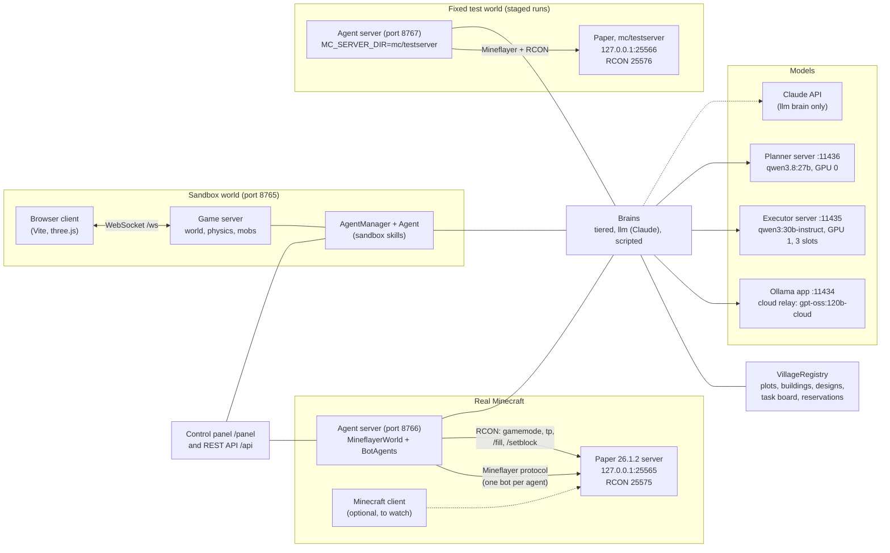

| Component | Where | What it does |
|---|---|---|
| Browser client | `client/src` | Renders the sandbox, sends player input; a human player or a spectator. |
| Game server | `server/src/game.ts`, `serverWorld.ts`, `mobs.ts` | Authoritative sandbox world: chunks, physics, mobs, crafting, saving. |
| Sandbox agents | `server/src/agents.ts` | Agents as real sandbox players, their skills, the building engine, the REST API. |
| Paper server | `mc/` (scripts; jar and world gitignored) | A private Minecraft 26.1.2 server for the agents (offline mode, localhost only). |
| Minecraft agents | `server/src/mineflayer/` | Agents as Mineflayer bots on the Paper server, their skills, the same REST API. |
| Test world | `mc/testserver.py`, `scripts/reset_site.py` | A second Paper server and agent server on the seed's untouched land, restored site by site before staged runs. |
| Brains | `server/src/tieredBrain.ts`, `llmBrain.ts`, `brains.ts` | Decide what agents do. The tiered and llm brains run in either world. |
| Villages | `server/src/village.ts`, `designs.ts`, `buildingGen.ts`, `vanillaPieces.ts`, `streetPlan.ts`, `layout.ts` | Shared project state and building designs (drawn by the architect, by code from its style, or imported from Minecraft's own village pieces), layouts in rows, along streets or round a green, one registry per world. |
| Control panel | `server/panel/index.html`, `server/src/panel.ts` | Live view of every agent's body and brain, maps, the task board. |
| Model servers | `scripts/ollama_exec.py`, the Ollama app | Local models pinned to GPUs; the app relays cloud models. |

## 2. The world interface

The brains and the village logic never import a world. They see an agent only through `WorldAgent` and a world only
through `WorldAdapter` (`server/src/world.ts`). Each world implements both; that is all it takes to host the same
agents.

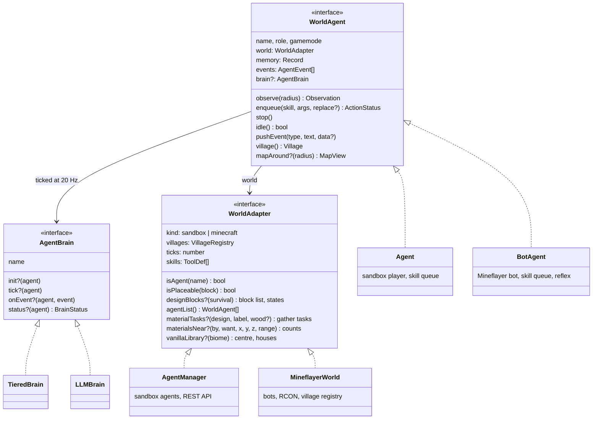

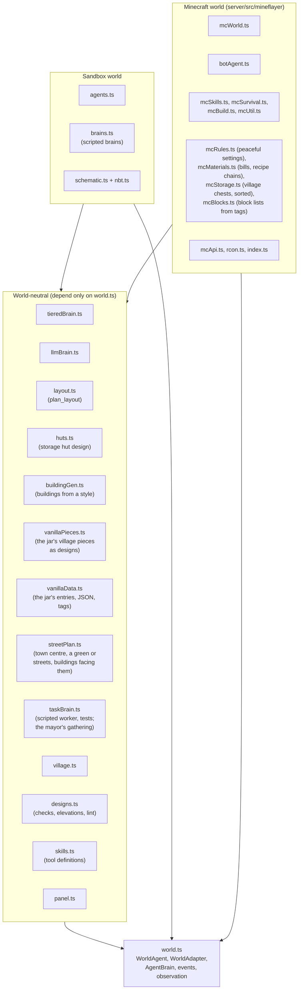

**The contract a world keeps.** Skill names and arguments are the same in both worlds (the brain's tools come from
`skills.ts`; a world lists the ones it has in `WorldAdapter.skills`). Events carry the data the brain relies on:

| Event | Data | Used for |
|---|---|---|
| `chat` | `{from, text, distance?}` | answering people; agent chatter only interrupts when it names the agent |
| `action_done` | `{action, type, args}` | marking a plan step done when the skill it names succeeds with the item it names |
| `action_failed` | `{action, type, args, message}` | the loop guard (same call failed twice: refused for 5 minutes) |
| `damage`, `death`, `pickup`, `crafted`, `broke`, `killed`, `system` | text | urgency, replanning, the panel |

Two optional `WorldAdapter` methods carry the survival economy, so `layout.ts` and the brain stay world-neutral:
`materialTasks` turns a design's bill of materials into gather tasks, and `materialsNear` counts, up to the amounts
wanted, the blocks `collect` would gather for each material near a point (as `collect` reaches them: anything within
40 blocks, only exposed blocks farther out, nothing more than 16 below the ground), in the ground one agent has loaded.
`plan_layout` uses it to refuse designs whose materials are not near the site, and the architect's brief uses it to
say when there is no sand or sandstone. A third, `scoutPoints`, gives the points of a 160-block ring around a new
village's home that the world's map (Minecraft's atlas) does not know yet, for scouting (section 4). The sandbox
implements none of them. A fourth, `designBlocks(survival)`, gives the blocks the architect may draw with and whether
it may write block states: Minecraft's list (`designBlockList` in `mcMaterials.ts`) adds stairs, slabs, fences, fence
gates, trapdoors, walls and glass panes in three woods and the stones, each made only from easily gathered materials in
survival; the sandbox keeps `DESIGN_BLOCKS` without states. `isPlaceable` in Minecraft checks a block's states and
values against minecraft-data. A fifth, `vanillaLibrary(biome)`, gives a biome's vanilla town centre and the houses
that pass the survival checks (`vanillaPieces.ts`, read from the server's jar; section 3); the mayor's brain and
`plan_layout` use the village pieces and the street plan only where a world has it.

## 3. The two-tier brain

`TieredBrain` splits deciding into a slow **planner** (a goal and 3-8 steps, rarely) and a fast **executor** (the
next 1-3 skill calls, every few seconds). A third role, the **architect**, draws building designs on request (in a
Minecraft village only what the vanilla houses of the site's biome do not cover: below). Each
role can use a different model, set per agent in memory (`planModel`, `execModel`, `designModel`, as
`"<provider>:<model>"`).

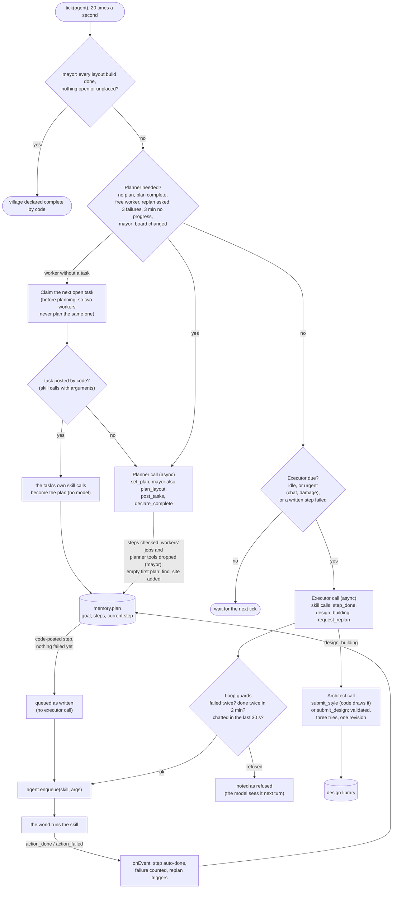

What each model is shown, per call:

| Role | Sees | Answers with | How often |
|---|---|---|---|
| Planner | role, objective, long-term notes, village summary (plots, buildings, designs, storage contents, task board, recent village events, ground others are working on), previous plan, events since the last plan, observation; a worker also its claimed task | `set_plan`; the mayor also `plan_layout`, `post_tasks` and `declare_complete` | on the triggers above; a worker only for tasks a model wrote (code-posted tasks carry their own steps, so in the acceptance runs no worker's planner was called once) |
| Executor | plan with the current step marked, the claimed task, recent decisions, blocked calls, events since its last turn, a trimmed observation (~2k tokens) | 1-3 skill calls, or `step_done`, `design_building`, `request_replan` | whenever the agent is idle, at least 6 s apart; 1.5 s when urgent. A step of a code-posted task is first queued exactly as written; the executor takes it over only after it fails (executors had rewritten such calls: withdrawing logs and depositing them again counted as gathering) |
| Architect | the design rules and format with the world's block list (`designSystem(blocks, states)`: in Minecraft the style first, with an example, then drawing by hand for what a style cannot express, the rules for block states and a 7x7 stair-gable example; in the sandbox a flat-roofed hut), a brief, the existing designs; on a revision, what it submitted, its elevations and the lint notes | `submit_style` (Minecraft: a style code draws) or `submit_design` (layers of spaced symbols plus a palette) | when a `design_building` call is made; up to three tries when the checks send it back (a failed model call is one), one of them a revision when a valid design has lint notes |

Code, not the model, does arithmetic and geometry and cleans up model output: `craft` makes missing planks and sticks,
doors are moved onto an outside wall, the building generator draws roofs, walls and doors from a style and fits the
style to the budget, `find_site` suggests the largest site that fits, `plan_layout` places buildings,
design layers sent as JSON strings (even without their outer brackets) are parsed, tasks written as skill calls are
turned into task text, plan steps given as objects are turned into text (keeping arguments such as a design's name).

Code also keeps the mayor on its job, because gpt-oss drifts back to doing the work itself:

| Guard | What it catches |
|---|---|
| Plan steps that are workers' jobs are dropped | a mayor planning "collect 12 logs, craft a pickaxe" (its executor cannot do them) |
| Hand-written building tasks before a layout are laid out by `plan_layout` | a mayor writing its own gather-craft-build chain |
| Tasks duplicating the layout's are not posted | a mayor re-posting the whole village after one failure |
| A re-posted failed building re-opens the layout task | "Build meeting hall" posted for the failed "Build meeting_hall" |
| `declare_complete` is refused while a layout build is not done | a village declared complete with nothing built |
| No timed review while workers hold tasks; a refused `plan_layout` replans at once | a waiting mayor re-posting gathering every 3 minutes; minutes lost after a refusal |
| Plan steps naming a planner tool (`plan_layout`) are dropped; the planner calls the tool | the executor, unable to call it, ran `find_site` and swapped a 30x30 site for a 24x24 |
| An empty first plan with nothing laid out gets `find_site` added (or is asked again after 10 s); size 40 where the world has vanilla pieces (room for a green; also the first search's floor, until a site is found) | a mayor that waited 3 minutes before doing anything; code's 24x24 site left a street village's house out |
| After the mayor's `find_site`, code fills the library with the biome's vanilla houses and names them in the replan reason (`fillVanilla`) | generated villages that looked alike whatever the land (F113) |
| A repeated vanilla small house in `plan_layout` becomes another of the library's (siblings) | the mayor naming one house twice for "two matching cottages" |
| Completion is checked by code on every tick of the mayor's brain | all three buildings stood, but the mayor had just tried to re-post work, so nothing woke it again |
| `move_to` and `explore` beyond 96 blocks of home are refused or shortened (every member; a new village's mayor may walk up to 256 to its first site) | a mayor wandering 500 blocks for a site; a worker exploring to 180 blocks out |
| Buildings that did not fit are laid out by code at the mayor's next successful `find_site` | the model placing them there only 1-2 times in 10 |
| A poor first site search sends scouts (code-posted, once per village); `plan_layout` waits for them (at most 20 minutes) and code runs `find_site` again when they are back | a mayor left to it would lay the village out on the poor site |

**The mayor gathers while it waits** (V2.3m, survival in a world with `materialTasks`). Once its layout is posted and
its plan is empty, a `TaskBrain` (`taskBrain.ts`) runs beside the empty plan, limited by `pick` (`mayorGatherPick`:
soft "Gather N item for ..." tasks, collect then deposit, logs, sand and dirt before cobblestone) and `notTheTask`. It
runs their skill calls as written, as workers run code-posted tasks, and takes no new task while a plan or an
executor call is due. It hands its task back with `VillageRegistry.unclaim` (no try counted) when the mayor gets a
plan with steps, the village is complete or a second site is needed, or `memory.mayorGathers` is false; "the mine is
busy" (`notTheTask`) hands back the same way and leaves cobblestone alone for 3 minutes. The plan stays empty, so every
wake-up of the planner works as before, and the mayor's gathering is kept out of the planner's and executor's events,
the 3-failure replan, blocked calls and the completion and stuck-board checks. `TaskBrain` waits only for its own
action ids and notices an action stopped without a report; `finish` refuses done and failed tasks. In Minevale21 (1x,
Minevale20's site) the mayor did 8 gather tasks with no extra model calls and the village took 15.0 minutes instead
of 18.0.

### Designs: from a brief to the library

`TieredBrain.design()` runs the architect (phase D, `docs/PLAN.md`). Where the world takes block states (Minecraft) it
offers two tools, `submit_style` first; the sandbox offers `submit_design` only.

```mermaid
flowchart TD
  brief["design_building name, brief<br/>(+ site room, materials near,<br/>the survival note)"] --> call["architect call<br/>(a failed call is one try)"]
  call -- submit_style --> norm["normalizeStyle: enums, odd sizes,<br/>material names read as meant"]
  norm --> fit["capWalls (house 9, landmark 11),<br/>fitSmelts (stone to cobblestone,<br/>glass to panes), shrinkStyle<br/>(largest size within the budget)"]
  fit --> gen["generateDesign (buildingGen.ts):<br/>layers, palette, Design.style"]
  call -- submit_design --> stations["survival: workstations<br/>and chests become air"]
  gen --> check{"validateDesign, obtainable,<br/>no workstations, fits the site,<br/>budget and furnace runs"}
  stations --> check
  check -- "errors (a hand drawing is<br/>pointed at submit_style)" --> call
  check -- ok --> lint{"lintDesign: strong notes,<br/>first valid design?"}
  lint -- "yes: shown back once with<br/>elevations (a style stays a style)" --> call
  lint -- "no, or a revision" --> keep["saved: a revision only<br/>with fewer notes than the first"]
  keep --> library[("design library")]
```

`generateDesign` draws a style (`BuildingStyle`: walls width and depth, wall height, floor, base course, log frame,
wall material, roof gable, hip or flat with its axis, material and overhang, windows, door side) on a grid of the walls
plus the overhang ring. The roof is a height field over that grid (gable: rising from the two long sides to a ridge;
hip: from all four), each cell's block a stair facing uphill or, at the top, a slab ridge; the wall columns are filled
up to the roof, so gable ends are whole, and the inside is left empty (the roof is a shell); a flat roof is one layer
with a slab parapet. Without a floor the inside keeps the prepared ground and a foundation course goes under the walls.
Windows go every other cell from the middle of each wall (sizes are odd, so they are symmetric) and the door in the
middle of its wall. Stair `shape` is left out: `/setblock` and `/fill` compute it from the neighbours (read from the
26.1.2 jar); `stairShape()` is vanilla's rule, for `gen_designs.mts` and `rotate_design.py` to check against. The
generator is world-neutral like `huts.ts`: a `Design` comes out, built, billed and laid out like a drawn one.

`elevations(d)` writes a design's views from the south, the east and above as text, with the palette as a legend; the
architect sees them on a revision and the panel shows them. `lintDesign(d)` gives strong notes (a flat roof by its
stairs, wall gaps bigger than a window and gable ends open above the eaves, from the openings in the wall columns
grouped; a layer empty all round under the roof; walls under 3 high on a building over 7 across) and, for hand drawings
only, weak ones; its definitions were checked on 4,320 generated styles and the stored designs. Every refused try and
the revision's verdict go to the log as `[design]` lines. Doors are placed by the building's edge, not the grid's:
`outsideCells` finds the `_` cells of layer 1 joined to the grid's edge (an overhang's ring, an L's notch), and
`outwardStep` / `doorOutward` give a door's way out, used by `validateDesign`, `fixDoor` and `build_design` in both
worlds. A door with no way out (between two rooms) faces across its wall, and a door on an upper floor is judged by its
own layer.

### Vanilla pieces: designs from the game's jar

Minecraft's own villages are built from pieces stored in the server jar (`data/minecraft/structure/village/`: houses,
town centres and streets for plains, savanna, snowy, taiga and desert) and joined by jigsaw blocks. `vanillaPieces.ts`
reads them at runtime from the local jar (`vanillaJar()`: `MC_VANILLA_JAR` or the default) with the zip reader in
`vanillaData.ts` (section 5) and the structure reader in `nbt.ts`; no piece is copied into the
repository. It is world-neutral like `buildingGen.ts`: a `Design` comes out, and the checks are the caller's.

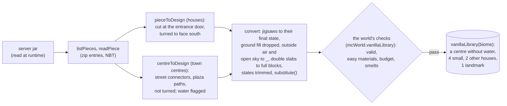

`pieceToDesign` finds the entrance (the `building_entrance` jigsaw, which joins the piece to its street) and the door
nearest it, and cuts the piece at that door's level: layer 1 is the door's level and layer 0 the floor under it, so vanilla's ground fill
below is dropped (plains floors sit a block lower than in vanilla, the entrance step flush with the street). Jigsaw blocks
become their final state; ground in the floor layer, plants, structure void, water and air outside the building (a flood
of layer 1 from the edge) or open to the sky become `_`; double slabs become full blocks (`validateDesign` refuses them);
only the states the server does not work out itself are kept (facing, half, axis, type, open, rotation: stair shapes and
fence sides are the server's, lesson 55); the piece is turned so its entrance faces south. A piece without an entrance or
a door, or whose door opens elsewhere (F124), is refused. `substitute(name, biome, wood)` keeps what the economy makes
(cobblestone, stairs, slabs, planks, logs, fences, trapdoors, doors, panes) and swaps the rest: terracotta by biome
(cobblestone, savanna acacia planks, desert sandstone), smooth sandstone to sandstone, stained glass and iron bars to
glass panes, diorite, granite, andesite, mossy cobblestone and bricks to cobblestone, glazed terracotta to chiseled
sandstone, bookshelves to the piece's planks, wool to a slab of its wood; decoration, lights, workstations, containers,
hay and clay to air. Snow and ice are left for the checks to refuse. Of the 152 house pieces 113 import, 105 are valid and
62 pass the survival checks and budgets (55-189 gather units; taiga's log houses mostly cost over 150, F122).

`centreToDesign` imports a town centre: its walk level (where the street connectors are) is layer 1, it keeps its sides
(the connectors give the streets' directions, `connectors` with a side and offset), its plaza's path cells are listed
(`paths`), and a centre holding water is flagged. `vanillaLibrary(biome, accept)` (cached per biome) takes the biome's
houses that pass `accept`, at most four small houses (siblings: "matching" houses), two others and one landmark (a library
or temple, judged by the landmark budget), and the first meeting point without water that passes (desert has none,
F130). `villageBiome` maps the world's biome names onto the five. Imported designs carry `by: "vanilla"`.

**How the mayor gets them.** When the mayor's `find_site` succeeds and nothing is laid out, `fillVanilla` (`tieredBrain.ts`)
asks the world for the library of the site's biome (`find_site` records the biome in `memory.lastSite`), replaces earlier
vanilla designs (a later site in another biome swaps them; drawn designs stay), sets `village.plan = "street"` and
`village.vanillaBiome`, and adds the list to the replan reason. `MAYOR_VANILLA`, a paragraph of the mayor's prompt where
the world has pieces, says to search with size 40 (room for a green), to use the library in `plan_layout`, to name siblings for matching
houses and the landmark as the hall (one building over the house budget a village), and to draw only what the pieces do
not cover. In Minevale20 the mayor drew no design at all.

### A village, end to end (the survival economy)

```mermaid
sequenceDiagram
  autonumber
  participant M as Mayor (planner: gpt-oss)
  participant L as plan_layout (code)
  participant B as Task board
  participant W as Worker brain
  participant E as Worker executor (qwen3:30b)
  participant S as Skills (Minecraft)
  participant C as Village storage
  M->>S: find_site size 40 (with 30 logs near; the site's biome recorded)
  M->>M: code fills the library with the biome's vanilla houses (fillVanilla), village plan "street"
  M->>S: design_building only for a kind the pieces do not cover (its executor)
  opt the first search finds no site, a small one or too few trees (memory.siteSearch)
    M->>B: code posts scout tasks to ring points the atlas lacks (once per village)
    W->>S: scout x, z (queued as written; the land comes into the atlas)
    M->>S: code runs find_site again when the scouts are back; plan_layout waited till then
  end
  M->>L: plan_layout ["plains_small_house_1", "plains_small_house_2", "plains_library_2"]
  L->>S: materialsNear: are the materials near the site, as collect reaches them?
  L->>L: a green round the town centre (a 40 site), else streets; each building turned to face one (else rows)
  L->>B: prepare the plot (streets laid as dirt_path); set up the storage (4 chests into the storage hut's spots); gather for the hut, build it
  L->>B: gather tasks per building (after the storage); builds at x, z (after the hut)
  opt the site holds only some of the buildings
    L->>B: lay out the ones that fit (at least half); the rest wait as unplaced
    M->>S: find_site again
    S->>L: code lays the unplaced buildings out on the new site
  end
  W->>B: claim "Gather 12 logs for cottage 1"
  B-->>W: its steps: collect block=logs count=12, deposit item=all (the plan, no planner call)
  W->>S: collect(block=logs, count=12), then deposit(item=all), queued as written (no model call)
  S->>C: deposit: logs into the logs chest (sorted by material group)
  opt a step fails (logs out of reach)
    W->>E: plan, the failure, observation
    E-->>W: another way (e.g. collect elsewhere within 96 blocks)
    W->>S: enqueue
  end
  W->>B: finish (plan complete); claim "Build cottage 1" when its gather tasks and the hut are done
  W->>S: build_design cottage x, z
  S->>C: withdraw what is missing; craft planks, doors, smelt glass
  alt still short (gathered logs went elsewhere)
    S->>B: post gather tasks for the shortfall, put the build back behind them
  else everything in hand
    S-->>W: action_done: cottage recorded, placed 81 blocks
  end
  alt the mayor declares it
    M->>B: declare_complete (checked: every layout build done)
  else code, on the mayor's next tick
    B-->>M: every layout build done, nothing open: declared complete by code
  end
```

## 4. Villages

A village is shared state for agents building together, saved to `villages.json` next to each world
(`server/worlds/<world>/` for the sandbox, `mc/server/` for Minecraft). Roles come from memory: `villageRole: "mayor"`
coordinates, everyone else in the village is a worker.

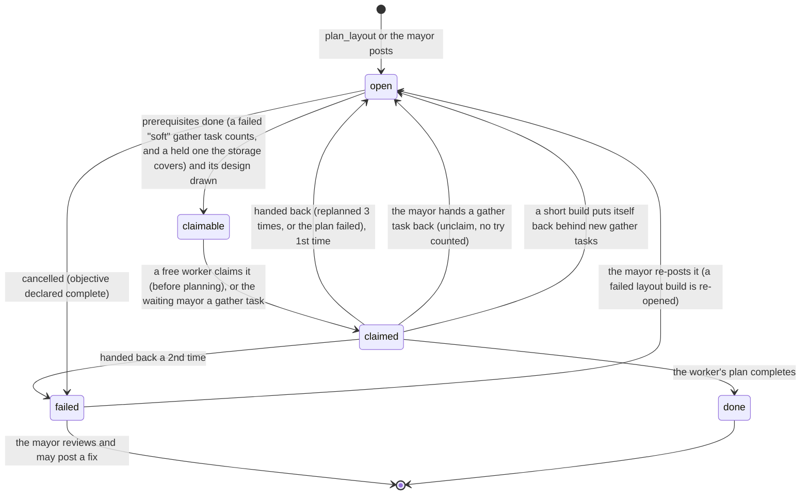

| Record | Written by | Purpose |
|---|---|---|
| Plots | `prepare_site` | Level ground, with its height, so buildings go on prepared land and plots can be extended at the same level. |
| Structures | `build`, `build_design`, `build_box` | Footprints: nothing is built on top of them; "a cottage already stands here" ends duplicate work. |
| Designs | the architect (by hand or as a style the generator draws), `fillVanilla` (vanilla houses, `by: "vanilla"`), the API, schematic import | The design library for `build_design`: layers of palette symbols (in Minecraft with block states such as `oak_stairs[facing=south]`), validated by `validateDesign` (`designs.ts`): sizes, the block list, states, a door of any wood in an outer wall (by the building's edge), `waterlogged` dropped, double slabs refused, and for drawn buildings the rain test (every open cell of layer 1 covered) and the solid-roof check (at most 2.5 blocks a column above the inside). A generated design keeps its style (`style`, also when posted through the API): layouts pack it by its walls and its build claims its own area. |
| Task board | `plan_layout`, the mayor, short builds | Tasks with prerequisites (`after`), claims, results, tries; gather tasks are `soft` (their failure does not block the build, which checks its materials itself). |
| Storage | `deposit`, `withdraw`, builders (Minecraft) | The village's chests, each one's material group in a sorted storage, and what each held when last opened; shown chest by chest in the planners' village summary and the panel. |
| Storage hut (`storageHut`) | `plan_layout` (a new village's first economy layout) | The hut's footprint and its nine chest spots in the order chests go down; `deposit` fills them, the stuck rescue teleports to its door. |
| Reservations | building skills while they run | Ground another agent is working on; `find_site` and other jobs avoid it (renewed while working, 3-minute expiry). |
| Layouts (`layouts`) | `plan_layout` | Each laid-out plot with its buildings, before any ground is prepared: site searches and later layouts, this village's or another's, keep off it. A street plan's plot also keeps its streets, door paths and plaza (`streets`), which `prepare_site` lays as `dirt_path`, and a green village's plot the green inside its ring (`green`), kept free. |
| Plan (`plan`, `vanillaBiome`) | `fillVanilla` (both), `POST /api/village/:v/layout` (`plan`) | "street": the first plot is laid out round a green or by the street plan; the biome the vanilla library came from, whose town centre the plan uses. |
| Unplaced (`unplaced`) | `plan_layout` | Buildings that did not fit on the site: shown in the village summary, laid out by code at the mayor's next successful `find_site`; completion waits for them. |
| Unavailable (`unavailable`) | `collect` (Minecraft) | Materials found nowhere near the village (sand): the first failed collect closes their other open gather tasks, and code posts no gathering for them until the next layout clears the list. |
| Scouting (`scouted`, `scoutRerun`, `scoutDone`) | the mayor's brain | When code posted scout tasks, ran `find_site` again after them, and when that search ended; scouting happens once per village. |
| Mine (`mine`) | `dig_mine`, `collect cobblestone` (Minecraft) | The mining hut, the stairs (first step, direction, steps, `level` once in stone), the main tunnels (`legs`: start, level, direction, cells dug in their fixed order, branches cut short, why it ended, turns tried), the stairs down to deeper levels (`down`: start, steps, `level` or why they stopped), what the mine gave and the ores its cells laid open (`got`), and why it stopped; mines from before V.5b load as one leg (`upgradeMine`). Who digs which tunnel is kept in memory only, per trip. |

Every village member stays within `VILLAGE_RANGE` (96 blocks, `village.ts`) of the village's home, `villageHome`: the
first layout or plot, else the first storage chest, else where the mayor started (`memory.origin`). `move_to` and
`explore` beyond it are refused or shortened, `collect` walks back first and searches from there, and `find_site`
walks at most two 40-block legs without leaving it. The exception is a new village before its first layout
(`SCOUT_RANGE`, 256 blocks from where the mayor started): its mayor's first `find_site` (which writes a verdict, good,
small, treeless or none, to `memory.siteSearch`) and its walk there, and the `scout` skill. A poor first verdict makes
the mayor's brain post scout tasks, one per worker, each a run of the ring points `scoutPoints` returns (none on land the
atlas knows); `scout` walks toward a point, waits for the atlas to take in what came into view, and never fails.

### Layouts: rows, streets or a green

`postLayout` (`layout.ts`, behind `plan_layout`) packs buildings in rows (`layoutBuildings` in `village.ts`, a plot of
up to 32x32) unless the village's plan is "street" and this is its first plot; then `streetPlan.ts` lays the plot out
(up to 40x40) as vanilla lays out a village, in code, and the content comes from vanilla: the town centre of the
library's biome (`v.vanillaBiome`, else the site's) is added to the buildings, and a repeated vanilla small house is
swapped for another of the library's (siblings).

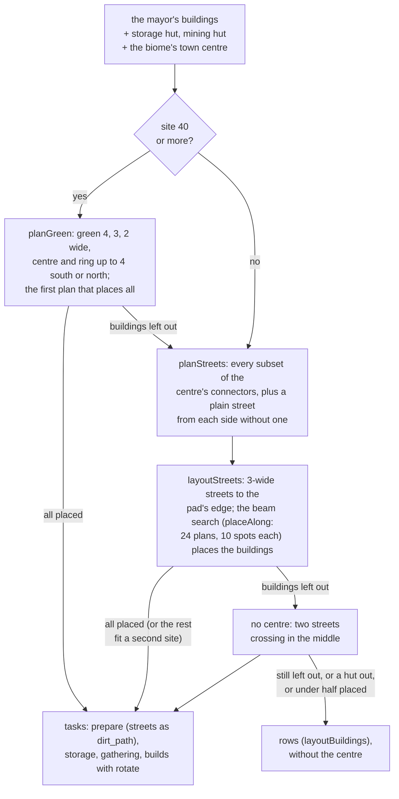

`layoutStreets(cx, cz, size, centre, items)` puts the centre in the middle of the pad and a 3-wide street from each of
its connectors to the pad's edge (without a centre, two streets crossing in the middle). Each building is tried at the
four turns (the storage hut only as drawn: its chest spots are not turned) at spots where its door's way out (`doorOf`:
the door opening south, nearest the middle of that side) reaches a street, directly, its entrance step touching the
street as vanilla's houses touch their street pieces, or by a path of up to 4 blocks. A spot must lie inside the pad a
block in from its edge, off the streets, paths and anything kept free, and 2 blocks from every other building and the
centre (each build claims a block round its own area, so 1 put two neighbours' claims on one cell, F129). The mining
hut's stairs run out its back, so the ground behind it to the pad's edge must be free and stays so; its turn is the
plan's. Spots are scored by distance from the middle, path length and the ground kept behind the mining hut. The huts go
first, then the largest buildings; a beam search keeps the best partial plans (most placed, then lowest score), each
with its best spots or without the building (a greedy first choice left half the pad unused). `planStreets` tries the
centre's connectors in every combination, with a plain street from each side vanilla leaves without one (the storage
hut, never turned, needs an east-west street), and takes the plan that places the most, then the one with more of
vanilla's streets, more streets, buildings nearer the middle.

`postLayout` takes the street plan unless it leaves buildings out where rows would place them all, leaves out more than
half of the mayor's buildings, or leaves out a hut; a centre that leaves buildings out gives way to crossing streets
first (savanna's only centre without water is 13x12 and sent a hall to a second site), and a centre whose materials
cannot be had is dropped, never sent back to the mayor. Each build task carries its `rotate`. The plot's record keeps the
streets, door paths and the centre's plaza; `prepare_site` lays them as `dirt_path` while levelling, free (a shovel's
work: building streets as designs collided with every build's claim). Later sites get rows. A 32x32 pad holds a centre,
its streets and four or five buildings (F130), so the street plan now takes up to 40 (at 32 it left a house out in
four biomes of five).

**A green** (V2.4, the user's choice). On a site of 40 or more `postLayout` first tries `planGreen`: `layoutGreen`
puts the centre in an open green `g` blocks wide round it, a 3-wide ring street round the green, and spokes from the
centre's own connectors across the green to the ring; the same beam search (`placeAlong`) places every building
outside the ring with its door's way out on the ring (a door onto a spoke would stand on the green), and the green is
kept free of buildings and paths. `planGreen` tries greens 4, 3 and 2 wide with the centre and ring at the pad's middle
or moved up to 4 blocks south or north (the storage hut, never turned, opens south and needs room north of the ring),
at most 27 layouts, and takes the first that places everything; otherwise the street plan as above. Offline, plains,
savanna and snowy get greens with 6 buildings (7 with a fifth house) and taiga with 5; desert, with no centre, keeps
crossing streets. The vanilla mayor searches with size 40 (its prompt, the code-added first step and the first
search's floor); a 40 search that finds a site of 26 or more is good enough for the street plan and sends no scouts.

## 5. Skills in each world

Both worlds run skills from a per-agent queue, one at a time, with the same names, arguments and failure messages.

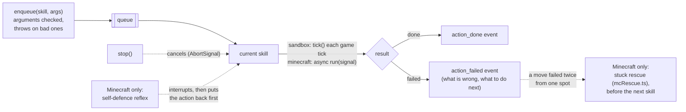

| | Sandbox (`agents.ts`) | Minecraft (`server/src/mineflayer/`) |
|---|---|---|
| Body | a sandbox `Player` driven by input each tick | a Mineflayer bot (client-side physics, half-width 1229/4096 to stay in step with the server: with 0.3001 a bot stopped at a wall face ended up 4e-16 inside the wall at faces ±4, ±128 and ±1024, and Paper's clipped-into-block check refused every move into it without a log line; F147) |
| Walking | own A* Navigator (opens doors, digs out in creative) | mineflayer-pathfinder with a stuck/timeout watchdog (`walkOnce` in `mcUtil.ts`: stuck after 10 s without horizontal progress over 0.5 or a new block level, samples after a server set-back not counted; the error carries `moved`, the horizontal blocks the walk got, and a stall or time-out under one block is `unmoved`; every stall logs a `[stuck]` line, section 8; a path that has been empty for over 1 s short of the goal, with no search going on, gets the goal set again, twice a walk at most, logged as `[repath]`), the pathfinder (2.4.5) patched by patch-package (`patches/mineflayer-pathfinder+2.4.5.patch`) so that a path holds copies of the A* nodes (it post-processed a partial path in place, and the search, going on, judged the goal on the moved coordinates: a cell 3.6 from a range-3.5 goal was accepted and the walk idled a cell short; F148), digging natural blocks only, opening doors (its own door support covers fence gates only; `moves()` adds doors), never digging into or placing blocks on any village's ground (`exclusionAreasBreak`, `exclusionAreasPlace`), avoiding water (and swimming out of it), diagonals only with both sides clear, legs of ~40 blocks for long walks, a retry with longer drops |
| Crafting | recipes applied to the inventory | the recipe from minecraft-data, carried out by server command: ingredients counted and taken (`/clear`), the result given (`/give`); a table recipe still needs a table placed nearby |
| Gathering | `collect`, `mine` on sandbox blocks | `collect` resolves names in code (logs, cobblestone from stone, deepslate ores), picks the cheapest block to reach (near, not deep below, in the open, away from water), crafts a wooden pickaxe when stone needs one, stays within 96 blocks of the village and no more than 16 below it, and never mines inside any village's buildings or plots (2-block margin); a log fells its whole tree (`fellTree`: the logs in reach from the ground, then a dirt pillar under the feet, dug back down, with the pillar checked on the server afterwards); a fallen tree (a straight row of lying logs of one kind, touching nothing built, outside every village) is cut from the ground, while stumps and other logs without leaves are builds, passed over in the candidate search without a failure; a giant tree (more than max(40, 2x the logs wanted + 20) logs) is passed over while an ordinary tree is near and felled whole only as a fallback; in a village the first search that finds no sand fails the task and marks sand unavailable (section 4); a candidate is dry when no water comes in from above, also through the sand or gravel stacked on it (`wetOver`), and a buried one also needs none beside it (`wetSide`; seagrass, kelp and bubble columns count as water, F137: a tunnel to sand under a lake bed flooded); after each block or tree, side pickups take open blocks of other materials the village still needs within 4 blocks (`sideGather`), only at or above the feet, never the bot's own column and none with water beside or above (F136, F138: pits at a lake shore flooded or trapped the gatherer); every block search goes through `nearestBlocks` (`mcUtil.ts`), which reads state ids from the loaded chunk sections itself (`scanBlocks`: sections whose palette or single state lacks the block, or outside the caller's y window, are skipped, and filters, reading with `stateAt`/`exposedAt`/`wetOver`/`wetSide`, run on matches only; Mineflayer's `findBlocks` read all-air and all-stone sections cell by cell, 2.4 s for a futile desert search, now ~3 ms), and slow searches are logged as `[search]`; it gives up after 3 tries (one per tree) or 90 s and shares unreachable blocks and targets between bots; every dig through `mineBlock` (`mcSurvival.ts`; sand and gravel aside) is checked on the server (`execute if block` every 150 ms for up to max(450 ms, 4x the dig time)): Mineflayer writes air when its own dig timer ends, while Paper breaks the block only when it agrees the dig finished, so a block still there is put back in the bot's view and dug once more, then the dig fails (logged as `[dig]`; F147: a tunnel cell left stone on the server set back every walk through it) |
| Stuck rescue | none | `mcRescue.ts`: two failed moves within 3 blocks in 6 minutes (including a timed-out walk that got nowhere; `BotAgent.movedFailed`) run in the reflex's slot: swim up, walk out (away from the goal of a walk that stalled from the same spot in the last 2 minutes first, `BotAgent.lastStall`, then to either side, then toward it), climb out through natural blocks (pillaring with dirt or stone), and last, teleport beside the village storage (in front of the storage hut's door when there is one); survival only. A walk-out counts only when the bot is out (`isOut`): a village member when a path home exists (`getPathFromTo` with the walks' own `moves()`, a search only, one slice a physics tick; no path means sealed in, which also skips the walk-out; a search that times out counts as out), a bot in no village under the open sky (leaves aside). A village member on village ground (`protectedGround`: the mine, plots, buildings) is not climbed out, and the climb never digs or pillars into any village's ground: the teleport follows (F131: a walk 7 blocks along a sealed mine tunnel had counted as out) |
| Building | `BuildJob`: blocks placed one by one, paced by `buildSpeed` | `/setblock` and `/fill` over RCON, paced by `buildSpeed`, vertical runs merged, a door's two halves in one command; the builder stands outside the job's claim (plot and margin, or footprint + 1: `standSpot`, 3 blocks off it to the south, north, east or west, near the job's level, on the village plot or its margin first, off the village's buildings, laid-out footprints and mine, walked to without scaffolding), and no block is set inside a player (the builder walks out, other bots are teleported to its stand spot, people's cells wait to the end of the job); `prepare_site` takes plots up to 40x40 (its block cap scaled with the area; a preparer walks to the plot's middle when part of it is not loaded) and then checks its plot: cells unlike the plan are run once more, every plot column must pass the build's ground rule (odd ones confirmed over RCON), else it fails saying where; in survival each run is charged to the inventory (`/clear`) after a material check, with crafting from storage and a requeue when short |
| Storage | none | `deposit` and `withdraw` against the village's chests (`mcStorage.ts`), sorted by material group in a storage hut; `openChest` gives up at once on an `unmoved` stall more than 6 blocks from the chest (within 6 it tries only the nearest side spot), and callers that would go on to other chests rethrow it, so a bot that cannot move reaches the rescue after two failed actions |
| Safety | none | reflex: fight back with a weapon, run when unarmed, hurt or near a creeper |
| Spawning | `game.join` | a bot joins; RCON sets game mode, teleports, `reset` clears inventory and returns it to spawn; a spawn without a height uses `spreadplayers`, which refuses water: then the nearest dry land within 16, then 64 blocks, else a drop from y 120 |
| Game speed | fixed | `MC_TIME_SCALE` (tests only): the server's tick rate (`tick rate 40` over RCON at start, `mcRules.ts`) and the bots' physics clock (a patch-package patch on Mineflayer 4.39.0) run faster; build pacing, smelt polling, jump-and-place waits and the pathfinder's search budget follow; digs stay in real time (Paper times them by the wall clock) |

### Building in Minecraft

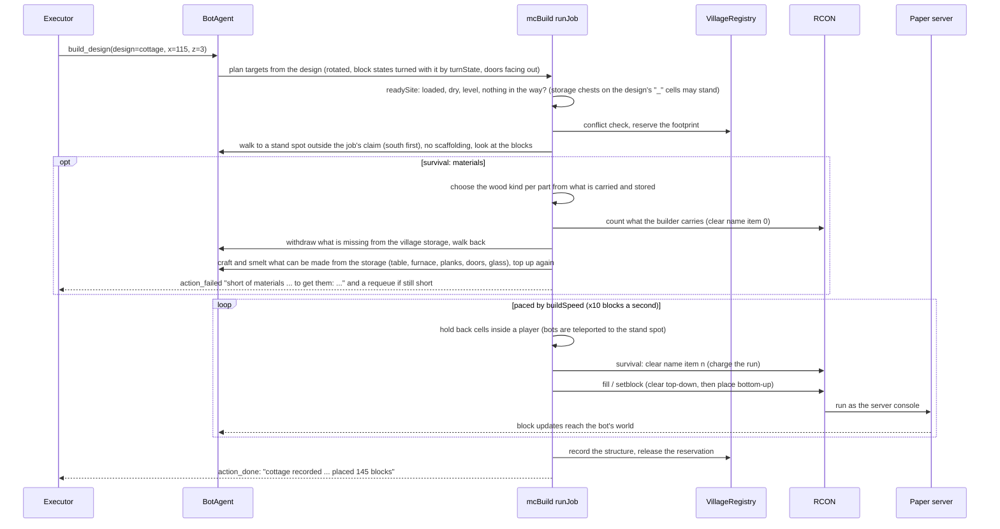

`turnState` (`designs.ts`) turns a block's states clockwise with the building: `facing` north, east, south, west;
`axis` x and z swapped on odd turns; a fence's or pane's sides; a sign's `rotation`. Stair shapes, halves and slab
types stay, and doors are left to the builder's own facing (`doorOutward`: out of the building's wall, which an
overhang's ring moves in from the grid's edge). A resumed build counts a block as there only if its
`facing`, `half`, `axis`, `type` and `open` match the target (`alreadyThere`), so a stair the wrong way round is set again.
A design with an overhang claims only its own area while it builds (its eaves are the clearance: layouts pack such
buildings by their walls, so two neighbours' eaves meet over a 2-block street), and the way out in front of each door is
cleared only where neither the design's own cells nor another building of the village, built or laid out, stand.
The stand spot keeps off buildings and the mine because in a street plan "3 south of the claim" was the mining hut
across a 3-wide street: a builder's footing search found its roof and the walk there pillared dirt in front of the hut's
doorway, sealing the mine (F131).

### Vanilla's data from the jar

Where the game itself has the answer, the Minecraft adapter reads it (V2.5). `vanillaData.ts` (world-neutral) reads the
Paper jar on this machine at runtime: `listEntries`, `readEntry` and `readJson` on the zip (central directory, stored or
deflated entries, Node's zlib), and `tag(kind, name)` / `itemTag`, a tag's members with the tags it names resolved
recursively, cached per process and only once complete. `vanillaJar()` is `MC_VANILLA_JAR` or
`mc/server/versions/26.1.2/paper-26.1.2.jar`, resolved against the repository's root. Mojang's data is never committed:
nothing read from a jar, or derived from it, is written into the repository.

| Consumer | What it reads | Without the jar |
|---|---|---|
| `vanillaPieces.ts` | the village pieces (section 3) | `vanillaLibrary` returns nothing: no vanilla houses, the architect draws every building |
| `mcMaterials.ts` (`smeltOptions`) | every `minecraft:smelting` recipe, tags expanded; inputs a plan cannot get (ores, gear, unobtainable or ungatherable items) left out, a family's inputs merged into its `any:` token, the old table's input first. Stone smelts from plain cobblestone only (vanilla turns cobbled deepslate into deepslate); mushroom stems are not logs | the hand table (`SMELT_FALLBACK`, 11 entries) |
| `mineflayer/mcBlocks.ts` | the adapter's block and item lists (`DEFS`: each a union of tags, other lists and extras, minus exclusions): natural ground and what prepare_site clears, `NON_GROUND` for find_site's surface read, `TREE_LOG` shared by find_site, collect and felling, what walks, the mine and the stuck rescue may dig, water, falling blocks, junk and tools for `deposit`, the atlas's logs, leaves and water | every list from the hand rules they replaced (`HAND`), all or nothing |

Each consumer builds its table once, on first use, and logs one `[vanilla]` line saying where it came from (or why it
fell back). In `mcUtil.ts`'s per-state tables (`stateTables`), waterlogged states of blocks with an empty box (coral
fans, glow lichen under water) count as water, as find_site's surface read takes them; `wetAt` and `openAt` read them,
and the mine shares collect's wet table. Mushroom stems are cleared by prepare_site but are not logs.

Three offline checks compare the hand-made data with vanilla's (section 8). The renderer's colours come from the
client jar instead (Paper's has no textures), through `scripts/vanilla_colours.py`.

## 6. Models and GPUs

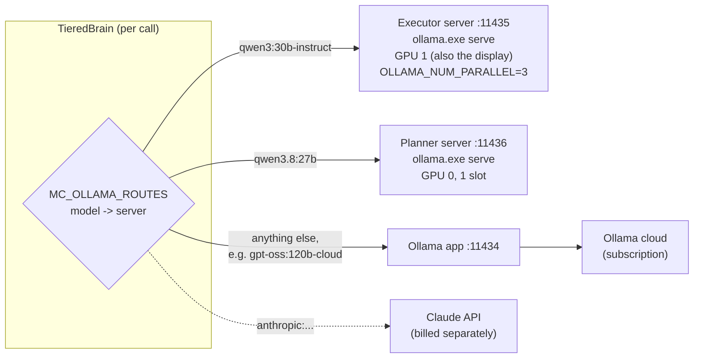

| Role | Model (as used in the Elmfield and Ashvale runs) | Why |
|---|---|---|
| Mayor's planner, architect | `gpt-oss:120b-cloud` | ~3.5 s per plan, ~9 s per design, valid designs; about 10x faster than gemma4:31b |
| Workers' planner | `qwen3.8:27b` | tight one-step plans (6/6 against 2/6 for qwen3:30b); in the village economy it is not called at all (`plan 0x0ms` in every acceptance run), since tasks posted by code carry their own steps; it will matter for tasks players ask for in chat |
| Executors | `qwen3:30b-instruct` | a mixture of experts (~3B active): ~2 s a turn, as accurate as larger models when the plan is clear |

`scripts/ollama_exec.py start` runs the two local models on their own `ollama.exe serve` instances, pinned to a GPU
by UUID (CUDA and nvidia-smi number the cards differently here), after unloading them from the Ollama app: left to
itself, the app split a model across both cards and Windows silently spilled the rest into system RAM (60x slower).
It loads each model, checks it is fully in VRAM and times it. The servers start with `OLLAMA_VULKAN=0`: Ollama turns
its Vulkan backend on by default, and Vulkan ignores `CUDA_VISIBLE_DEVICES` (it put the executor on the planner's card).

Ollama's own "in VRAM" figure is not enough: once it reported "20383 of 20383 MB in VRAM" while nvidia-smi showed
1.3 GB on that card (Windows' shared GPU memory counted as VRAM), and the executor ran at 2.7 tokens a second; a model
fast at start-up can degrade like this later. `ollama_exec.py start` and `status` compare each card's used memory with
the model pinned to it and print a WARNING when it does not fit; then stop and start the servers. The brain sends
`keep_alive: -1` for routed models, so they stay loaded between runs.

## 7. The control panel

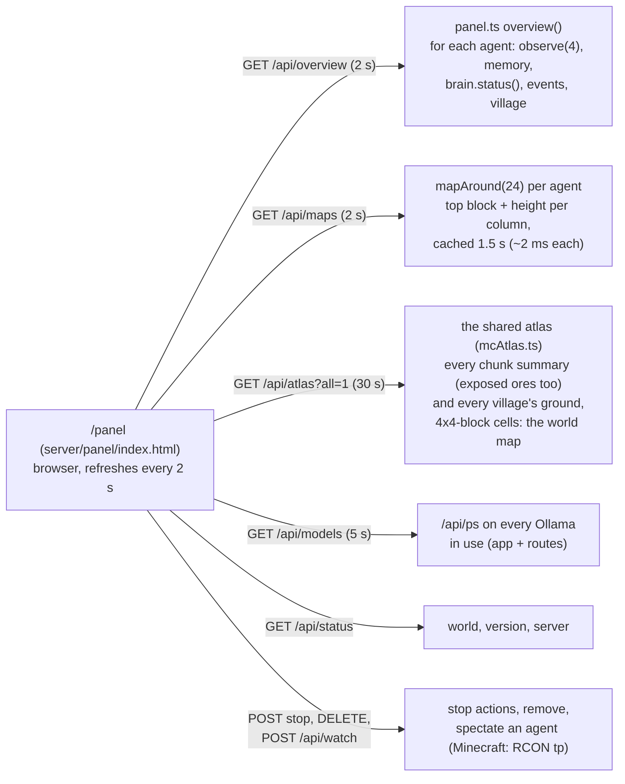

Each agent's card shows: the brain's state (planning, thinking, acting, waiting, idle, backing off, done: since when
and why), health and food, position and biome, objective and task, the plan as a checklist, the current action, blocked
calls, a top-down map (terrain, facing, mobs, players, target, plots, buildings, reserved ground), what the executor and
the planner last saw (the exact user prompt) and answered, recent decisions and events, inventory and model stats. The
village section shows the task board, buildings, plots, designs (each opens to its elevations, as the architect sees
them; `overview()` adds them), the storage contents (chest by chest with each one's
material group, "chest 1 (logs): 64 oak_log, ...", when the chests are sorted), reservations and the village log.

In Minecraft, every village (in the simple view too) has a map of the **shared atlas** (`mcAtlas.ts`): one summary per
chunk any bot has received, shared by every agent and village and saved to `mc/server/atlas.json` at most every 30 s.
A summary holds the ground's lowest, median and highest height and how flat it is, water and lava columns, log blocks
by wood kind (and how many stand within 5 blocks of the ground), the surface materials, and a 4x4-block grid of heights
and covers for the map. Bots report chunks as they arrive (`chunkColumnLoad`) and changed blocks (`blockUpdate`,
summarised again after a minute); the world's tick works the queue off within 3 ms per tick. The scan reads block
state ids straight from the chunk through a lookup table per state, starting at the highest section that is not all
air: ~0.1 ms a chunk (99th percentile ~0.6 ms), against ~7 ms with `bot.blockAt`.

Underground (V.6), `exposedOres` records the ores exposed to air: in cave walls, ravines, cliffs and mine tunnels. It
reads the sections from the bottom up to the highest one with blocks and passes over every section whose palette names
no ore (most of them). An ore counts when one of its faces inside the chunk touches air or cave air (a face across the
chunk's edge is not seen: the next column may not be loaded); per kind (deepslate ores counted with the others) the
summary keeps how many and the lowest and highest y (`ores`). The rescan a minute after a change shows ores mined out
or newly laid open. `mine` names the village whose mine has dug in the chunk (`atlas.mined`, called for every cell the
mine digs; kept through rescans). With the ore scan a summary costs ~0.4 ms a chunk (median; 99th percentile ~1.3 ms)
and ~100 more bytes in `?all=1` when it has ores; the panel's pointer shows them.

`find_site` reads the atlas (step 2.3, `mcSiteAtlas.ts`): when the column survey around the bot finds nothing good, an
agent in no village or a mayor looking for its first site asks `atlasSites` for areas worth a look: squares of 4x4
cells, nearly all known, none water, lava or built, their mean heights within 5 of each other, off every village's
ground, ranked by height range, trees on them, distance, and logs within 48 and sand within 96 at the site's height.
The cells are too coarse to choose the square, so the bot walks to the best candidates (the best first, then the
nearest; 300 blocks of walking in all) and the column survey there picks the site. `collect` from the atlas is still
planned (`docs/PLAN.md`, phase 2).

## 8. Testing

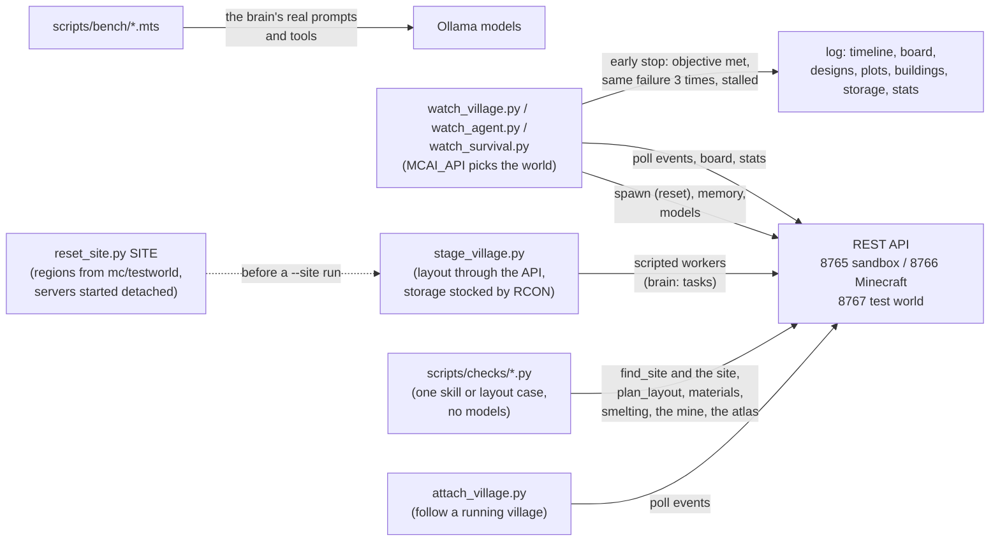

Tests go from fast to slow. `npm run typecheck` first. `scripts/checks/` then checks one piece of the survival
village's code in seconds to a minute, without models: `find_site.py` (site search, wood, walking legs),
`layout_small_sites.py` (partial layouts, second sites), `materials_near_site.py` (plan_layout's material counts),
`treeless_site.py`, `smelt_fuel.py`, `mine.py` (the mine's cells against a snapshot of its level from `/api/blocks`:
nothing dug outside the plan), `atlas_ores.py` (the atlas's exposed ores against the blocks), `site.py` (find_site's
reported ground, height range, trees and wood count against the blocks of the site and prepare_site's margin; it found
that the column scan started 32 blocks above the bot, so a higher hill read as flat, treeless ground: the scan now
climbs to the column's top first; and that the wood count, floored at the bot's height, missed a valley's trees seen
from a hill), `fell_trees.py` (whole trees and fallen ones, and what is left around them), `search_cost.py` (plan_layout's
material counts and find_site's searches timed at a spot, through `GET /api/agents/:name/near`), `rotate_design.py` (a
stair-gabled test house, a design from a file or a style for the generator, built at four turns, its states and stair
shapes compared through `/api/blocks?states=1` with what `gen_designs.mts` says the build should show); `test_rescue.py` traps Gus in a pit, a box, a pool or a sealed tunnel (`tunnel`: the rescue must not end with him still inside).
Some checks need no server at all: `gen_designs.mts` generates every roof type at several sizes, with and without an
overhang, and checks each design (validation, the door, stairs facing uphill and their shapes by vanilla's rule, whole
walls, a covered inside, the bill, no lint notes), then validates every stored design again; `render_design.py` draws a
design or a box from `/api/blocks` as an isometric PNG (phase D's renderer; colours averaged from the client jar's
textures by `vanilla_colours.py`, `MC_CLIENT_JAR`, or its hand table with `--colours hand` or no jar; PNGs go to
`runs/renders/`); `vanilla_tags.mts` (the block and item lists from the tags against the hand rules, and the
waterlogged states), `vanilla_recipes.mts` (the smelting table against the jar's recipes and the old hand table, whose
outputs it must keep; crafting against minecraft-data's; every stored design's and vanilla piece's bill planned each
way) and `vanilla_drops.mts` (`collect`'s target blocks against the loot tables) compare our data with vanilla's,
printing only; `village_pieces.py` surveys the vanilla
village pieces in the Paper jar; `vanilla_pieces.mts` imports every house piece (or, with `KIND=town_centers`, every
town centre) and checks each as the architect's survival designs are checked, with a report per biome (`OUT=` writes
the designs for `contact_sheet.py`, which tiles their renders by biome, and for `rotate_design.py --design`; renders of
pieces stay private); `street_plan.mts` lays out each biome's library with both huts and checks the plan (inside the
pad, off the streets, 2 blocks apart, every door's way out on a street, the storage hut unturned, the mining hut's back
at the edge; with `PLAN=green` and `SIZE=40`, greens, with nothing on the green and no door onto it). `stage_village.py` sets a
village up at a stage and runs scripted workers (`taskBrain.ts`: they run the skill calls each task spells out), so
the economy's code is checked in one to ten minutes with no model involved (its test designs include `stairhut` and
`stairhall`, with stair gable roofs, and `genhut` and `genhall`, drawn by the generator; `--design-file` takes a design
from a file, such as a vanilla piece, and `--plan street --biome B` the street plan (a green on a 40 site); `--mayor` adds a tiered Mayor with
its layout posted and an empty plan, which gathers while it waits, `--planner none` for no planner). The benches (`modelbench`,
`execbench`, `planbench`, `mayorbench`, `designbench`) replay the brain's real prompts against a model in seconds per
case (`mayorbench` with the vanilla library's prompt line and case, `VANILLA=0` without); `designbench` offers both design tools as the brain does (`STYLES=0` for hand drawing only, `REVISE=1` for the
revision round) and reads each design's roof shape, blocks, gather cost, lint notes and validity, on 10 or more samples
a case. Only then do
model-driven village runs test behaviour. `watch_village.py` probes for land (in survival, skipping ground with too
few trees) and spawns the village at the site it found (`MCAI_NO_PROBE=1` starts it at the given point instead, for
scouting tests); when a watcher dies mid-run (background tasks stop with the
session that started them), `attach_village.py` follows the running agents instead.

Staged runs and checks are made faster and repeatable in two ways (`docs/PLAN.md`, phase T). `MC_TIME_SCALE=2` runs
the game and the bots at 2x (section 5's table): walking is 1.94x faster and a staged build takes 1.5 instead of 2.2
minutes, but mining is not faster, since digs keep their real-time length; model-driven acceptance runs stay at 1x.
The **fixed test world** is a second Paper server in `mc/testserver` (25566, RCON 25576, agent server 8767 with
`MC_SERVER_DIR=mc/testserver`) generated from the same seed, with a snapshot in `mc/testworld` (`mc/testserver.py`).
`reset_site.py SITE` stops both test servers, copies back the site's region, entity and poi files (whole 512x512
regions), removes the villages and atlas chunks tests made there, and starts both servers again detached from the
calling shell (servers run as a Claude session's background tasks were stopped at the task's time limit).
`stage_village.py --site SITE` then uses the find_site result recorded in `scripts/test_sites.json`: two runs on one
restored site gave the same plot, the same mine and the same time. The sites cover woods with sand, hills, a drop and a
shelf (a plot against a drop, whose mine meets the hillside); `site.py` and `fell_trees.py` reach the test world's
agent server through `MCAI_API`. `region_blocks.py --compare` checks a restore
against the snapshot without a server. `stage_village.py --site-at X,Y,Z,SIZE` takes a site find_site gave elsewhere
(in jungle, where a probe spawned by x,z lands on the canopy).

The agent server runs every bot on one Node event loop, so a slow synchronous step stalls them all: it logs any stall
over 2 s as a `[lag]` line with each agent's current action (`mineflayer/index.ts`). 2-3.5 s while bots join is
expected (a site search's log scan stalled as long until `nearestBlocks` got its own scanner, 2026-10-03); a stall over
~30 s made Paper time out every bot at once.

A walk that stalls, or times out (short pickup walks given under 10 s aside), logs one `[stuck]` line (`stuckLine` in `mcUtil.ts`): where it
stood and was going, how far it moved, the goal (kind, cell, range, whether it is still set, whether the floored position
is an end), whether the path is empty and since when and where, a tally of the walk's physics ticks (controls held, on
ground, in water, busy digging or placing, idle without a path and of those with no goal, y range, horizontal spread),
the server's set-backs (`forcedMove`) with the corrected position, the blocks round the feet and the pathfinder's
recent events (a ring of 16, repeats folded with their last time; each path update gives its last node and whether the
goal accepts it; `BotAgent.listen`). Reading it: forward off most ticks means the pathfinder stood still; jump on with
set-backs means the server refused the moves; an empty path whose last update ends "NOT end" means the pathfinder idled
short of the goal (F148; walkOnce now searches again, `[repath]`).
A walk set back 20 times or more also logs `[stuck-world]`: the blocks round the bot's feet and head that the server
(`execute if block` over RCON) does not have as the bot sees them. Both found F147 (the half width, and a dig Paper
never finished); a re-dig after such a dig is logged as `[dig]`.

Agent names are fixed (Gus for single-agent tests; Mayor, Worker1, Worker2 for villages) so they are easy to find in
the world. There is no unit test suite: `npm run typecheck`, then agents are run.

## 9. The village economy (real Minecraft)

Villages in real Minecraft are built in survival from materials the agents gather themselves, in a world made safe:
the agent server applies peaceful difficulty and game rules for no damage and keep-inventory at every start
(`mcRules.ts`).

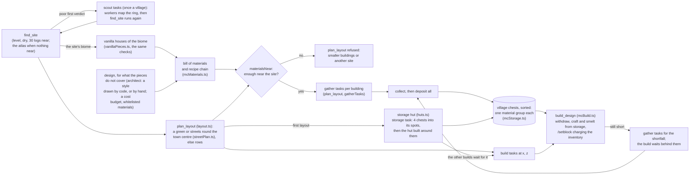

| Part | File | What it does |
|---|---|---|
| World rules | `mcRules.ts` | peaceful; no fall, drowning, fire or freeze damage; keep-inventory; no monster spawning or fire spread; read back and shown in `/api/status` |
| Bill of materials | `mcMaterials.ts` | blocks per design (a door once for two cells; grass and `dirt_path` charged as dirt, stripped logs and bark blocks as logs by `chargedItem`), the cheapest recipe chain to raw materials (wood-kind variants merged into "any planks", smelting from the jar's recipes or the hand table without it (section 5), whole batches, leftovers reused, fuel), unobtainable and hard-to-find items flagged |
| Storage hut | `huts.ts`, `layout.ts` | a fixed 7x9x4 design (cobblestone floor, plank walls, log corners, plank roof, an open doorway in the middle of the south wall, no windows; the village's crafting table and furnace inside) with nine chest spots marked `_`, none side by side; added by code to a new village's first layout (the mayor does not name it, `design_building` refuses the name); tasks in order: prepare the plot, set up the storage (collect 10 logs, craft 4 chests, deposit puts them in the spots), gather for the hut, build it around the chests; other buildings' gathering waits only for the storage, their builds for the hut |
| Mine | `huts.ts`, `mcMine.ts`, `layout.ts` | a wood-only 5x5 mining hut in the first layout, turned toward the plot's edge; `dig_mine` digs stairs to stone (7+ steps); `collect cobblestone` then extends main tunnels with 12-long branches every 3 cells, turns a new tunnel off one that ended, and digs the stairs on down to a new level when none can go on (see below) |
| Storage | `mcStorage.ts` | sorted in a hut: material groups (logs, planks, cobblestone, sand, glass, terracotta, misc) given at a chest's first use; deposit routes each item to its group's chest, else a free chest, else a new chest crafted (from carried or stored logs) and put in the next free spot; withdraw goes to the chests that hold the item; `deposit item=all` leaves tools and junk (dirt, saplings, seeds), but not junk the depositor holds a task to collect (F132); a deposit that found no path says to walk back, not to craft a chest; a walk to a chest that stalls without moving the bot a block fails at once when the chest is over 6 blocks away (nearer, only the nearest side spot is tried), and is rethrown by every caller that would go on to other chests (`depositSorted`, `newChest`, `refreshStorage`, makePickaxe's and a build's making from stock), while a deposit that already put something away returns that with the stuck note (F143, F146). Villages from before the hut keep loose chests, placed by the first deposit and in a row when full. Chests are registered as 1x1 structures, contents recorded at every opening |
| Site search | `mcBuild.ts` (`surveyGround`, `bestSite`) | a height grid built once with prefix sums and sliding min/max (each column's real top; kelp and seagrass count as water), every centre within 112 blocks checked, a height range of 4 allowed; off every village's buildings, layouts and plots; in survival 30 log blocks within 48 (each log judged by its own column's ground and the site's level: no more than 16 below either); when nothing good is near, the atlas's best areas for an agent in no village or a mayor's first site (`mcSiteAtlas.ts`, section 7), else up to two 40-block legs toward land or trees; a new village's first site may lie up to 256 blocks from the mayor's start, and the verdict (`memory.siteSearch`) decides whether workers scout first (section 4) |
| Design limits | `tieredBrain.ts` (design checks), `designs.ts`, `buildingGen.ts`, `layout.ts` | the world's block list (`designBlocks`), raw materials whitelisted (logs, stone, sand, sandstone, dirt, gravel, terracotta), no workstations or containers as decoration (made air in a hand drawing); a cost budget in place of the old 9x9 cap, in raw blocks to gather from `materialTasks` (`HOUSE_UNITS` 150, a landmark by its name, a hall, chapel, tower..., `LANDMARK_UNITS` 300; 250 and 400 before the generator; at most `MAX_SMELTS` 32 furnace runs), and `plan_layout` lays out one building over 150 a village; a style is fitted by code instead of refused (walls capped at `HOUSE_WALLS` 9 and `LANDMARK_WALLS` 11, `fitSmelts`, `shrinkStyle`); three tries with the problems; vanilla pieces pass the same checks in `mcWorld.vanillaLibrary` before they reach the library (a library or temple as a landmark) |
| Materials near the site | `mcWorld.materialsNear` | counts up to the amounts needed, as `collect` reaches blocks; wood may be a quarter short |
| Layout and tasks | `layout.ts`, `streetPlan.ts`, `mcWorld.materialTasks` | a green (on a 40 site) or the street plan for a vanilla village's first plot (section 4: the town centre, streets laid by `prepare_site` as `dirt_path`, buildings turned to face them); otherwise rows with streets (narrower when that fits; generated buildings packed by their walls, the overhang's eaves over the street); partial layouts with the rest kept as unplaced; land, storage, gather (soft, in shareable parts) and build tasks, each as exact skill calls |
| Survival building | `mcBuild.ts` | builds do not wait for a held gather task the storage already covers (`stockCovers` in `village.ts`); registered chests may stand on a design's `_` cells (refused if one is not at the floor's level), crafting tables and furnaces kept off village plots and buildings and out of the mine (`onVillageGround`, `stepOffVillageGround`, `freeSpotNearby` in `mcUtil.ts`), wood kind per part (a swap keeps "stripped_": `woodPart`, `woodName`), server-side counting, withdrawing, crafting and smelting from storage (fuel topped up from every plank stack), charging each run, requeueing a shortfall, open windows when there is no glass |
| Scripted workers | `taskBrain.ts` | run a task's skill calls without a model, for staged tests; a limited runner (`pick`, `notTheTask`) is the waiting mayor's gathering (section 3) |

**The mine's trips** (`mcMine.ts`, `mineFor`): a main tunnel's cells are dug in a fixed order (`tunnelCell`: 3 main
cells, then a 12-cell branch to each side, and again), two blocks each, until the bot carries enough or 6 minutes pass.

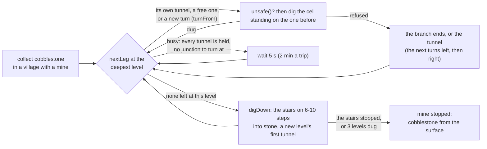

`turnFrom` starts a turned tunnel at the latest junction whose branch on that side ran its full length, so its first
stretch is open already (the first tunnel may also turn at the bottom of the stairs). `digDown` goes on from the deepest
level's bottom step in the stairs' direction, under that level's first tunnel, one block down per step, until at least
6 steps and stone. One bot holds each tunnel and one the stairs down (`holders`, `downHolders`, in memory, released when
its trip ends). `unsafe()` refuses a cell beyond 90 blocks of the village's home; under any village's plot or laid-out
plot (2-block margin, down to 4 below its level), at a building, in another village's mine or beside the stairs; that is
not natural ground or has water or lava in or next to it; with open air beside it under the open sky (a hillside; not on
the side it is dug from); or with no solid, non-falling ceiling; so do a missing floor and a cell with no stone (F79). A refused cell ends its branch or tunnel.
Every walk in the mine (`walkMine`) has digging, scaffolding and pillaring turned off, and `digCell` digs only standing
on its approach (`stand`: the cell before, the step above); the stairs from the hut keep the pathfinder's own walk onto
each step (F80, F81). `mineAreas` gives the boxes the mine takes up (hut and stairs, each stairs down, each tunnel's
reach to the end of the stretch being dug, floor to ceiling `y2`, so the ground above stays free), and no bot's
pathfinder breaks blocks in them. Two trips in a row that gathered nothing end the tunnel or branch they worked on, and
so do three that stopped at the same cell inside the mine; a bot stuck outside it ends nothing.

Results: the acceptance runs of 2026-09-28/29 built "two matching cottages and a meeting hall" from nothing with a
mayor and two workers and no manual help, five times with gpt-oss as the workers' planner (10.2-29.2 minutes; three in
a row) and twice with qwen3.8 (26.2 and 39.2 minutes); every failed run on the way was a code bug, since fixed. Still
open: `collect` often cannot reach logs high on hills (9-23 failed collects in hilly or jungle-edged woods); log roofs
make villages slow (a 9x9 log roof is 81 logs); and builders drawing on the chest at the same moment still come up short now and then (the
requeue recovers). The shared atlas (`docs/PLAN.md`, phase 2) helps with the first: `find_site` now leaves poor land
for a better area the atlas knows (staged runs from the jungle hills and the lake that went wrong before built all
three buildings, 2026-10-02); gathering from the atlas is still to come. With stair gable roofs (phase D's first step,
2026-10-04) the same objective was built on the test world at 1x in 14.6 and 17.0 minutes with no failed actions;
with buildings drawn from styles (D.2, D.3) in 16.1 and 19.2 minutes with no failed designs or actions. With vanilla
villages (`docs/PLAN.md`, "Vanilla villages", V2.1-V2.3): four houses of four biomes and a library with upper-floor
doors were built at four turns with no block differing from the design (the server worked out vanilla's roof corners;
a sixth piece lost one turn to gravel sliding onto its plot, F128); staged street
villages built 5-6 buildings in about 3 minutes at 2x from stocked storage (VanS1-4) and 6 in 9.7 minutes from nothing
(VanF1), with no failed actions; and the model-driven Minevale20 built two sibling plains houses, a library as the
hall, the plains town centre and both huts in 18.0 minutes at 1x, with no failed actions and no design drawn (on the
test site whose mine is slow, F121). With the mayor gathering while it waits (V2.3m), the staged VanM2 took 8.0
minutes at 2x from nothing (10.9 without it) and the model-driven Minevale21 15.0 minutes at 1x on Minevale20's site,
with 2 failed actions, both a worker's. Round a green on a 40 site (V2.4), staged plains and snowy villages built 6
buildings from nothing in 8.1-8.4 minutes at 2x with no failed actions (VanG1, VanG2, and VanG5 after collect's lake
and pit fixes; VanG3 and VanG4 on the same land lost 2-4 minutes each to a lake beside the plot, F136-F138), and the
model-driven Minevale22 built six in 15.2 minutes at 1x with no failed actions. With the block lists and smelting read
from vanilla's tags and recipes (V2.5; loot tables are only checked so far), staged VanG6 and VanM3 built six in 8.3
minutes at 2x, and the model-driven Minevale23 six in 14.9 minutes at 1x on Minevale22's site, all with no failed actions.
