# Architecture

How the agent system fits together: the two worlds agents can live in, the world interface that lets one brain run
in either, the two-tier brain, villages, the models behind it all, and the control panel. For running things see the
[README](../README.md); for working notes and lessons learned see [CLAUDE.md](../CLAUDE.md).

## 1. The system at a glance

Agents are players. A **world** gives them a body, skills and senses; a **brain** decides which skills to run; the
**village registry** lets several agents work on one project; **models** (local on two GPUs, or in the cloud) do the
deciding. There are two worlds: the browser sandbox in this repository, and real Minecraft Java Edition through
Mineflayer.

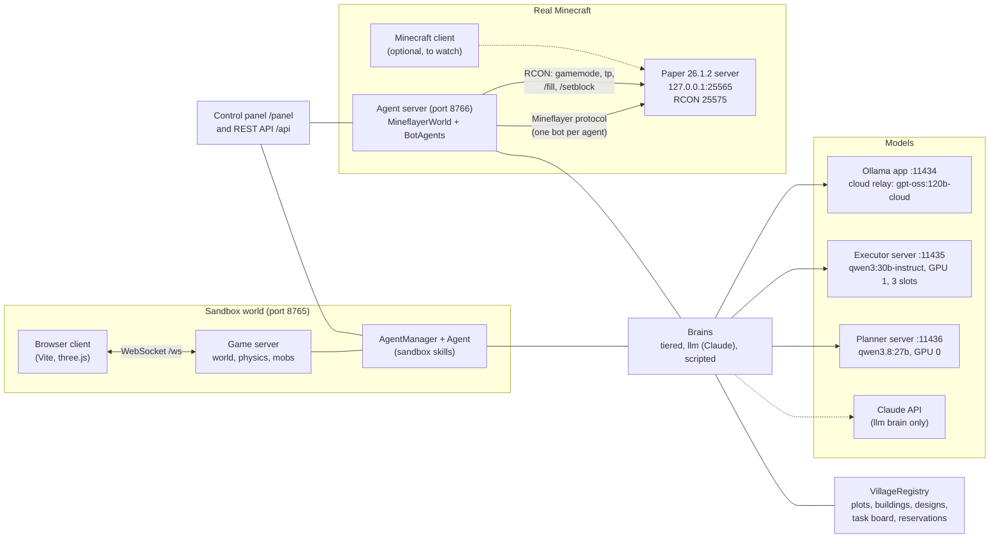

| Component | Where | What it does |
|---|---|---|
| Browser client | `client/src` | Renders the sandbox, sends player input; a human player or a spectator. |
| Game server | `server/src/game.ts`, `serverWorld.ts`, `mobs.ts` | Authoritative sandbox world: chunks, physics, mobs, crafting, saving. |
| Sandbox agents | `server/src/agents.ts` | Agents as real sandbox players, their skills, the building engine, the REST API. |
| Paper server | `mc/` (scripts; jar and world gitignored) | A private Minecraft 26.1.2 server for the agents (offline mode, localhost only). |
| Minecraft agents | `server/src/mineflayer/` | Agents as Mineflayer bots on the Paper server, their skills, the same REST API. |
| Brains | `server/src/tieredBrain.ts`, `llmBrain.ts`, `brains.ts` | Decide what agents do. The tiered and llm brains run in either world. |
| Villages | `server/src/village.ts`, `designs.ts` | Shared project state and building designs, one registry per world. |
| Control panel | `server/panel/index.html`, `server/src/panel.ts` | Live view of every agent's body and brain, maps, the task board. |
| Model servers | `scripts/ollama_exec.py`, the Ollama app | Local models pinned to GPUs; the app relays cloud models. |

## 2. The world interface

The brains and the village logic never import a world. They see an agent only through `WorldAgent` and a world only
through `WorldAdapter` (`server/src/world.ts`). Each world implements both; that is all it takes to host the same
agents.

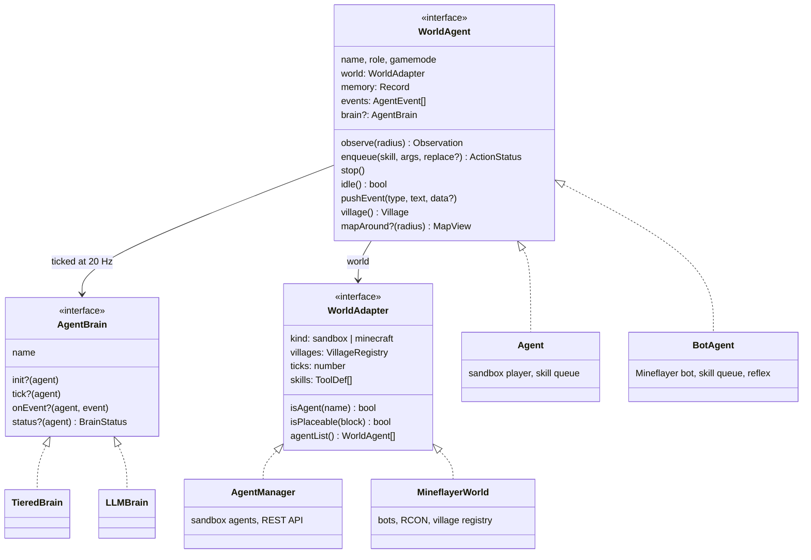

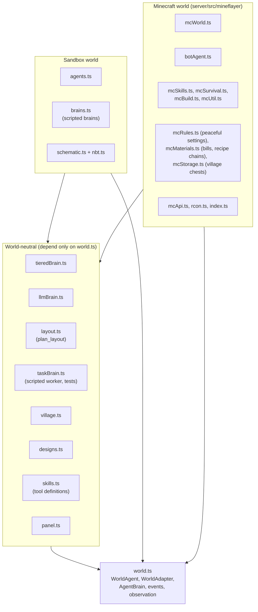

**The contract a world keeps.** Skill names and arguments are the same in both worlds (the brain's tools come from
`skills.ts`; a world lists the ones it has in `WorldAdapter.skills`). Events carry the data the brain relies on:

| Event | Data | Used for |
|---|---|---|
| `chat` | `{from, text, distance?}` | answering people; agent chatter only interrupts when it names the agent |
| `action_done` | `{action, type, args}` | marking a plan step done when the skill it names succeeds with the item it names |
| `action_failed` | `{action, type, args, message}` | the loop guard (same call failed twice: refused for 5 minutes) |
| `damage`, `death`, `pickup`, `crafted`, `broke`, `killed`, `system` | text | urgency, replanning, the panel |

## 3. The two-tier brain

`TieredBrain` splits deciding into a slow **planner** (a goal and 3-8 steps, rarely) and a fast **executor** (the
next 1-3 skill calls, every few seconds). A third role, the **architect**, draws building designs on request. Each
role can use a different model, set per agent in memory (`planModel`, `execModel`, `designModel`, as
`"<provider>:<model>"`).

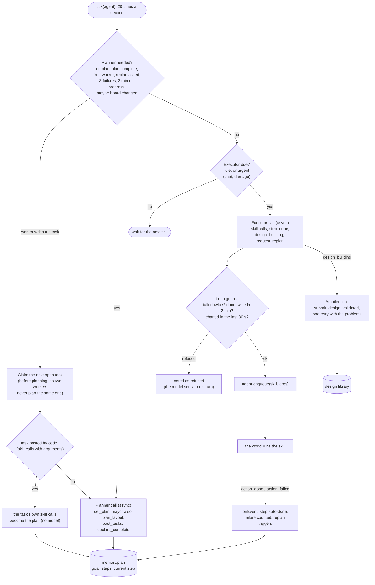

What each model is shown, per call:

| Role | Sees | Answers with | How often |
|---|---|---|---|
| Planner | role, objective, long-term notes, village summary (plots, buildings, designs, storage contents, task board, recent village events, ground others are working on), previous plan, events since the last plan, observation; a worker also its claimed task | `set_plan`; the mayor also `plan_layout`, `post_tasks` and `declare_complete` | on the triggers above; a worker only for tasks a model wrote (code-posted tasks carry their own steps) |
| Executor | plan with the current step marked, the claimed task, recent decisions, blocked calls, events since its last turn, a trimmed observation (~2k tokens) | 1-3 skill calls, or `step_done`, `design_building`, `request_replan` | whenever the agent is idle, at least 6 s apart; 1.5 s when urgent |
| Architect | the design rules and format, a brief, the existing designs | `submit_design` (layers of spaced symbols plus a palette) | when a `design_building` call is made |

Code, not the model, does arithmetic and geometry and cleans up model output: `craft` makes missing planks and sticks,
doors are moved onto an outside wall, `find_site` suggests the largest site that fits, `plan_layout` places buildings,
design layers sent as JSON strings (even without their outer brackets) are parsed, tasks written as skill calls are
turned into task text, plan steps given as objects are turned into text (keeping arguments such as a design's name).

Code also keeps the mayor on its job, because gpt-oss drifts back to doing the work itself:

| Guard | What it catches |
|---|---|
| Plan steps that are workers' jobs are dropped | a mayor planning "collect 12 logs, craft a pickaxe" (its executor cannot do them) |
| Hand-written building tasks before a layout are laid out by `plan_layout` | a mayor writing its own gather-craft-build chain |
| Tasks duplicating the layout's are not posted | a mayor re-posting the whole village after one failure |
| A re-posted failed building re-opens the layout task | "Build meeting hall" posted for the failed "Build meeting_hall" |
| `declare_complete` is refused while a layout build is not done | a village declared complete with nothing built |
| No timed review while workers hold tasks; a refused `plan_layout` replans at once | a waiting mayor re-posting gathering every 3 minutes; minutes lost after a refusal |

### A village, end to end (the survival economy)

```mermaid
sequenceDiagram
  autonumber
  participant M as Mayor (planner: gpt-oss)
  participant L as plan_layout (code)
  participant B as Task board
  participant W as Worker brain
  participant E as Worker executor (qwen3:30b)
  participant S as Skills (Minecraft)
  participant C as Village storage
  M->>S: find_site size 30, design_building cottage, meeting_hall (its executor)
  M->>L: plan_layout ["cottage", "cottage", "meeting_hall"]
  L->>B: prepare the plot; set up the storage; gather tasks per building; builds at x, z
  W->>B: claim "Gather 12 logs for cottage 1"
  B-->>W: its steps: collect block=logs count=12, deposit item=all (the plan, no planner call)
  loop every few seconds while idle
    W->>E: plan, events, observation
    E-->>W: collect(block=logs, count=12), then deposit(item=all)
    W->>S: enqueue
    S->>C: deposit: logs into the chest
  end
  W->>B: finish (plan complete); claim "Build cottage 1" when its gather tasks are done
  W->>S: build_design cottage x, z
  S->>C: withdraw what is missing; craft planks, doors, smelt glass
  alt still short (gathered logs went elsewhere)
    S->>B: post gather tasks for the shortfall, put the build back behind them
  else everything in hand
    S-->>W: action_done: cottage recorded, placed 81 blocks
  end
  M->>B: declare_complete (checked: every layout build done)
```

## 4. Villages

A village is shared state for agents building together, saved to `villages.json` next to each world
(`server/worlds/<world>/` for the sandbox, `mc/server/` for Minecraft). Roles come from memory: `villageRole: "mayor"`
coordinates, everyone else in the village is a worker.

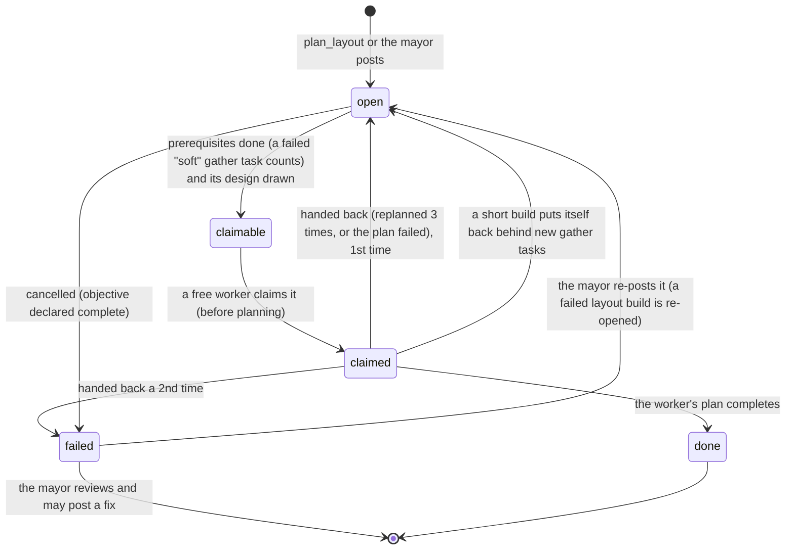

| Record | Written by | Purpose |
|---|---|---|
| Plots | `prepare_site` | Level ground, with its height, so buildings go on prepared land and plots can be extended at the same level. |
| Structures | `build`, `build_design`, `build_box` | Footprints: nothing is built on top of them; "a cottage already stands here" ends duplicate work. |
| Designs | the architect, the API, schematic import | The design library for `build_design`: layers of palette symbols, validated. |
| Task board | `plan_layout`, the mayor, short builds | Tasks with prerequisites (`after`), claims, results, tries; gather tasks are `soft` (their failure does not block the build, which checks its materials itself). |
| Storage | `deposit`, `withdraw`, builders (Minecraft) | The village's chests and what each held when last opened; shown in the planners' village summary and the panel. |
| Reservations | building skills while they run | Ground another agent is working on; `find_site` and other jobs avoid it (renewed while working, 3-minute expiry). |

## 5. Skills in each world

Both worlds run skills from a per-agent queue, one at a time, with the same names, arguments and failure messages.

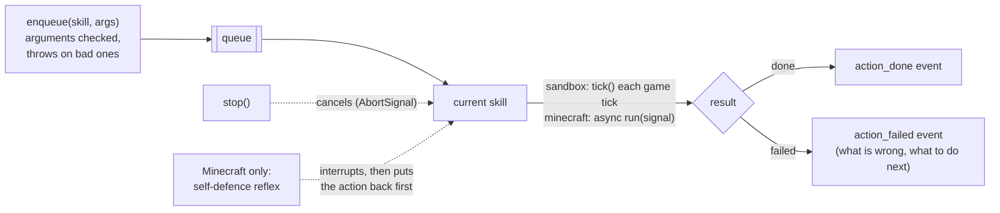

| | Sandbox (`agents.ts`) | Minecraft (`server/src/mineflayer/`) |
|---|---|---|
| Body | a sandbox `Player` driven by input each tick | a Mineflayer bot (client-side physics, half-width 0.3001 to stay in step with the server) |
| Walking | own A* Navigator (opens doors, digs out in creative) | mineflayer-pathfinder with a stuck/timeout watchdog, digging natural blocks only, opening doors, avoiding water (and swimming out of it), diagonals only with both sides clear, legs of ~40 blocks for long walks, a retry with longer drops |
| Crafting | recipes applied to the inventory | the recipe from minecraft-data, carried out by server command: ingredients counted and taken (`/clear`), the result given (`/give`); a table recipe still needs a table placed nearby |
| Gathering | `collect`, `mine` on sandbox blocks | `collect` resolves names in code (logs, cobblestone from stone, deepslate ores), picks the cheapest block to reach (near, not deep below, in the open), crafts a wooden pickaxe when stone needs one, stays within 96 blocks of the village and never mines inside its buildings |
| Building | `BuildJob`: blocks placed one by one, paced by `buildSpeed` | `/setblock` and `/fill` over RCON, paced by `buildSpeed`, vertical runs merged; in survival each run is charged to the inventory (`/clear`) after a material check, with crafting from storage and a requeue when short |
| Storage | none | `deposit` and `withdraw` against the village's chests (`mcStorage.ts`) |
| Safety | none | reflex: fight back with a weapon, run when unarmed, hurt or near a creeper |
| Spawning | `game.join` | a bot joins; RCON sets game mode, teleports, `reset` clears inventory and returns it to spawn |

### Building in Minecraft

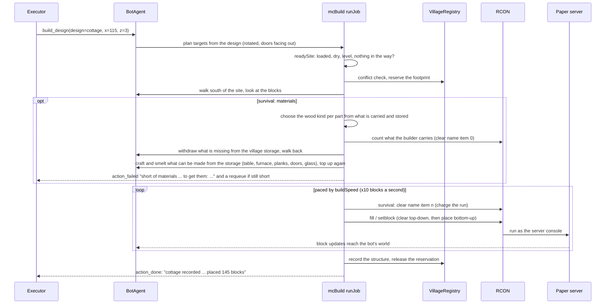

## 6. Models and GPUs

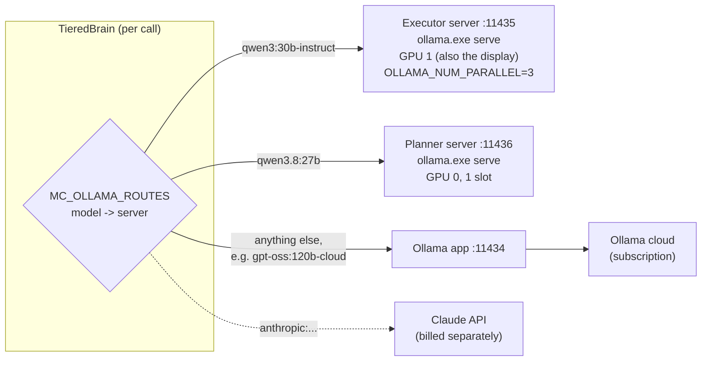

| Role | Model (as used in the Elmfield and Ashvale runs) | Why |
|---|---|---|
| Mayor's planner, architect | `gpt-oss:120b-cloud` | ~3.5 s per plan, ~9 s per design, valid designs; about 10x faster than gemma4:31b |
| Workers' planner | `qwen3.8:27b` | tight one-step plans (6/6 against 2/6 for qwen3:30b); in the village economy it is rarely called, since tasks posted by code carry their own steps |
| Executors | `qwen3:30b-instruct` | a mixture of experts (~3B active): ~2 s a turn, as accurate as larger models when the plan is clear |

`scripts/ollama_exec.py start` runs the two local models on their own `ollama.exe serve` instances, pinned to a GPU
by UUID (CUDA and nvidia-smi number the cards differently here), after unloading them from the Ollama app: left to
itself, the app split a model across both cards and Windows silently spilled the rest into system RAM (60x slower).
It loads each model, checks it is fully in VRAM and times it.

## 7. The control panel

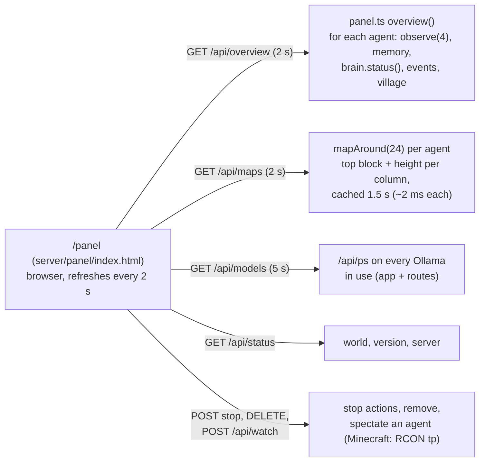

Each agent's card shows: the brain's state (planning, thinking, acting, waiting, idle, backing off, done: since when
and why), health and food, position and biome, objective and task, the plan as a checklist, the current action, blocked
calls, a top-down map (terrain, facing, mobs, players, target, plots, buildings, reserved ground), what the executor and
the planner last saw (the exact user prompt) and answered, recent decisions and events, inventory and model stats. The
village section shows the task board, buildings, plots, designs, the storage contents, reservations and the village log.

## 8. Testing

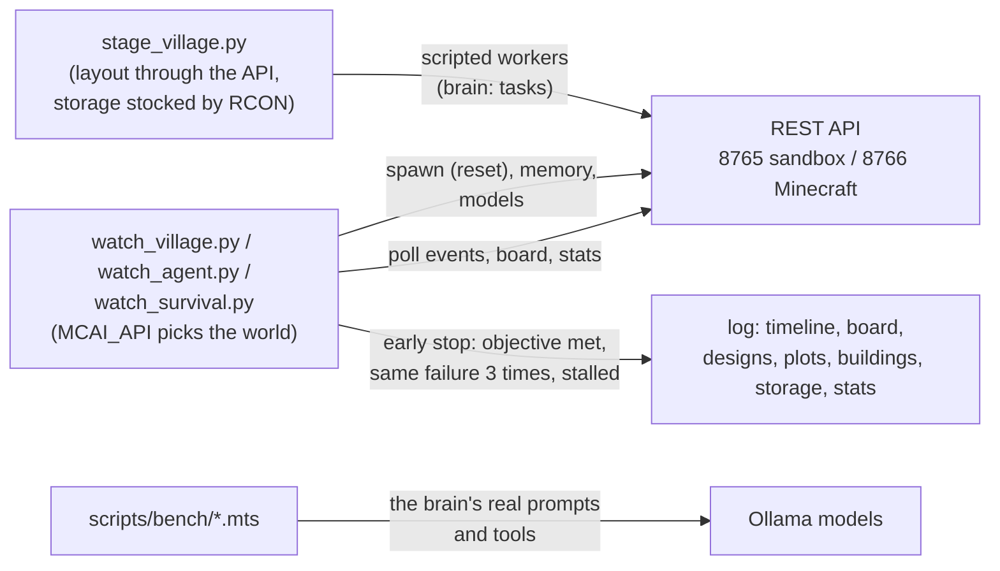

Tests go from fast to slow. `stage_village.py` sets a village up at a stage and runs scripted workers (`taskBrain.ts`:
they run the skill calls each task spells out), so the economy's code is checked in one to ten minutes with no model
involved. The benches (`modelbench`, `execbench`, `planbench`, `mayorbench`) replay the brain's real prompts against a
model in seconds per case. Only then do model-driven village runs test behaviour.

Agent names are fixed (Gus for single-agent tests; Mayor, Worker1, Worker2 for villages) so they are easy to find in
the world. There is no unit test suite: `npm run typecheck`, then agents are run.

## 9. The village economy (real Minecraft)

Villages in real Minecraft are built in survival from materials the agents gather themselves, in a world made safe:
the agent server applies peaceful difficulty and game rules for no damage and keep-inventory at every start
(`mcRules.ts`).

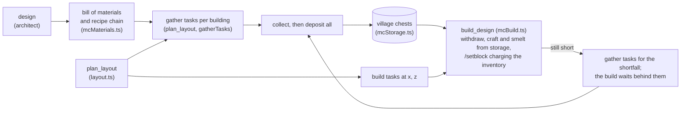

| Part | File | What it does |
|---|---|---|
| World rules | `mcRules.ts` | peaceful; no fall, drowning, fire or freeze damage; keep-inventory; no monster spawning or fire spread; read back and shown in `/api/status` |
| Bill of materials | `mcMaterials.ts` | blocks per design (a door once for two cells), the cheapest recipe chain to raw materials (wood-kind variants merged into "any planks", a smelting table, whole batches, leftovers reused, fuel), unobtainable and hard-to-find items flagged |
| Storage | `mcStorage.ts` | chests placed by the first deposit and when full, registered as 1x1 structures, contents recorded at every opening |
| Layout and tasks | `layout.ts`, `mcWorld.materialTasks` | positions with streets; land, storage, gather (soft, in shareable parts) and build tasks, each as exact skill calls |
| Survival building | `mcBuild.ts` | wood kind per part, server-side counting, withdrawing, crafting and smelting from storage, charging each run, requeueing a shortfall, open windows when there is no glass |
| Scripted workers | `taskBrain.ts` | run a task's skill calls without a model, for staged tests |

Results: one cottage from nothing in 9.3 minutes; "two matching cottages and a meeting hall" in 35 minutes with two
workers (Meadowford2). Still open: builds often come up a few logs short (a quick requeue each time), gathering fails
on poor terrain (no sand or trees within 96 blocks of the village), and a waiting mayor still tries to re-post work
when woken, which the guards in section 3 catch.
